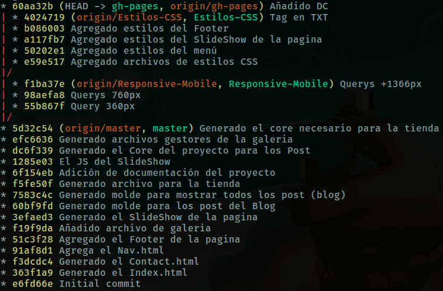
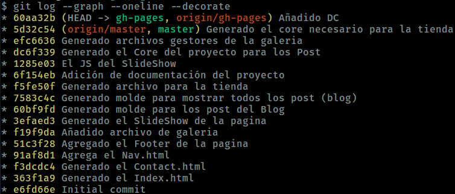

# Curso Profesional de Git y GitHub

## Tabla de contenido
- [쯈ué es un sistema de control de versiones?](#쯈ué-es-un-sistema-de-control-de-versiones?)
- [쯈ué es Git?](#쯈ué-es-Git?)
- [쮺칩mo saber si Git está instalado?](#쮺칩mo-saber-si-Git-está-instalado?)
- [쯈ué hacer después de tenerlo instalado?](#쯈ué-hacer-después-de-tenerlo-instalado?)
- [쮺칩mo saber si Git está configurado?](쮺칩mo-saber-si-Git-está-configurado?)
- [Los estados de Git](#Los-estados-de-Git)
- [쮺칩mo hacer una iteración básica en git? (Git Workflow / Flujo de trabajo)](#쮺칩mo-hacer-una-iteración-básica-en-git?-(Git-Workflow-/-Flujo-de-trabajo))
- [Estructura de un commit](#Estructura-de-un-commit)
- [Volver al pasado: Git Reset](#Volver-al-pasado:-Git-Reset)
  - [Git reset --hard](#Git-reset---hard)
  - [Git reset --mixed](#Git-reset---mixed)
  - [Git reset --soft](#Git-reset---soft)
  - [Deshacer un Reset](#Deshacer-un-Reset)
- [Git Checkout](#Git-Checkout)
- [Ramas en Git](#Ramas-en-Git)
  - [쮺칩mo crear una rama?](#쮺칩mo-crear-una-rama?)
  - [Fusiones](#Fusiones)
  - [Conflictos en las fusiones](#Conflictos-en-las-fusiones)
  - [Rebase](#Rebase)
- [Comando útiles](#Comando-útiles)
  - [De Git](#De-Git)
  - [De bash](#De-bash)
  - [Algunos comandos para guardar en alias](#Algunos-comandos-para-guardar-en-alias)
    - [Log Personalizado 1](#Log-Personalizado-1)
    - [Log Personalizado 2](#Log-Personalizado-2)
    - [Crear un archivo guardando el historial de commits 1](#Crear-un-archivo-guardando-el-historial-de-commits-1)
    - [Crear un archivo guardando el historial de commits 2](#Crear-un-archivo-guardando-el-historial-de-commits-2)
- [Algunos logs útiles](#Algunos-logs-útiles)
  - [Condensar todos los logs en una línea](#Condensar-todos-los-logs-en-una-línea)
  - [Mostrar en detalle los cambios](#Mostrar-en-detalle-los-cambios)
  - [Agrupar los commits por autor](#Agrupar-los-commits-por-autor)
  - [Ramas + Mensaje + Commit + Head](#Ramas-+-Mensaje-+-Commit-+-Head)
  - [Autor + Commit + Fecha](#Autor-+-Commit-+-Fecha)
  - [Mostrar los últimos N commits](#Mostrar-los-últimos-N-commits)
  - [Mostrar los commits despues de X fecha](#Mostrar-los-commits-despues-de-X-fecha)
  - [Mostrar los commits antes de X fecha](#Mostrar-los-commits-antes-de-X-fecha)
  - [Mostrar los commits entre un rango de fechas](#Mostrar-los-commits-entre-un-rango-de-fechas)
  - [Filtrar por autor](#Filtrar-por-autor)
  - [Filtrar por título de commit](#Filtrar-por-título-de-commit)
  - [Buscar en cuál commits se modificó un archivo](#Buscar-en-cuál-commits-se-modificó-un-archivo)
  - [Buscar en cuál commits se modificó el contenido de una carpeta](#Buscar-en-cuál-commits-se-modificó-el-contenido-de-una-carpeta)
- [Clonar un repositorio](#Clonar-un-repositorio)
  - [Mediante Git](#Mediante-Git)
  - [Mediante GitHub](#Mediante-GitHub)
- [Crear repositorio en GitHub desde cero](#Crear-repositorio-en-GitHub-desde-cero)
- [Colaborar en Equipo (Git fetch + Git Merge)](#Colaborar-en-Equipo-(Git-fetch-+-Git-Merge))
- [Añadiendo colaboradores a un repositorio](#Añadiendo-colaboradores-a-un-repositorio)
- [Folk's y Pull Request a repositorios (Colaborando con repositorios ajenos)](#Folk's-y-Pull-Request-a-repositorios-(Colaborando-con-repositorios-ajenos))
  - [Aspectos a tener en cuenta](#Aspectos-a-tener-en-cuenta)
- [Gestión de Proyectos](#Gestión-de-Proyectos)
- [Documentación que se pueden incorporar al proyecto](#Documentación-que-se-pueden-incorporar-al-proyecto)
  - [El README del proyecto](#El-README-del-proyecto)
  - [Plantilla para los Issues](#Plantilla-para-los-Issues)
  - [Plantilla para los Pull Request](#Plantilla-para-los-Pull-Request)
- [Los Issues](#Los-Issues)
- [Aspectos a tener en cuenta para hacer Deployment con Git](#Aspectos-a-tener-en-cuenta-para-hacer-Deployment-con-Git)
- [Configurar varias cuentas de Git en la misma PC](#Configurar-varias-cuentas-de-Git-en-la-misma-PC)
- [Repositorios Bare](#Repositorios-Bare)
- [Git Tags (Etiquetas)](#Git-Tags-(Etiquetas))
  - [Annotated Tags](#Annotated-Tags)
  - [Lightweight Tags](#Lightweight-Tags)
  - [Comandos de los tags](#Comandos-de-los-tags)
- [GitHub Pages](#GitHub-Pages)
  - [Usando el username (Disponible 1 sola vez)](#Usando-el-username-(Disponible-1-sola-vez))
  - [Usando la Rama gh-pages](#Usando-la-Rama-gh-pages)
- [Guardando cambios temporalmente (Sin commits)](#Guardando-cambios-temporalmente-(Sin-commits))
  - [Aplicando un cambio guardado](#Aplicando-un-cambio-guardado)
- [Ignorar archivos automáticamente](#Ignorar-archivos-automáticamente)


## 쯈ué es un sistema de control de versiones?
Es un sistema que se encarga de estar pendiente de los cambios que van ocurriendo a un archivo o conjunto de archivos a lo largo del tiempo.

<div align="right">
    <small>
        <a href="#tabla-de-contenido">
            🡡 volver al inicio
        </a>
    </small>
</div>

## 쯈ué es Git?
Git es un sistema de control de versiones que permite guardar tus proyectos de manera online en GitHub para que múltiples personas puedan trabajar en él de manera simultanea. *Git no es GitHub*

<div align="right">
    <small>
        <a href="#tabla-de-contenido">
            🡡 volver al inicio
        </a>
    </small>
</div>

## 쮺칩mo saber si Git está instalado?
Podemos saber si git está instalado si en nuestra consola escribimos:

```bash
git --version
```

Si nos devuelve la versión de git, quiere decir que está instalado.

<div align="right">
    <small>
        <a href="#tabla-de-contenido">
            🡡 volver al inicio
        </a>
    </small>
</div>

## 쯈ué hacer después de tenerlo instalado?
Luego de haberlo instalado o confirmar que está instalado en nuestro computador, hay que configurar Git con nuestros datos de GitHub, indicando nuestro correo, username y editor de la siguiente manera:

```bash
git config --global user.name "Tu Nombre de usuario"
git config --global user.email "tu@correo.com"
git config --global core.editor "Atom --wait"
```
>Nota: La forma en que se configura el editor puede variar dependiendo del mismo. Confirmar con internet.

<div align="right">
    <small>
        <a href="#tabla-de-contenido">
            🡡 volver al inicio
        </a>
    </small>
</div>

## 쮺칩mo saber si Git está configurado?
Luego de haber introducido los comandos anteriores, cabe destacar que git no devuelve ningún tipo de "respuesta" luego de introducirlos, entonces para saber si tomó nuestros datos podemos ejecutar alguno de los siguientes comandos:

```bash
git config -l
```
O también:
```bash
git config --global --list
```

<div align="right">
    <small>
        <a href="#tabla-de-contenido">
            🡡 volver al inicio
        </a>
    </small>
</div>

## Los estados de Git
* `Working Directory` Hace referencia a archivos que se encuentra en nuestro equipo.
* `Staging area` Hace referencia a archivos que han sido seleccionados para ser almacenados en un commit.
* `Git Repository` Hace referencia al repositorio donde fueron confirmados y almacenados los cambios.

<div align="center">
  
  <small><p>Los estados de git según los comandos.</p></small>
</div>

<div align="right">
    <small>
        <a href="#tabla-de-contenido">
            🡡 volver al inicio
        </a>
    </small>
</div>

## 쮺칩mo hacer una iteración básica en git? (Git Workflow / Flujo de trabajo)
Para empezar a guardar tu progreso del proyecto en git debes seguir los siguientes pasos:

1. Con "git bash" abierto, usamos el comando de consola `pwd` para saber dónde estamos.
2. Una vez ubicados, con `cd` nos desplazamos hasta encontrar la carpeta con nuestro proyecto. EX: `cd desktop/practica`.
3. Ya dentro de la carpeta de nuestro proyecto iniciamos git con `git init`.
4. Realizamos los cambios pertinentes en nuestro proyecto (Editar, agregar o eliminar archivos).
5. Una vez realizado los cambios en el proyecto pasan a añadirse al `staging area` usando:
   * Para agregar todos los cambios de una vez:
        ```bash
        git add -A
        ```
        o también:
        ```bash
        git add .
        ```
        >Cualquiera de las dos opciones es válida.
    - Para agregar un archivo en específico:
        ```bash
        git add archivo.extensión
        ```
6. En este punto se puede usar `git status` para saber en cuál estado de Git se encuentran nuestros archivos.
7. Se confirman los cambios con un mensaje usando `git commit -m "Mensaje del commit"`

>Nota: Cada vez que se exista un cambio/mejora significativa en el proyecto se debe hacer un commit ya que de esta forma lo integramos a la historia de nuestro proyecto. (Se repite el proceso desde el paso 5)

<div align="right">
    <small>
        <a href="#tabla-de-contenido">
            🡡 volver al inicio
        </a>
    </small>
</div>

## Estructura de un commit
Al efectuar un `git log` podemos ver los datos de un commit, los cuales son los siguientes:

```bash
commit 1642c8df15ec6b4a699560a812646c505163e6b3 -> SHA-1
Author: WuilfredoAz <wuilfredo.az@gmail.com> -> Quien hizo el commit
Date:   Tue Jul 30 10:17:32 2019 -0400 -> Fecha

    Minimizado de imágenes -> Mensaje del commit
```

<div align="right">
    <small>
        <a href="#tabla-de-contenido">
            🡡 volver al inicio
        </a>
    </small>
</div>

## Volver al pasado: Git Reset
Se hace para volver a un punto de control en específico o para mezclar distintos commits en uno. Existen 3 tipos: `--hard`, `--mixed`,`--soft`.

<div align="center">
    
    <small><p>Git reset en acción.</p></small>
</div>

>Nota: se recomienda hacer un `git log` y guardar el historial del proyecto (o último commit) en caso de necesitar revertir un reset. Ver comandos útiles.

### Git reset --hard
En este caso el repositorio, el staging area y el working directory se alinean en el punto que se selecciona borrando todo los commits en adelante al seleccionado de todos los estados de git.

Se ejecuta de la siguiente manera:
1. Ejecutamos un `git log` y seleccionamos el commit ID (código SHA-1) del commit al cual queremos volver.
2. Ejecutamos:

```bash
git reset --hard [SHA-1]
```

<div align="right">
    <small>
        <a href="#tabla-de-contenido">
            🡡 volver al inicio
        </a>
    </small>
</div>

### Git reset --mixed
En este caso se borran los commits que están adelante del que seleccionamos, pero mantiene todos los cambios realizados de los commits borrados en el  `working directory`. Es decir, se debe confirmar con una iteración básica. (`git add -A` + `git commit -m "mensaje"`).

Se ejecuta de la siguiente manera:

1. Ejecutamos un `git log` y seleccionamos el commit ID (código SHA-1) del commit al cual queremos volver.
2. Ejecutamos:

```bash
git reset --mixed [SHA-1]
```

<div align="right">
    <small>
        <a href="#tabla-de-contenido">
            🡡 volver al inicio
        </a>
    </small>
</div>

### Git reset --soft
Borra los commits que están adelante del que seleccionamos, pero mantiene todos los cambios realizados de los commits borrados en el `staging area`, listos para *comitearlos* con `git commit -m "mensaje"`.

1. Ejecutamos un `git log` y seleccionamos el commit ID (código SHA-1) del commit al cual queremos volver.
2. Ejecutamos:

```bash
git reset --soft [SHA-1]
```
### Deshacer un Reset
Todos los reset se pueden deshacer si se sabe el código SHA-1 del commit más reciente. De ahí la importancia de guardar el log con dichos códigos. Se deshace de la siguiente manera

```bash
git reset --hard [SHA-1 Commit más reciente]
```

<div align="right">
    <small>
        <a href="#tabla-de-contenido">
            🡡 volver al inicio
        </a>
    </small>
</div>

## Git Checkout
Es un comando utilizado para volver en el tiempo a un determinado commit/rama/tag sin hacer un reset directamente. Se ejecuta de la siguiente manera:


```bash
git checkout [SHA-1/rama/tag]
```

<div align="center">
  
  <small><p>Ejemplo visual de git checkout.</p></small>
</div>

<div align="right">
    <small>
        <a href="#tabla-de-contenido">
            🡡 volver al inicio
        </a>
    </small>
</div>

## Ramas en Git
Son generadas para crear líneas de tiempo "alternas" del proyecto con la idea de proponer ideas, features, bug fixes sin tocar/modificar la rama del proyecto principal (rama master).

<div align="center">
  
  <small><p>Ejemplo visual de ramas.</p></small>
</div>

`Head`: Término utilizado para saber en cual commit del repositorio nos encontramos.

>Nota: Al crear una rama, por defecto esta se crea a partir del último commit de la rama en la que se encuentre el head en ese momento.

<div align="right">
    <small>
        <a href="#tabla-de-contenido">
            🡡 volver al inicio
        </a>
    </small>
</div>

### 쮺칩mo crear una rama?
Una vez posicionado en el lugar donde se desea que empiece la nueva rama, ejecutamos lo siguiente:

```bash
git chekout -b "Nombre de rama"
```

Una vez creada la rama, debemos efectuar una iteración básica en la cual se agreguen cambios y se confirme el commit (`git add -A` + `git commit -m "mensaje"`).

>Nota: si se desea volver en algún momento a la rama master, o a cualquier otra rama, se hace con: `git checkout "Nombre de rama"`.

<div align="right">
    <small>
        <a href="#tabla-de-contenido">
            🡡 volver al inicio
        </a>
    </small>
</div>

### Fusiones
Se utilizan para mezclar dos ramas en una sola, bien sea para absorber cambios o propuestas que se realizaron en una rama alterna.

Para ejecutar una fusión se deben seguir los siguientes pasos:
1. Posicionarse en la rama que *absorberá* los cambios con `git checkout "nombre de rama"`.
2. ejecutar:

```bash
git merge "Rama a absorber"
```

<div align="right">
    <small>
        <a href="#tabla-de-contenido">
            🡡 volver al inicio
        </a>
    </small>
</div>

### Conflictos en las fusiones
Al momento de ejecutar una fusión puede darse alguno de los siguientes casos:

1. **Fusión "Fast-Foward"**: Es cuando se modifican archivos que en la rama que se está absorbiendo no se hayan modificado o no existan. EX: En la rama "Nueva" se creó un "script.js" que no existía en la rama "Master", en ese caso se efectúa un "Fast-Foward" en cual git mezcla todo automáticamente sin ningún problema.
2. **Fusión "con conflictos**: Es cuando se modifican los mismos archivos tanto en la rama que absorbe como en la rama absorbida. EX: En la rama "Nueva" se modificó el "index.html" en la línea 15 y en la rama "Master" también se modificó el mismo archivo en la misma línea de código. <br>
En este caso, el líder del proyecto (o encargado de fusionar), debe determinar e indicarle a git manualmente cual versión del "index.html" es la indicada para el proyecto, si la de la rama "Master" o la "Nueva".

<div align="right">
    <small>
        <a href="#tabla-de-contenido">
            🡡 volver al inicio
        </a>
    </small>
</div>

### Rebase
Es una técnica en la cual se busca **superponer** en una rama "A", todos los commits de la rama "B" (rama que se desea superponer) y al final fusionarlos con ayuda de un `git merge`. Se realiza de la siguiente manera:

1. Ubicarnos en la rama que queremos superponer.
2. Ejecutar `git rebase "Rama Donde quiero colocarla"`.
3. Ubicarnos en la rama donde queremos colocarla.
4. Ejecutar un `git merge "Rama que queremos superponer`.

Al final (paso 3 y 4) se busca realizar una fusión porque si volvemos a la rama donde se quiere colocar con `git checkout "rama"`  y hacemos un commit el rebase se va a deshacer.

Se diferencia del `git merge [rama]` porque éste condensa todos los commits de la rama que se absorbe en uno solo y a través de esta técnica (Rebase) se pueden conservar todos los commits.

<div align="right">
    <small>
        <a href="#tabla-de-contenido">
            🡡 volver al inicio
        </a>
    </small>
</div>

## Comando útiles

### De Git
* `git branch -d "Nombre de rama"` = Borrar rama que se ha fusionado.

* `git branch -D "Nombre de rama"` = Borrar rama que no se ha fusionado.

* `git commit -m "Nuevo mensaje del commit" --amend` = Corrige el último commit y cambia el mensaje del mismo.

* `git commit --amend --no-edit` = Corrige el último commit pero sin cambiar el mensaje del mismo.

* `git remote -v` = Ver las conexiones.

* `git pull origin "Nombre de rama"` = Descargar cambios del repositorio y fusionar con una rama.

* `git remote rm [REMOTO]` = Borrar conexiones remotas.

* `git branch -a` = Revisar ramas escondidas.

* `git branch -v` = Revisar ramas descargadas.

* `git merge --no-ff "Rama"` = Fusionar evitando Fast-Foward.

* `git push -f` = Hacer un push forzosamente al repositorio.

* `git rm --cached archivo.extensión` = Devolver un archivo que se encuentra en el staging area al working directory sin borrar el archivo del proyecto.

* `git rm -f` = Sacar un archivo del staging area y borrarlo.

* `git branch -m "Nombre Viejo" "Nuevo Nombre"` = Renombrar una rama.

* `git rebase -i "Rama a Absorber"` = Hace un rebase interactivo (Posibilidad de escoger/editar/borrar commits).

* `git cherry-pick [SHA-1]`= Copiar un commit y pegarlo en la rama donde nos encontremos al momento de ejecutar el comando.
  >Nota: Este comando NO corta el commit de un lugar a otro, solo lo copia/clona y lo reubica en la rama donde nos encontremos al comento de ejecutarlo. Si al reubicar hay conflictos, se deben solucionar al igual que una fusión y después ejecutar `cherry-pick --continue`.

* `git merge origin/master --allow-unrated-histories` = Permite realizar merge de ramas que no tienen el mismo histórico de commits.

* `git push origin "Rama con tags" --tags` = Subir los tags de una rama en específica.

* `git push origin --tags` = Subir los tags de todas las ramas.

* `git push --all origin` = Subir todas las ramas a la vez.

<div align="right">
    <small>
        <a href="#tabla-de-contenido">
            🡡 volver al inicio
        </a>
    </small>
</div>

### De bash
* `touch archivo.extension` = Crea un archivo.

* `rm -rf archivo/carpeta` = Borrar un archivo o carpeta.

* `ls -la` / `ls -a` = Ver/Listar los archivos de una carpeta incluso si están ocultos.

* `mkdir "Nombre de Carpeta"` = Crear una carpeta.

* `start archivo.extensión` = Abrir un archivo en Windows.

* `mv archivo.extensión ../nuevo/destino` = Cortar un archivo de un lugar a otro.

* `vim archivo.extension` = Abre un editor de texto en la terminal.
    - Para escribir se debe presionar "i" o "o".
    - Para cerrar (en windows) se presiona Ctrl + C y se escribe `:x` para guardar y cerrar. Para cerrar sin guardar `:qa!`.

* `&&` = Concatenar comandos EX: `cd desktop && mkdir test`

<div align="right">
    <small>
        <a href="#tabla-de-contenido">
            🡡 volver al inicio
        </a>
    </small>
</div>

### Algunos comandos para guardar en alias
Un alias en un comando que nos permite guardar en un shorcout un comando para que sea más fácil y rápida su ejecución. Se hace de la siguiente manera:

```bash
git config --global alias.nombreDelComando "Comando a guardar"
```
* #### Log Personalizado 1

    <div align="center">
      
      <small><p>Log personalizado.</p></small>
    </div>

    ```bash
    log --graph --abbrev-commit --decorate --date=relative --format=format:'%C(bold blue)%h%C(reset) - %C(bold green)(%ar)%C(reset)%C(white)%s%C(reset) %C(dim white)- %an%C(reset)%C(bold yellow)%d%C(reset)' --all
    ```

<div align="right">
    <small>
        <a href="#tabla-de-contenido">
            🡡 volver al inicio
        </a>
    </small>
</div>

* #### Log Personalizado 2

    <div align="center">
      
      <small><p>Log personalizado.</p></small>
    </div>

    ```bash
    log --oneline --graph --all
    ```

<div align="right">
    <small>
        <a href="#tabla-de-contenido">
            🡡 volver al inicio
        </a>
    </small>
</div>

* #### Crear un archivo guardando el historial de commits 1

   <div align="center">
      
      <small><p>Respaldo de log 1.</p></small>
   </div>

    ```bash
    log --pretty=format:'%h was %an, %ar, message: %s'
    ```

    >Nota: para que funcione el comando, siempre hay que añadir al final del alias el siguiente texto: "> Logs.log" donde "Logs" será el nombre con el que aparecerá nuestro historial. EX: `git respaldo > Logs.log`

<div align="right">
    <small>
        <a href="#tabla-de-contenido">
            🡡 volver al inicio
        </a>
    </small>
</div>

* #### Crear un archivo guardando el historial de commits 2

  <div align="center">
    
    <small><p>Respaldo de log 2.</p></small>
  </div>

    ```bash
    log --pretty=format:'%h : %s' --graph
    ```

    >Nota: para que funcione el comando, siempre hay que añadir al final del alias el siguiente texto: "> Logs.log" donde "Logs" será el nombre con el que aparecerá nuestro historial. EX: `git respaldo > Logs.log`

<div align="right">
    <small>
        <a href="#tabla-de-contenido">
            🡡 volver al inicio
        </a>
    </small>
</div>

## Algunos logs útiles

### Condensar todos los logs en una línea

```bash
git log --oneline
```

  <div align="center">
    
    <small><p>Vista previa</p></small>
  </div>

<div align="right">
    <small>
        <a href="#tabla-de-contenido">
            🡡 volver al inicio
        </a>
    </small>
</div>

### Mostrar en detalle los cambios

```bash
git log --stat
```

  <div align="center">
    
    <small><p>Vista previa</p></small>
  </div>

>Nota: Si se necesita ver qué se hizo en cada cambio se puede usar `git log -p`.

<div align="right">
    <small>
        <a href="#tabla-de-contenido">
            🡡 volver al inicio
        </a>
    </small>
</div>

### Agrupar los commits por autor

```bash
git shortlog
```

  <div align="center">
    
    <small><p>Vista previa</p></small>
  </div>

<div align="right">
    <small>
        <a href="#tabla-de-contenido">
            🡡 volver al inicio
        </a>
    </small>
</div>

### Ramas + Mensaje + Commit + Head

```bash
git log --graph --oneline --decorate
```

  <div align="center">
    
    <small><p>Vista previa</p></small>
  </div>

<div align="right">
    <small>
        <a href="#tabla-de-contenido">
            🡡 volver al inicio
        </a>
    </small>
</div>

### Autor + Commit + Fecha

```bash
git log --pretty=format:"%cn hizo el commit %h en esta fecha %cd"
```

  <div align="center">
    
    <small><p>Vista previa</p></small>
  </div>

<div align="right">
    <small>
        <a href="#tabla-de-contenido">
            🡡 volver al inicio
        </a>
    </small>
</div>

### Mostrar los últimos N commits

```bash
git log -N
```
Donde "N" es el número de commits que queremos ver.

  <div align="center">
    
    <small><p>Vista previa</p></small>
  </div>

<div align="right">
    <small>
        <a href="#tabla-de-contenido">
            🡡 volver al inicio
        </a>
    </small>
</div>

### Mostrar los commits despues de X fecha

```bash
git log --after="01-11-2018"
```

  <div align="center">
    
    <small><p>Vista previa</p></small>
  </div>

<div align="right">
    <small>
        <a href="#tabla-de-contenido">
            🡡 volver al inicio
        </a>
    </small>
</div>

### Mostrar los commits antes de X fecha

```bash
git log --before="today"
```
>Nota: En este ejemplo se usa "today" pero para referirse a la fecha actual, pero podría usarse el formato DIA-MES-AÑO como el ejemplo anterior.

  <div align="center">
    
    <small><p>Vista previa</p></small>
  </div>

<div align="right">
    <small>
        <a href="#tabla-de-contenido">
            🡡 volver al inicio
        </a>
    </small>
</div>

### Mostrar los commits entre un rango de fechas

```bash
git log --after="01-11-2018" --before="today"
```
>Nota: En este ejemplo se usa "today" pero para referirse a la fecha actual, pero podría usarse el formato DIA-MES-AÑO como el ejemplo anterior.

<div align="center">
    
    <small><p>Vista previa</p></small>
</div>

<div align="right">
    <small>
        <a href="#tabla-de-contenido">
            🡡 volver al inicio
        </a>
    </small>
</div>

### Filtrar por autor

```bash
git log --author="Nombre autor"
```

  <div align="center">
    
    <small><p>Vista previa</p></small>
  </div>

<div align="right">
    <small>
        <a href="#tabla-de-contenido">
            🡡 volver al inicio
        </a>
    </small>
</div>

### Filtrar por título de commit

```bash
git log --grep="Título del commit"
```

>Nota: si se agrega la bandera "`-i`" se desactiva el case sensitive, omitiendo las mayúsculas y minúsculas.

  <div align="center">
    
    <small><p>Vista previa</p></small>
  </div>

<div align="right">
    <small>
        <a href="#tabla-de-contenido">
            🡡 volver al inicio
        </a>
    </small>
</div>

### Buscar en cuál commits se modificó un archivo

```bash
git log -- "archivo.extensión"
```

  <div align="center">
    
    <small><p>Vista previa</p></small>
  </div>

<div align="right">
    <small>
        <a href="#tabla-de-contenido">
            🡡 volver al inicio
        </a>
    </small>
</div>

### Buscar en cuál commits se modificó el contenido de una carpeta

```bash
git log -S"./"
```

  <div align="center">
    
    <small><p>Vista previa</p></small>
  </div>

<div align="right">
    <small>
        <a href="#tabla-de-contenido">
            🡡 volver al inicio
        </a>
    </small>
</div>

## Clonar un repositorio

### Mediante Git
1. Buscar un repositorio en GitHub.
2. Copiamos el link de SSH de la opción "Clone or Download".
3. Abrimos git bash.
4. Con ayuda de `cd` nos ubicamos en una carpeta donde queremos que se descargue.
5. ejecutar `git clone [Link Copiado]`.

<div align="right">
    <small>
        <a href="#tabla-de-contenido">
            🡡 volver al inicio
        </a>
    </small>
</div>

### Mediante GitHub
1. Buscar un repositorio en GitHub.
2. Click en "Clone or Download".
3. Click en Download Zip.

<div align="right">
    <small>
        <a href="#tabla-de-contenido">
            🡡 volver al inicio
        </a>
    </small>
</div>

## Crear repositorio en GitHub desde cero

1. Crear un repositorio yendo a GitHub / Your Profile / Repositories / New. O en el símbolo de "+".
2. Colocar el nombre del repositorio.
3. Click en "Crear repositorio".
4. Copiamos el SSH del repositorio
5. Hacer lo siguiente:
    - 5.1. Ir a "Settings".
    - 5.2. Ir a "SSH and GPG Keys".
    - 5.3. New "SSH Key".
        - 5.3.1. Abrir Git Bash.
        - 5.3.2. Ejecutar `ssh-keygen -t rsa -b 4096 -C "tu@correo.com"`.
        - 5.3.3. Aceptar la localización por defecto (Dar enter).
        - 5.3.4. Colocar contraseña (Opcional).
        - 5.3.5. Ir a la dirección del paso 5.3.3 con `cd`.
        - 5.3.6. Escoger la llave pública (id_rsa.pub) ejecutando `cat id_rsa.pub`.
        - 5.3.7. Copiar todo el texto de la llave pública que aparece en git bash.
    - 5.4. Pegar la llave pública y darle un nombre en el apartado de SSH key de GitHub.
6. Iniciar git con `git init` en la carpeta de nuestro proyecto.
7. Añadir el remoto con `git remote add origin [SSH del repositorio]`
8. Hacer iteración básica.
9. Hacer un push al repositorio con `git push origin "Nombre de Rama"`.

>Nota: Solo se tiene que hacer todo el proceso completo cuando no hemos generado llaves públicas para el equipo donde se está trabajando, si ya se poseen llaves podemos omitir el paso "5" <b>completo</b>.

<div align="right">
    <small>
        <a href="#tabla-de-contenido">
            🡡 volver al inicio
        </a>
    </small>
</div>

## Colaborar en Equipo (Git fetch + Git Merge)
Al bajar un repositorio de GitHub, se crea una *rama oculta* llamada "origin/master", la cual está sincronizada con el repositorio al momento de descargarlo. Esto se hace para que la persona que esté trabajando en el proyecto pueda continuar haciendo cambios en local sin problemas. La rama "origin/master" recibe (espejea) los cambios de la rama Master que se encuentra en GitHub.

Sin embargo, esta rama no es capaz de actualizarse sola, su actualización debe ser manual. Entonces antes de subir cambios al repositorio en GitHub, se debe descargar los cambios que han generado otras personas y fusionarlos con nuestros cambios y después subirlos al repositorio. <b>Esto es responsabilidad de todo el equipo.</b>

Se ejecuta de la siguiente manera:

1. Agregamos los remotos del repositorio de GitHub con `git remote add origin [SSH]`.
2. Descargamos los cambios de las otras personas con `git fetch origin`.
3. Hacemos una fusión con los cambios de las otras personas en la rama donde estemos trabajando con: `git merge origin/rama`.
4. Realizamos iteraciones básicas (Hacemos nuestros cambios).
5. Comprobamos nuevamente si hay nuevos cambios con `git fetch origin`.
6. De haber cambios nuevamente los tenemos que fusionar con `git merge origin/rama`.
7. Hacemos el push al repositorio en GitHub con `git push origin "Rama"`.

>Nota: Recordar que los cambios se descargan en una rama *oculta*, por lo tanto no se verán los archivos o los cambios una vez descargados a menos que se fusionen o se revisen directamente con `git checkout origin/rama`.

>Nota 2: Si se intenta hacer un push y Git detecta que han habido cambios que no se han sincronizado con nuestro repositorio local, git dará error al momento de hacer el push y sugerirá una fusión antes de continuar.

La tarea de `git fetch origin` y `git merge origin/rama` se puede automatizar usando un solo comando que hace las dos cosas a la vez, es decir, descarga los cambios y los fusiona automáticamente:

```bash
git pull origin "Rama que absorve los cambios"
```

<div align="right">
    <small>
        <a href="#tabla-de-contenido">
            🡡 volver al inicio
        </a>
    </small>
</div>

## Añadiendo colaboradores a un repositorio

Para agregar integrantes/colaboradores a un repositorio nuestro con los cuales desarrollar un proyecto y usar Git y GitHub de intermediarios se debe realizar lo siguiente:

1. Crear un repositorio en GitHub.
2. Dentro del repositorio ir a Settings / Colaborators.
3. Buscar a nuestros colaboradores.
4. Una vez encontrado, lo agregamos con la opción "Add Colaborator".
5. La otra persona debe aceptar la invitación de unirse como colaborador a dicho proyecto.

<div align="right">
    <small>
        <a href="#tabla-de-contenido">
            🡡 volver al inicio
        </a>
    </small>
</div>

## Folk's y Pull Request a repositorios (Colaborando con repositorios ajenos)

El Folk es una opción de GitHub que permite realizar una copia de un repositorio que no es nuestro con la opción de hacerle cambios para que después a través de un Pull Request presentarle dichos cambios/mejoras al dueño del repositorio para que puedan ser integradas al mismo.

Se hace de la siguiente manera:

1. Buscar el repositorio en GitHub.
2. Una vez en el proyecto hacer click en la opción de "Fork".
3. Ir a la carpeta donde iniciaremos el proyecto e iniciar git con `git init`.
4. Sincronizarnos con la copia que acabamos de hacer (Fork):
   - 4.1 Añadimos el remoto de nuestro fork con `git remote add origin [SSH - Fork]`.
   - 4.2 Descargamos nuestro fork con `git fetch origin`.
   - 4.3 De haber descargado algún cambio que no tengamos lo fusionamos con `git merge origin/rama`.
5. Sincronizarnos con el repositorio original
   - 5.1 Añadimos el remoto del repositorio original con `git remote add upstream [SSH]` (Al que queremos hacerle pull request).
   - 5.2 Descargamos el repositorio original con `git fetch upstream`.
   - 5.3 De haber descargados cambios que no se tenga en nuestra versión del repositorio lo fusionamos con `git merge upstream/rama`.
6. Realizar nuestros cambios / iteraciones básicas.
7. Sincronizarnos con el proyecto original (Paso 5.2 y 5.3).
8. Sincronizarnos con nuestro fork (Paso 4.2 y 4.3).
9. Hacer push a nuestro Fork con `git push origin "Rama"`.
10. A través de GitHub usar la opción que se encuentra en nuestro fork llamada "Pull Request".

<div align="right">
    <small>
        <a href="#tabla-de-contenido">
            🡡 volver al inicio
        </a>
    </small>
</div>

### Aspectos a tener en cuenta:
* Si estás desarrollando mejoras a un proyecto en solitario, no es necesario sincronizarte con tu Fork una vez terminado de realizar tus cambios. Puesto que no habrá cambios inesperados que necesites fusionar en dicho proyecto. En este caso se puede omitir el paso 8.

* Si solo quieres hacer mejoras a un proyecto para tu uso particular y no necesariamente para colaborar con el dueño del repositorio, puedes omitir el paso 10.

<div align="right">
    <small>
        <a href="#tabla-de-contenido">
            🡡 volver al inicio
        </a>
    </small>
</div>

## Gestión de Proyectos
GitHub dispone de múltiples opciones que permiten gestionar proyectos de diversas formas, permitiendo:

* Crear organizaciones a las cuales incluir integrantes y repositorios.
* Las organizaciones pueden tener también equipos con sus respectivos integrantes y repositorios.
>Nota: En los repositorios de las organizaciones es buena práctica añadirle su descripción y la url donde está/estará el proyecto.

Algunas webs que son útiles para la gestión de proyectos es [Trello](https://www.trello.com), [Slack](https://www.slack.com).

<div align="right">
    <small>
        <a href="#tabla-de-contenido">
            🡡 volver al inicio
        </a>
    </small>
</div>

## Documentación que se pueden incorporar al proyecto
Si bien no todos los proyectos son tan complejos como para añadirle todas las opciones, si sería bueno al menos contar con la del Readme para saber de qué va dicho proyecto.

### El README del proyecto
Es un archivo Markdown que lleva por nombre `README.md` y está ubicado en la raíz del proyecto. Tiene la finalidad de al menos documentar o hacer saber los siguientes datos del proyecto:

- Descripción del Proyecto
- Instalación del Proyecto
   - Requisitos
   - Versiones
   - Encargados del proyecto
- 쮺칩mo funciona? (Usage)
- Documentación
- Licencia
- El Roadmap

<div align="right">
    <small>
        <a href="#tabla-de-contenido">
            🡡 volver al inicio
        </a>
    </small>
</div>

### Plantilla para los Issues
Es un archivo Markdown que lleva por nombre [`issue_template.md`](./docs/2018/issue_template.md) que va dentro de la carpeta raíz del proyecto. Tiene la finalidad de recolectar la mayor información posible referente a un error:

- 쮺uál es el problema/bug/mejora?
- 쮺uál navegador usa?
- 쮺uál versión del navegador usa?
- 쮺uál versión/tag usaba de este proyecto cuando se produjo el error? o 쮸 Cuál versión/tag de este proyecto le sugiere una mejora?
- En caso de ser un error lo que encontró: 쮺칩mo o cuando se produce?

<div align="right">
    <small>
        <a href="#tabla-de-contenido">
            🡡 volver al inicio
        </a>
    </small>
</div>

### Plantilla para los Pull Request
Es un archivo Markdown que lleva por nombre [`pull_request_template.md`](./docs/2018/pull_request_template.md) que va dentro de la carpeta raíz del proyecto. Tiene la finalidad de recolectar la mayor información posible referente a una mejora que se recibirá por pull request:

- 쯈ué ha cambiado?
- 쮺칩mo puedo probar los cambios?

<div align="right">
    <small>
        <a href="#tabla-de-contenido">
            🡡 volver al inicio
        </a>
    </small>
</div>

## Los Issues
Es una opción de GitHub que permite denotar los "Por hacer" generales del proyecto los cuales tienen "Milestones" con "Labels" que ayudan a medir el progreso de esas tareas.

Antes de generar un Issue, debemos tener lo siguiente:

* Miletones: Son las líneas de progreso del proyecto. Se crean a través de Issues / Milestones / New Milestone. Se debe especificar un título, descripción, y una fecha estimada de culminación del milestone.

* Labels: Son las etiquetas a las que se asocian los milestones. Si se desean etiquetas personalizadas se debe ir a Issues / Labels / New Labels.

Ya con los Milestones y Labels declarados creamos un Issue a través de Issue / New Issue, donde asignaremos un título, el contenido, y datos como las personas encargadas, los milestones y labels que se necesitan para ello.

Al terminar un Issue se da click en la opción de "Close and Comment" para marcarlo como completado en la plataforma de GitHub.

>Nota: Para cada Issue se debe repetir el proceso de crear primeramente los Milestones, luego asiganarle los labels y después crear el issue con sus datos.

<div align="right">
    <small>
        <a href="#tabla-de-contenido">
            🡡 volver al inicio
        </a>
    </small>
</div>

## Aspectos a tener en cuenta para hacer Deployment con Git

Algunos proveedores de hosting tienen integrado git en el servicio, permitiendo así hacer despliegues del proyecto usando GitHub como intermediario para que traiga todo los archivos al hosting.

1. Si se logra conectar con Git Bash mediante SSH al hosting, para desplegar podemos hacer un `git clone [SSH]` o un `git pull origin master`.

2. Si no se logra conectar por SSH al servidor pero tiene soporte para GitHub, se puede usar el mismo para que haga el despliegue automáticamente usando solo algunos datos del proyecto.

Hay que tener en cuenta que **la rama que se despliega en el servidor siempre será master** o en su defecto la que no posea errores y sea completamente funcional.

<div align="right">
    <small>
        <a href="#tabla-de-contenido">
            🡡 volver al inicio
        </a>
    </small>
</div>

## Configurar varias cuentas de Git en la misma PC
Git ofrece la posibilidad mediante una configuración de algunos archivos poseer varias cuentas en el mismo PC. Se hace de la siguiente manera:

1. Configuramos la nueva cuenta a añadir.
    - 1.1. Se debe crear una llave SSH pública para la nueva cuenta a añadir con `git ssh-keygen -t rsa -b 4096 -C "correo@cuenta2.com"`.

    - 1.2. A la hora de generarla la guardamos con un nombre que la distinga de las demás, por ejemplo: "cuenta2.pub".

    - 1.3. La vinculamos a GitHub.

    - 1.4. Repetir el paso 1 completo por cada cuenta.

2. Configuramos Git
    - 2.1 A través de `cd` nos movemos a la carpeta ".ssh" que generalmente se encuentra en la raíz de nuestro sistema o `cd ~/.ssh`.

    - 2.2 Creamos un archivo llamado "config" en dicha carpeta con `touch config`.

    - 2.3 Editamos el archivo creado con el bloc de notas o si se prefiere la terminal usamos `vim config`, y escribiremos la siguiente configuración:

    ```bash
    #Datos de la cuenta por defecto de Git (La primera cuenta)
    Host cuenta1
    HostName github.com
    User git
    IdentityFile ~/.ssh/id_rsa

    #Datos de la segunda cuenta de Git (La que estamos añadiendo)
    Host cuenta2
    HostName github.com
    User git
    IdentityFile ~/.ssh/cuenta2

    #Donde:
    #Host [Nombre que usaremos para la cuenta]
    #IdentityFile [Ruta de la llave de dicha cuenta]
    ```
    - 2.4 Guardamos y cerramos.

    - 2.5 Hacemos un test para confirmar que ambas cuentas quedaron configuradas correctamente ejecutando `ssh -T host NombreDeLaCuenta`.

3. Configuramos el proyecto
    - 3.1 Al trabajar con varias cuentas en un repositorio dentro de la misma PC, al momento de añadir los remotos (bien sea por SSH o HTTPS) se debe sustituir la palabra "github.com" de la URL por el nombre del Host (Nombre de la cuenta) que indicamos en nuestro archivo "config". Ejemplo: Si me estoy trayendo un repositorio para usarlo con la cuenta2 la URL de mi remoto quedaría así: git@cuenta2:WuilfredoAz/Prueba.git en lugar de git@github.com:WuilfredoAz/Prueba.git

    - 3.2 Una vez descargado el proyecto y ya dentro de la carpeta del mismo ejecutaremos lo siguiente:
    ```bash
    git config user.name "Nombre de usuario de la cuenta 2"
    git config user.email "email@cuenta2.com"
    ```
    >Nota: En este ejemplo usamos los datos de la Cuenta 2 para hacer referencia a que se deben de introducir los datos de la cuenta que se está configurando en el momento.

Si bien con estos pasos se puede trabajar varias cuentas de GitHub en la misma PC, a la hora de trabajar en el proyecto cada cuenta debe tener su versión en carpetas separadas. Es decir, tener una carpeta del proyecto para la cuenta2 configurada con el "Paso 3" y otra carpeta con el proyecto para las demás cuentas configuradas con el mismo "Paso 3".

También es importante recordar que para que ambas personas/cuentas puedan hacer push al repositorio deben de estar configuradas como colaboradores.

<div align="right">
    <small>
        <a href="#tabla-de-contenido">
            🡡 volver al inicio
        </a>
    </small>
</div>

## Repositorios Bare
Es un tipo de repositorio diferente al normal ya que pareciera Git sin GitHub. Es decir, es una forma de gestionar el proyecto usando Git pero sin la plataforma de GitHub de intermediario.

Se realiza de la siguiente manera:

1. Creamos la estructura de carpetas
    - 1.1 Creamos una carpeta a la cual le podemos asignar el nombre de "Bare" (puede llevar cualquier nombre), que será donde se almacenará nuestro Bare Repository. La cual puede estar creada en un servidor o en nuestra PC.
    - 1.2 Creamos otra carpeta a la cual le asignaremos el nombre de "Local" (Puede llevar cualquier nombre) en nuestro PC.
2. Efectuamos los cambios
    - 2.1 Dentro de la carpeta "Bare" ejecutaremos `git init --bare server.git`
    >Nota: Es importante la extensión .git después del nombre de la carpeta. En este caso se utilizó "server" pero puede ser cualquiera.
    - 2.2 Dentro de la carpeta "Local" haremos un clon del repositorio "server.git" con `git clone ../Bare/server.git`.
    - 2.3 Entramos en la carpeta que git acaba de descargar cuando clonamos.
    - 2.4 Efectuamos nuestros cambios / Iteraciones básicas.
    - 2.5 Una vez terminado de efectuar los cambios hacemos un `git push origin "Rama"`.
    >Nota: En este caso los remotos ya se encuentran configurados.
3. Desplegamos
    - 3.1 Nos ubicamos en la carpeta "Bare" nuevamente y clonamos el repositorio "server.git" dentro de una  carpeta que contenga nuestros despliegues con `git clone ./server.git ./deploys`.
    >Nota: En este caso la carpeta que contiene los despliegues se llama "deploys" pero puede tener cualquier nombre.
    - 3.2 Dentro de la carpeta "deploys" (nuestra carpeta de despliegues) cada vez que necesitemos desplegar cambios solo tendríamos que ejecutar `git pull origin master`.

**Es importante recordar que es en el repositorio "server.git" que se encuentra dentro de la carpeta "Local" donde se hacen los cambios necesarios**. Y el repositorio "deploys" de la carpeta "Bare" solo se debe usar para desplegar los cambios.

Si lo que se desea es solo almacenar nuestros cambios en un Bare Repository alojado en un servidor de nuestra pertenencia, se puede omitir todo el paso 3.

<div align="right">
    <small>
        <a href="#tabla-de-contenido">
            🡡 volver al inicio
        </a>
    </small>
</div>

## Git Tags (Etiquetas)
Es una técnica que se implementa para abanderar/identificar commits que resultan importantes. Existen de dos tipos:

### Annotated Tags
Son etiquetas que poseen un comentario. Se ejecuta de la siguiente manera:

```bash
git tag -a [versión] -m "Mensaje/Comentario"
```

<div align="right">
    <small>
        <a href="#tabla-de-contenido">
            🡡 volver al inicio
        </a>
    </small>
</div>

### Lightweight Tags
Son tags que solo contienen la versión del proyecto. Se ejecuta de la siguiente manera:

```bash
git tag [versión]
```

<div align="right">
    <small>
        <a href="#tabla-de-contenido">
            🡡 volver al inicio
        </a>
    </small>
</div>

### Comandos de los tags
* Para visualizar la lista de tags ejecutamos: `git tag` o `git tag -l`.
* Para visualizar la lista de tags y los mensajes de los tags ejecutamos (Si no tiene mensaje el tag se visualiza el título del commit): `git tag -l -n`
* Para revisar un tag `git checkout [versión]`

<div align="right">
    <small>
        <a href="#tabla-de-contenido">
            🡡 volver al inicio
        </a>
    </small>
</div>

## GitHub Pages
Es un servicio que permite probar/generar una vista previa de un proyecto a nivel de frontend (HTML, CSS, JS). Donde lo único que se necesita es subir el repositorio a GitHub y poseer un archivo index.html. Se puede realizar de dos maneras:

### Usando el username (Disponible 1 sola vez)
Donde el nombre del repositorio debe tener la siguiente estructura: [ussername].github.io. Lo podemos previsualizar a yendo a la misma url, es decir, [ussername].github.io y los cambios deben de estar en master.

<div align="right">
    <small>
        <a href="#tabla-de-contenido">
            🡡 volver al inicio
        </a>
    </small>
</div>

### Usando la Rama gh-pages
Donde el nombre del repositorio no tiene nada que ver. Lo único que hay que hacer es que al final cuando se requiera visualizar se debe crear una rama llama "gh-pages" y se suba a GitHub. Lo podemos previsualizar yendo a la url: [ussername].github.io/NombreRepositorio.

>Nota: Actualmente si se va al apartado de "settings" del repositorio GitHub permite hacer este despliegue pero con la rama "master".

<div align="right">
    <small>
        <a href="#tabla-de-contenido">
            🡡 volver al inicio
        </a>
    </small>
</div>

## Guardando cambios temporalmente (Sin commits)
Git tiene la función de guardar el estado actual del commit en el que se esté trabajando para después acceder a él y continuar el trabajo. Se hace de la siguiente manera:

1. Una vez ubicado en el commit en el que esté trabajando y se desea postergar su iteración básica completa para después, se ejecuta lo siguiente:
    - 1.1 Guardar los cambios en el staging area con `git add -A`.
2. Ejecutar `git stash save "Nombre a elegir"` o `git stash` (Si solo es para una sola vez).

### Aplicando un cambio guardado
1. Revisamos los stash guardados con `git stash list`.
2. Seleccionamos el que queremos con `git stash apply stash@{X}`
    >Nota: Donde X es el número del stash deseado.
3. Terminar la iteración básica con un `git commit -m "Mensaje"`.
4. Si después no se necesita lo podemos borrar con `git stash drop stash@{X}`
    >Nota: Donde X es el número del stash que queremos borrar.

<div align="right">
    <small>
        <a href="#tabla-de-contenido">
            🡡 volver al inicio
        </a>
    </small>
</div>

## Ignorar archivos automáticamente
En git existe la posibilidad de ignorar un archivo o grupo de archivos en particulares. A esta técnica se le conoce como Git Ignore. Se ejecuta de la siguiente manera:

1. Se crea el archivo ".gitignore" con `touch .gitignore`.
2. Abrimos el archivo con vim o un editor de texto y escribimos lo siguiente:
    - Para ignorar un archivo en particular solo escribimos el nombre del archivo y la extensión.
    - Para ignorar un conjunto de archivos de una misma extensión: `*.extensión`.
3. Hacemos un commit con el .gitignore.

<div align="right">
    <small>
        <a href="#tabla-de-contenido">
            🡡 volver al inicio
        </a>
    </small>
</div>