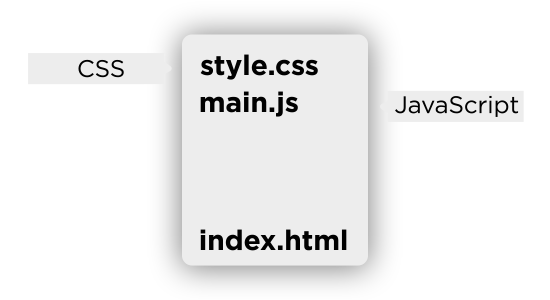
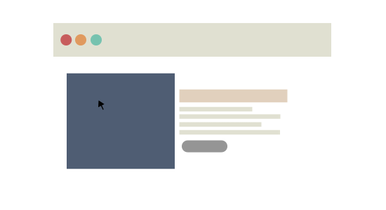
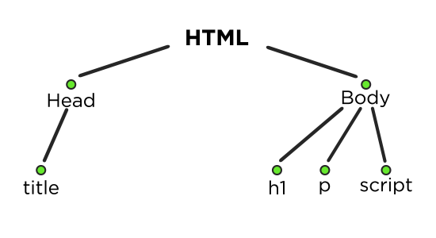
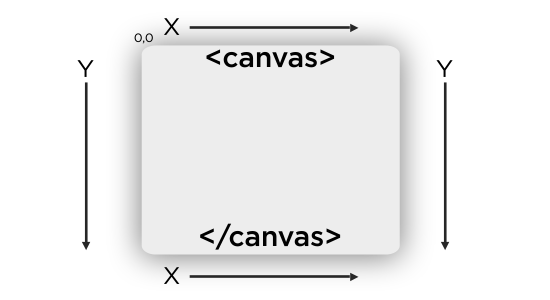

# Curso de Programación Básica

## Tabla de contenido
- [Breve introducción a JavaScript](#Breve-introducción-a-JavaScript)
- [¿Dónde se coloca el JavaScript?](#¿Dónde-se-coloca-el-JavaScript?)
- [Variables en JavaScript](#Variables-en-JavaScript)
- [Algunas notas](#Algunas-notas)
- [Condicionales](#Condicionales)
- [Estructura de control SWITCH](#Estructura-de-control-SWITCH)
- [Ciclos](#Ciclos)
    - [While](#While)
    - [Do While](#Do-While)
    - [For](#For)
    - [For (in)](#For-(in))
    - [For (of)](#For-(of))
- [Funciones](#Funciones)
    - [Algunas funciones del curso](#Algunas-funciones-del-curso)
- [Funciones Matemáticas en JavaScript (objeto .Math)](#Funciones-Matemáticas-en-JavaScript-(objeto-.Math))
    - [Funciones Matemáticas Aleatorias](#Funciones-Matemáticas-Aleatorias)
- [Eventos](#Eventos)
- [Los Objetos](#Los-Objetos)
- [Objetos y Clases](#Objetos-y-Clases)
    - [¿Cómo crear una clase?](#¿Cómo-crear-una-clase?)
    - [¿Cómo se le asignan atributos a una clase?](#¿Cómo-se-le-asignan-atributos-a-una-clase?)
    - [¿Cómo crear un objeto?](#¿Cómo-crear-un-objeto?)
    - [¿Cómo creo y uso una función dentro de la clase?](#¿Cómo-creo-y-uso-una-función-dentro-de-la-clase?)
- [Objetos Literales](#Objetos-Literales)
- [Arreglos](#Arreglos)
    - [¿En dónde se guardan los valores?](#¿En-dónde-se-guardan-los-valores?)
    - [¿Cómo colocar un valor en un arreglo en la última posición automáticamente?](#¿Cómo-colocar-un-valor-en-un-arreglo-en-la-última-posición-automáticamente?)
- [Arreglos Asociativos](#Arreglos-Asociativos)
- [Dibujando con Canvas](#Dibujando-con-Canvas)
- [Uso y carga de Imagen en Canvas](#Uso-y-carga-de-Imagen-en-Canvas)
- [Fizz Buzz](#Fizz-Buzz)
- [Modelo Cliente-Servidor](#Modelo-Cliente-Servidor)
- [Correr un servidor NodeJS con Express](#Correr-un-servidor-NodeJS-con-Express)

## Breve introducción a JavaScript
Es un lenguaje de programación con el cual se hace la interactividad en la web. Es implementado tanto en el FrontEnd como en el BackEnd.

HTML = No tiene interactividad. <br />
CSS = No tiene interactividad. <br />
JavaScript= Si tiene interactividad. <br />

En el HTML es donde se agregan todos los elementos pero por lo general de maneras separadas.

<div align="center">
    
    <small><p>Contenido general de un documento HTML.</p></small>
</div>

Una vez cargado los distintos el HTML, el CSS y el JS, el sitio procedería a verse de la forma deseada.

<div align="center">
    
    <small><p>Ejemplo de la vista de un sitio cargado.</p></small>
</div>

En el ejemplo anterior, en el HTML estaría toda la distribución de los elementos como tal. En el CSS estaría la manera en la que se muestra la página (visualmente) y en el JavaScript estaría la interactividad, como podrían ser las validaciones de un botón.

>**Nota Importante:** JavaScript no es Java. Java no es JavaScript. <br /><br />
JavasScript es un lenguaje de programación fuertemente tipado. Esto quiere decir que distingue entre mayúsculas y minúsculas. EX: MiNombre es diferente de minombre en JS.

<div align="right">
    <small>
        <a href="#tabla-de-contenido">
            🡡 volver al inicio
        </a>
    </small>
</div>

## ¿Dónde se coloca el JavaScript?
Los códigos JavaScript se colocan por lo general, dentro del archivo HTML y al final del body, usando la etiqueta `<script></script>` es decir:

```html
<body>
    <!--Empieza tu contenido HTML-->
    ...
    <!--Termina tu contenido HTML-->
    <!--Aquí va el JS-->
    <script type="text/javascript"></script>
</body>
```

<div align="right">
    <small>
        <a href="#tabla-de-contenido">
            🡡 volver al inicio
        </a>
    </small>
</div>

## Variables en JavaScript
Para declarar una variable se hace uso de la palabra reservada `var` seguida del nombre de la variable y (si aplica) el valor de la variable.

Por ejemplo:

```javascript
//Para número
var x = 1;

//Para texto
var y = "texto";
```

>Nota: Al hacer uso de las comillas bien sea en una variable o una función quiere decir que es un texto libre (string).

Algunos ejemplos de operaciones matemáticas con variables:

```javascript
//Ejemplo n°1
var x = 1;
var y = 2;
var z = x + y;

//El valor de z será de 3.
```

```javascript
//Ejemplo n°2
var x = "1";
var y = "2";
var z = x + y;

//El valor de z será de "12". Dónde el mismo será considerado texto o string y no un número.
```

Cabe destacar que en ambos ejemplos:

- `var` corresponde a la palabra reservada para declarar variables.
- `x,y,z` son los nombres de las variables.
- `=` es el operador lógico que asigna un valor.
- `1` o `"1"` corresponde al valor de la variable.

<div align="right">
    <small>
        <a href="#tabla-de-contenido">
            🡡 volver al inicio
        </a>
    </small>
</div>

## Algunas notas
- Obtener un elemento por #ID:
    ```javascript
    document.getElementById("id");
    ```
- Las funciones, variables al ser declaradas la primera letra de la palabra debe de ir en minúscula y la primera letra de la próxima palabra (si tiene) debe de ir en mayúsculas. `miFuncion` o también es válido `mi_funcion`.

- Las variables no pueden empezar con números.

- Las variables son fuertemente tipadas.

- Las variables que se mantendrán con el mismo valor en el tiempo deben de escribirse en MAYÚSCULAS.

- Se gasta menos memoria usando valores numéricos que textos en programación, aunque el uso es casi imperceptible.

- Agregar un hijo al body:
    ```javascript
    document.body.appendChild("variableQueAlmacenaElHijo");
    ```
- Las etiquetas HTML dentro de las funciones en general deben de ir dentro de strings o textos libres, EX:
    ```javascript
    alert("Hola <strong>" + variable + "</strong>");

    //o también

    alert("<strong>Hola</strong>");
    ```
- Los Nombres de los archivos deben de seguir las mismas reglas de las variables.

- Salto de línea en JavaScript: `\n`.

- `NaN` = Nom a Number. Es un error de JavaScript que ocurre cuando una variable vacía trata de utilizarse.

- Para extraer un texto de un `<input type=text />` es a través de:
    ```javascript
    variableDelInput.value
    ```
- Si se le agrega un "`!`" a una variable es como si se le colocara un "`!=`".

<div align="right">
    <small>
        <a href="#tabla-de-contenido">
            🡡 volver al inicio
        </a>
    </small>
</div>

## Condicionales

```javascript
//Si x = 1
if (x==1)
{
    //código a ejecutar
}

// o si x=2
else if (x==2)
{
    //código a ejecutar
}

//si X no tiene el valor de las opciones anteriores
else
{
    //código a ejecutar
}
```
<div align="right">
    <small>
        <a href="#tabla-de-contenido">
            🡡 volver al inicio
        </a>
    </small>
</div>

## Estructura de control SWITCH

El `switch` se usa para comparar cuando una variable o algo es igual a algún valor. Es decir, no se puede comparar si es >, <,<= o >=. Su estructura es la siguiente:

```javascript
switch (elementoQueCambia)
{
    case (tecla.ARRIBA)
        //bloque de código
    break;
    default
        //bloque de código
    break;
}
```
En el primer `case` lo que se está realizando es que cuando la variable "elementoQueCambia" tenga el valor de "tecla.ARRIBA" ejecute dicho bloque de código. El `default` se usa para cuando no cumple ninguna de las condiciones declaradas.

<div align="right">
    <small>
        <a href="#tabla-de-contenido">
            🡡 volver al inicio
        </a>
    </small>
</div>

## Ciclos

### While
```javascript
while(//condicióm)
{
    //código a ejecutar...
}
```

### Do While
```javascript
do
{
    //código a ejecutar...
}while(//condición)
```

### For
```javascript
for(//variable=0; condicion; iteraccion)
{
    //código a ejecutar...
}
```

### For (in)
```javascript
for(var p in imagen)
{
    //código a ejecutar...
}

//Con IN devuelvo el índice del arreglo "imagen".
```

### For (of)
```javascript
for(var p of imagen)
{
    //código a ejecutar...
}

//con OF devuelvo el contenido/objetos que tiene el arreglo "imagen".
```

Cabe destacar que los cilos `while` y `do while` tienen que llevar dentro del pedazo de código la iteración de la condición. Mientras que el ciclo `for` lo lleva al principio de la declaración.

<div align="right">
    <small>
        <a href="#tabla-de-contenido">
            🡡 volver al inicio
        </a>
    </small>
</div>

## Funciones
Son pedazos de código que se encapsulan en una "variable" cuyo nombre constituye el nombre de la función, el cual se usa para llamar y ejecutar dicho código más cómodamente las veces que sean necesarias. En todas las funciones cuando se invocan se les debe colocar paréntesis "( )".

Dicho de otra manera, son herramienta que permiten escribir código que se reutilizará varias veces donde lo único que cambiará son las variables. EX:

```javascript
//Declarar (crear) una función
function miFunction()
{
    //código a ejecutar
}

//declarar (crear) una función con parámetros
function miFuncionConParametros(valor_a, valor_b)
{
    //código a ejecutar
    x= valor_a + valor _b;
    z= x+3;
}

//Invocar (usar) función
miFuncion();

//Invocar (usar) función con parámetros
miFuncionConParametros(1,2);
```
>Nota: las funciones pueden estar ubicadas en cualquier parte del código. Es decir, al principio, al final, etc. Pero JavaScript busca funciones y las carga primero en la memoria y después ejecuta todo lo demás.

<div align="right">
    <small>
        <a href="#tabla-de-contenido">
            🡡 volver al inicio
        </a>
    </small>
</div>

### Algunas funciones del curso

- Escribir en el DOM con JavaScript:
    ```javascript
    document.write("Tu mensaje");
    ```
- Disparar alertas:
    ```javascript
    alert("Mensaje de la alerta");
    ```
- Disparar alertas concatenando:
    ```javascript
    alert("Mensaje de la alerta" + variable);
    ```
- Pedir datos al usuario:
    ```javascript
        prompt("Mensaje");

        //también se puede almacenar dicha función en una variable
        var x = prompt("Mensaje");
    ```
- Redondear números / transformar strings en números:
    ```javascript
    parseInt(variable);
    ```
- Colocar decimales a un número:
    ```javascript
    parseFloat(variable);
    ```
- Seleccionar cuantos decimales se quieren para una variable:
    ```javascript
    variable.toFixed(n);

    //Donde "n" corresponde a la cantidad de decimales que se requieren.
    ```
    >Nota: Al usarlo retorna el número como un string, entonces es recomendable su uso junto a `parseFloat`.

- El uso de `document.write("Valor")` es considerado una **mala** práctica. Además que si se tiene elementos en el DOM al ejecutarlo este los borra. Entonces se sustituye por `innerHTML` y se usa así:

    ```html
    <!-- Declaramos un ID en el elemento que tendrá el texto en el HTML-->
    <p id="texto"></p>
    ```
    ```javascript
    //Capturo en una variable de JS el elemento HTML
    var test = document.getElementById("texto");

    //El asigno un valor al elemento
    test.innerHTML="Hola";

    //Nota: Se puede concatenar a él mismo para cuando se quiera usar varias veces.
    ```

<div align="right">
    <small>
        <a href="#tabla-de-contenido">
            🡡 volver al inicio
        </a>
    </small>
</div>

## Funciones Matemáticas en JavaScript (objeto .Math)

### Redondear Números

Para redondear números hacia arriba:
```javascript
Math.ceil(a);
// donde "a" es la variable que contiene el número a redondear.
```

Para redondear números hacia abajo:
```javascript
Math.floor(b);
// donde "b" es la variable que contiene el número a redondear.
```

<div align="right">
    <small>
        <a href="#tabla-de-contenido">
            🡡 volver al inicio
        </a>
    </small>
</div>

### Funciones Matemáticas Aleatorias
JavaScript devuelve un número aleatorio entre 0.000~1 y 0.999~9. Esto lo hace porque trabaja en función de porcentaje de 0% y 100%. Se invoca de la siguiente manera:

```javascript
random = Math.random();
floor = Math.floor();

//Ecuación final para generar números aleatorios
floor(random*maxi-min+1)+min

//Donde:
//maxi -> Número mayor
//min -> Número menor
//random -> Math.random()
//floor -> Math.floor()
```

>Nota: Esta función puede devolver número repetidos.

**Importante** Si se quisiera devolver un valor que se produce en una función se usa `return` ejemplo:

```javascript
function aleatorio(min, max)
{
    var resultado;
    resultado = Math.floor(Math.randon()*(maxi-min+1))+min;
    return resultado;
}
```

Si no se hiciera uso del `return` no habría forma de usar el valor "resultado" fuera de dicha función, bien sea si dicha variable es declarada tanto como fuera o dentro de la función. También es importante recalcar que una función al encontrar un `return` para de ejecutarse.


<div align="right">
    <small>
        <a href="#tabla-de-contenido">
            🡡 volver al inicio
        </a>
    </small>
</div>

## Eventos
Los eventos son funciones que se ejecutan cuando una determina acción pasa. Por ejemplo, el evento clic del mouse, o al pulsar una tecla del teclado.

La estructura del código es la siguiente:

```javascript
//Estructura:
//elmento.cuandoPase("evento",funcionLlamada);

//Estructura con sintaxis de javascript
//variable.addEventListener("evento", funcion);

//estructura real
boton.addEventListener("clic", validarForm);
```
Cabe destacar que las variables que están dentro de las funciones quedan "vivas" **solo** dentro de las funciones.

Se puede usar JavaScript para detectar eventos del teclado y del mouse, respectivamente.

Para el teclado:
```javascript
///presionar tecla -> keydown
document.addEventListener("keydown", miFuncion);

//soltar tecla -> keyup
document.addEventListener("keyup", miFuncion);
```

>Nota: si se quiere identificar una tecla en específica, se usa el atributo `.keyCode` que es el valor interno que le asigna el sistema operativo a las teclas para identificarlas.

>Nota 2: Si se le pasa una variable a una función vacía, al momento de que dicha función se ejecute, esta mandará por dicha variable todos los detalles que se originan cuando ocurre. De esta manera es que se sacó el `.keyCode`.

<div align="right">
    <small>
        <a href="#tabla-de-contenido">
            🡡 volver al inicio
        </a>
    </small>
</div>

## Los Objetos
Son nombres especiales que dentro tienen funciones, atributos, variables, etc.

Los objetos pueden tener funciones, como por ejemplo:

```javascript
humano.comer("arroz");

//Donde:
//Objeto= humano
//Función = comer
//variable/parametro= arroz

//o también
document.write("Hola");
```
>Nota: Las funciones que son parte de un objeto son conocidas como **métodos**. Y las variables que son parte de un objeto es un **atributo**.

<div align="right">
    <small>
        <a href="#tabla-de-contenido">
            🡡 volver al inicio
        </a>
    </small>
</div>

Entre alguno de los objetos que posee un navegador están:

- `document`: Es todo el contenido que se ve a través del navegador. Es el que controla internamente donde están los formularios, los botones, las cajas de texto, etc.

    Del `document` nace el concepto del **DOM** que es de la programación web. Es la forma en el que el navegador organiza todo el HTML en una estructura especial la cual puede ser manipulada por JavaScript. Es el árbol de los elementos del HTML.

    <div align="center">
      
      <small><p>Ejemplo de la estructura del DOM.</p></small>
    </div>

- `window`: Son las pestañas del navegador.

- `navigator`: Es el navegador entero. El cual permite tener acceso no solo a él mismo, sino también a opciones del Sistema Operativo.

<div align="right">
    <small>
        <a href="#tabla-de-contenido">
            🡡 volver al inicio
        </a>
    </small>
</div>

## Objetos y Clases
Un objeto es la definición de una clase. Porque primero se crea una clase con todos los atributos vacios y cuando se crea el objeto se definen o se le agregan todos sus atributos finales.

Las clases se deben de crear cuando existen variables que tienen la misma estructura en sus atributos, por ejemplo:

**Nombre=**"Cauchin"; <br />
**Ataque=** 150; <br />
**Vida=** 80; <br />

**Nombre=**"Tocinauro"; <br />
**Ataque=** 120; <br />
**Vida=** 200; <br />

**Nombre=**"Pokacho"; <br />
**Ataque=** 50; <br />
**Vida=** 80; <br />

En las variables anteriores se puede notar que aunque son diferentes, siempre tienen la misma estructura de datos: Nombre, Ataque y Vida.

Es en estos casos cuando se recomienda crear una clase y generar objetos a raíz de ella para automatizar el proceso.

<div align="right">
    <small>
        <a href="#tabla-de-contenido">
            🡡 volver al inicio
        </a>
    </small>
</div>

### ¿Cómo crear una clase?
A través de las siguientes líneas:

```javascript
class Pakiman
{
    //atributos
}

//Donde "Pakiman" es el nombre de la clase
```
<div align="right">
    <small>
        <a href="#tabla-de-contenido">
            🡡 volver al inicio
        </a>
    </small>
</div>

### ¿Cómo se le asignan atributos a una clase?
Al momento que se creó un objeto usando la clase se dispara una función especial que debe tener todas las clases llamada `constructor` en la que se añadirán "los atributos base" del objeto.

>Nota: Se sobre entiende que todo lo que estará dentro de la clase será parte de una función por ende la palabra reservada "`function`" no se usa.

```javascript
class Pakiman
{
    constructor()
    {
        //atributos
    }
}
```

Entonces para añadir atributos a la clase se hace uso del "`this`" que es un indicador que apunta al objeto que se está creando en ese momento.

```javascript
class Pakiman
{
    constructor(n)
    {
        this.nombre = n;
        this.tipo = "Tierra";
    }
}
```

<div align="right">
    <small>
        <a href="#tabla-de-contenido">
            🡡 volver al inicio
        </a>
    </small>
</div>

### ¿Cómo crear un objeto?
De la siguiente manera:

```javascript
var pokacho = new Pakiman (parametro);

//donde "parametro" será los atributos que se le pasarán al constructor para que se le asignen al objeto.
```
<div align="right">
    <small>
        <a href="#tabla-de-contenido">
            🡡 volver al inicio
        </a>
    </small>
</div>

### ¿Cómo creo y uso una función dentro de la clase?

```javascript
//Creamos la clase
class Pakiman
{
    constructor(n)
    {
        this.name = n;
    }
    hablar(n)
    {
        alert("Mi nombre es "+ this.name);
    }
}

//creamos el objeto
var pokapoka = new Pakiman("PokaPoka");

//Usamos la función (previamente creado el objeto)
pokapoka.hablar();
```
<div align="right">
    <small>
        <a href="#tabla-de-contenido">
            🡡 volver al inicio
        </a>
    </small>
</div>

## Objetos Literales
Son variables que dentro tienen más variables. Se ejecutan de la siguiente manera:

```javascript
var teclas={
    ARRIBA: 38,
    ABAJO: 39 //El último no lleva ","
};

//para usar algún valor (en este caso el 39)
teclas.ABAJO;
```

<div align="right">
    <small>
        <a href="#tabla-de-contenido">
            🡡 volver al inicio
        </a>
    </small>
</div>

## Arreglos
Son variables que permiten almacenar varias variables dentro de ellas como si fueran cajas.

### ¿Cómo crear un arreglo?
De la siguiente manera:

```javascript
var nombreVariable = [];
```

<div align="right">
    <small>
        <a href="#tabla-de-contenido">
            🡡 volver al inicio
        </a>
    </small>
</div>

### ¿En dónde se guardan los valores?
Como se había mencionado anteriormente, se guardan en "cajas" que en realidad con `índices`. <br />

Por ejemplo:

```javascript
//Declaramos el arreglo
var arregloEjemplo = [];

//Declaramos un valor en el arreglo con ínidce 0 (Texto)
arregloEjemplo[0]= "Hola";

//Declaramos un valor en el arreglo con el ínidce 1 (número)
arregloEjemplo[1]= 123;

//mostramos todo el contenido llamando al arreglo
arregloEjemplo;

//Mostramos el contenido del texto
arregloEjemplo[0];
```
>Nota: se pueden almacenar objetos dentro de un arreglo.

<div align="right">
    <small>
        <a href="#tabla-de-contenido">
            🡡 volver al inicio
        </a>
    </small>
</div>

### ¿Cómo colocar un valor en un arreglo en la última posición automáticamente?
Usando el método `push` de la siguiente manera:

```javascript
arregloEjemplo.push("Nuevo valor");

//Es posible almacenar objetos en un arreglo:
personajes.push(new Pakiman ("Poka", 80, 50));
```
> Nota: No funciona con arreglos asociativos.

<div align="right">
    <small>
        <a href="#tabla-de-contenido">
            🡡 volver al inicio
        </a>
    </small>
</div>

## Arreglos Asociativos
Son un tipo de arreglo cuyo índice no viene en números si no en texto. Se crean de la siguiente manera:

```javascript
//creamos un arreglo
var imagen=[];

//declaramos en el índice el texto por el cual llamaremos los valores del arreglo
//Primer Valor
var imagen["pokacho"]="img/poka.jpg";

//Segundo valor
var imagen["toci"]="img/vaca.png";

//Notese que en los índices no van números sino textos

//Invocamos el primer valor declarado
imagen.pokacho;
```
<div align="right">
    <small>
        <a href="#tabla-de-contenido">
            🡡 volver al inicio
        </a>
    </small>
</div>

## Dibujando con Canvas
En HTML la etiqueta de dibujo se llama `<canvas></canvas>`, la cual es manipulada por JavaScript.

Son dibujadas a partir de coordenadas en "X" y "Y" y siempre con números positivo, donde las esquinas superiores izquierdas es el punto (0,0).

<div align="center">
    
    <small><p>Ejemplo de la estructura del DOM.</p></small>
</div>

<div align="right">
    <small>
        <a href="#tabla-de-contenido">
            🡡 volver al inicio
        </a>
    </small>
</div>

## Uso y carga de Imagen en Canvas

Cuando javaScript va a cargar un archivo bien sea desde el HDD o el internet, se dispara un evento de carga (`load`) que tarda un tiempo X para poder mostrar la imagen (El tiempo que tarda JavaScript en encontrar la imagen).

Teniendo esto en cuenta, Canvas dibuja un objeto y luego dibuja el otro encima pero no en el orden en el que se escribió en el código sino en el que cargue primero.

Para importar imágenes a un canvas, previamente creado en el lado del HTML se procede a hacer lo siguiente:

1. Crear el canvas del lado del HTML y darle un ID:
    ```html
    <canvas id="dibujo" height="300" width="300"></canvas>
    ```

2. Colocar el ID dentro de una variable en el JavaScript y luego esa misma variable usarla para darle el contexto "2d".
    ```javascript
    //colocamos el ID dentro de una variable
    var elemento = document.getElementById("dibujo");
    //asignamos el contexto 2d
    var lienzo = elemento.getContext("2d");
    ```

3. Se repite lo siguiente para cada imagen: Se crea un objeto literal para representar la imagen en el código con la ruta de la imagen y el nombre de archivo y una función para representar cuando ya esté cargada:
    ```javascript
    var fondo={
        url: "img/tile.png",
        cargaOk: false
    };
    ```

4. A través de JavaScript se crea una etiqueta `</img>` usando el objeto literal anterior y agregándole un nuevo atributo, por ejemplo:
    ```javascript
    fondo.imagen= new Image();
    ```

5. Se le indica la ruta de la imagen (que se declaro previamente en el objeto literal) con:
    ```javascript
    fondo.imagen.src = fondo.url();
    ```

6. Se agrega un "escuchador de eventos" para cuando la imagen cargue en el evento `load`:
    ```javascript
    fondo.imagen.addEventListener("load", cargarFondo);
    ```

7. Se crea la función que se usa en el escuchador de eventos (paso anterior):
    ```javascript
    function cargarFondo()
    {
        fondo.cargaOk = true;
    }

8. Invocar la función que dibuja:
    ```javascript
    if(fondo.cargaOk==true)
    {
        canvas.drawImage(fondo.imagen, X, Y);
    }

    //Donde X será sustituido por el valor numérico de la posicion en X
    //DOnde Y será sustituido por el valor numérico de la posicion de Y
    ```

9. Repetir el proceso desde el paso 3 por cada imagen.

<div align="right">
    <small>
        <a href="#tabla-de-contenido">
            🡡 volver al inicio
        </a>
    </small>
</div>

## Fizz Buzz
Trata de lo siguiente:

*Escribe los números del 1 al 100 y si el número es múltiplo de 3 escribe "Fizz". Si el Número es mútilplo de 5 escribe "Buzz" y si es múltiplo de 3 y 5 escribe "FizzBuzz".*

Este ejercicio se implementa para saber si se conoce acerca de ciclos, condiciones, condiciones anidadas y sobre como extraer el residuo de una división. El cual se obtiene con JavaScript a través del módulo representado por "`%`" de la siguiente manera: 8%5=3.

<div align="center">
    
    <small><p>Identificar el módulo.</p></small>
</div>

>Nota: Cuando se divide un número entre 2 y se módulo es 0 es par.

<div align="right">
    <small>
        <a href="#tabla-de-contenido">
            🡡 volver al inicio
        </a>
    </small>
</div>

## Modelo Cliente-Servidor

### ¿Qué es el cliente?
Es el navegador, el cual abre un archivo HTML e invoca otros tipos de archivos (CSS, JS, etc.).

### ¿Qué es el servidor?
Es el software sobre el que se ejecuta el backend. Los más populares son: nginx, apache y node. Además de gestionar los puertos por donde mandará la información de la página web al cliente (por defecto es el puerto 80).

### ¿Cómo correr JavaScript del lado del servidor?
A través de NodeJS, que es una tecnología que permite correr JavaScript del lado del servidor a través de un servidor de eventos.

### ¿Qué métodos hay para conectarse del Frontend al Backend?
Entre los más populares están:

- **get**: Es el que transmite datos por parámetros de la URL. Ejemplo: www.tienda.com/producto?marca=xxx
    >Nota: get al mostrar las variables que envía en la URL **JAMÁS** debe ser usado para un login o formulario que maneje datos sensibles.

- **post**: Permite enviar los datos de un formulario y cambiar la URL dependiendo de lo que se necesite mostrar pero sin mostrar los datos que envía en la URL. Estos son enviados a través de los headers http.

- **AJAX** (Asincronus JavaScript And Xml): Permite el envío y recepción de datos en tiempo real y sin refrescar la página. Es de Microsoft y se lo inventó con Internet Explorer 6.

<div align="right">
    <small>
        <a href="#tabla-de-contenido">
            🡡 volver al inicio
        </a>
    </small>
</div>

## Correr un servidor NodeJS con Express
Se deben de seguir los siguientes pasos:

1. Descargar e instalar <a href="#">NodeJS</a>.

2. Verificamos que NodeJS se instaló correctamente ejecutando en la terminal:
    ```bash
    node -v
    ```

3. Con la terminal nos ubicamos en la carpeta del proyecto.

4. Instalamos Express desde la terminal ejecutando:
    ```bash
    npm install express
    ```
    >Nota: Es buena práctica instalar el Express solo en la versión del proyecto y no de forma global. Esto por si cambia algún feature que necesitábamos en otro proyecto.
    > Para entrar en Node en la terminal se usa el comando `node` y listo. Para salir se presiona 2 veces Ctrl + C.

5. Creamos un archivo JavaScript con cualquier nombre (en este caso lo llamaremos servidor.js) y con el siguiente contenido:
    ```javascript
    //Creamos una variable usando la opción "require" la cual no existe en JavaScript por defecto que se ejecuta en el Frontend pero si en el Backend con NodeJS. Es una función especial que busca los frameworks o liberias instaladas con "npm install" y las guarda en una variable.
    var express = require ("Express");

    //Se crea una aplicación y en ella se va a crear una instancia de la librería Express. (OJO: Express no es una clase).
    var aplicacion = express();

    //Se usa el método get como si fuera una manejador de eventos que al estar en el home ("/") llama a la función "inicio".
    aplicacion.get("/",inicio);

    //Creamos la función que nos permitirá ir a algún sitio o mostrar algo en pantalla, donde petición es "req" y respuesta es "res"
    function inicio(peticion, respuesta)
    {
        respuesta.send("Hola mundo");
    }

    //Se pone a correr el servidor en el puerto deseado.
    aplicacion.listen(8989);
    ```
6. A través de la consola activamos NodeJS con el archivo anteriormente creado (servidor.js) con:
    ```bash
    node servidor.js
    ```

7. Vamos al home de la red (127.0.0.1: Puerto Seleccionado).
    >Nota: En un esquema de Redes la dirección IP que siempre apunta mí PC por defecto es: 127.0.0.1:Puerto.

<div align="right">
    <small>
        <a href="#tabla-de-contenido">
            🡡 volver al inicio
        </a>
    </small>
</div>


