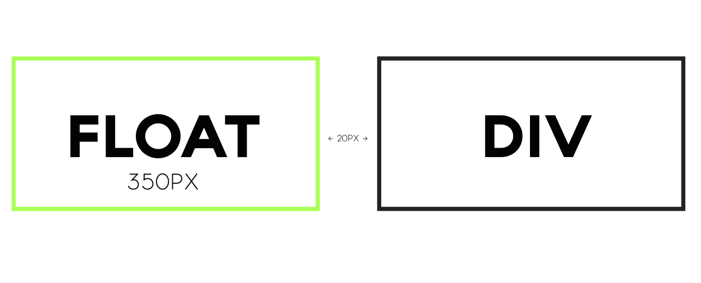
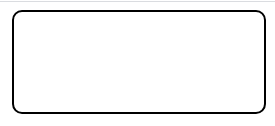
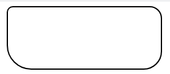

# Curso de Desarrollo Web Online

## Tabla de contenido
- [Etiqueta de ancla <a></a>](#Etiqueta-de-ancla)
- [Etiqueta <!DOCTYPE>](#Etiqueta-<!DOCTYPE>)
- [Algunas etiquetas semánticas](#Algunas-etiquetas-semánticas)
    - [Las cabeceras](#Las-cabeceras)
    - [Las secciones](#Las-secciones)
    - [Las figuras](#Las-figuras)
    - [Barra de navegación](#Barra-de-navegación)
- [Etiquetas para títulos](#Etiqueta-para-títulos)
    - [Título principal](#Título-principal)
    - [Título secundario](#Título-secundario)
    - [Título de menor importancia](#Título-de-menor-importancia)
    - [Ejemplo del uso de las etiquetas para títulos](#Ejemplo-del-uso-de-las-etiquetas-para-títulos)
- [Para artículos o contenido específico](#Para-artículos-o-contenido-específico)
- [Manejo de rutas](#Manejo-de-rutas)
    - [Absolutas](#Absolutas)
    - [Relativas](#Relativas)
- [¿Cómo dar estilos a nuestro HTML?](#¿Cómo-dar-estilos-a-nuestro-HTML?)
    - [Estilos en línea](#Estilos-en-línea)
    - [Estilos a través de la etiqueta "style"](#Estilos-a-través-de-la-etiqueta-"style")
    - [Estilos externos](#Estilos-externos)
- [¿Cómo usar una fuente diferente?](#¿Cómo-usar-una-fuente-diferente?)
- [Tipos de Displays](#Tipos-de-Displays)
    - [inline](#inline)
    - [block](#block)
    - [inline-block](#inline-block)
- [Rompiendo el Modelo de Caja](#Rompiendo-el-Modelo-de-Caja)
    - [Elementos flotantes](#Elementos-flotantes)
    - [Posiciones (position)](#Posiciones-(position))
- [Redondear Bordes](#Redondear-Bordes)
    - [Todos los bordes](#Todos-los-bordes)
    - [Bordes individuales](#Bordes-individuales)
- [Tipos de Anclas](#Tipos-de-anclas)
    - [Ancla para llamadas (teléfonos)](#Ancla-para-llamadas-(teléfonos))
    - [Ancla para correos](#Ancla-para-correos)
- [Elementos de un Formulario](#Elementos-de-un-formulario)
- [Tablas](#Tablas)
- [Hovers](#Hovers)
- [Transiciones](#Transiciones)
- [Algunas propiedades CSS](#Algunas-propiedades-CSS)
- [Notas de Animaciones](#Notas-de-Animaciones)
- [Datos útiles](#Datos-útiles)

## Etiqueta de ancla
Es una etiqueta que nos permite enlazar otras páginas de nuestro sitio web a la página actual. Su sintaxis en la siguiente:
```html
<a href="#" target="_blank">Texto</a>
<!--
Dónde:
href=""  corresponde a la propiedad donde la url de la página destino.
target="_blank" junto con el valor "_blank" corresponde a la forma en que se abrirá en link, en este caso en una nueva pestaña. Si queremos que se abra en la misma pestaña debemos quitar toda la propiedad "target".
-->
```
<div align="right">
    <small>
        <a href="#tabla-de-contenido">
            🡡 volver al inicio
        </a>
    </small>
</div>

## Etiqueta <!DOCTYPE>
La cual sirve para decirle a nuestro navegador que el archivo que se está visualizando en ese momento y que contenga dicha etiqueta es un documento .html (valga la redundancia). Su sintaxis es la siguiente:
```html
<!DOCTYPE html>
```
>**Nota:** Esta etiqueta debe ir siempre al principio (en la primera línea de todo documento .html).
<div align="right">
    <small>
        <a href="#tabla-de-contenido">
            🡡 volver al inicio
        </a>
    </small>
</div>

## Algunas etiquetas semánticas
Anteriormente, se usaba "div" para estructurar todo el sitio web, sin embargo con esta etiqueta era imposible para el navegador saber a qué parte de la página correspondía dicha etiqueta, por esta razón con el tiempo fueron creadas etiquetas que le permitieron al navegador saber de mejor manera a qué parte de la página corresponden, tal es el caso de:


### Las cabeceras
Tal es el caso del `<header></header>` la cual se usa para englobar los elementos que irán en la cabecera del sitio, como podrían ser el menú y el logotipo. Su sintaxis es la siguiente:
```html
<header>
    <!-- Contenido -->
</header>
```
<div align="right">
    <small>
        <a href="#tabla-de-contenido">
            🡡 volver al inicio
        </a>
    </small>
</div>

### Las secciones
Se usa para delimitar secciones genéricas del sitio web. Es decir para como para delimitar un área en específico para un contenido semánticamente hablando.
```html
<section>
    <!-- contenido -->
</section>
```
<div align="right">
    <small>
        <a href="#tabla-de-contenido">
            🡡 volver al inicio
        </a>
    </small>
</div>

### Las figuras
Se utiliza para envolver un medio, por ejemplo: imágenes, tablas, videos, fragmentos de código y citas. Es parte del nuevo estándar HTML5 y generalmente se usa con un `<figcaption></figcaption>` para indicarle la descripción del medio.

El valor semántico de un figure es para indicarle a un navegador que dicha imagen tiene que ver con el articulo donde está. EX:
```html
<!-- Para gráficos -->
<figure>
    
</figure>

<!-- Para imágenes -->
<figure>
    
    <figcaption>Descripción del lago</figcaption>
</figure>

<!-- Para citas -->
<figure>
    <p>Cita</p>
    <figcaption>Texto referente a la cita</figcaption>
</figure>
```
<div align="right">
    <small>
        <a href="#tabla-de-contenido">
            🡡 volver al inicio
        </a>
    </small>
</div>

### Barra de navegación
Corresponde a una etiqueta usada para englobar los menús o barras de navegación de una página. Su sintaxis en la siguiente:

```html
<nav>
    <!-- elementos del menú -->
</nav>
```
<div align="right">
    <small>
        <a href="#tabla-de-contenido">
            🡡 volver al inicio
        </a>
    </small>
</div>

## Etiqueta para títulos
Para identificar los títulos existen 6 tipos diferentes de etiquetas (h1,h2,h3,h4,h5.h6) sin embargo los más utilizados son:
el h1 y h2.

### Título principal
Corresponde al texto principal de la página web donde se hace uso. Hay que tener cuidado en su implementación dado que solo debe ser usado 1 vez por página. Y como tips para el SEO: Debe estar escrito en el HTML lo más arriba del documento posible y no debe contener enlaces. Su sintaxis es la siguiente:

```html
<h1>Título principal</h1>
```
<div align="right">
    <small>
        <a href="#tabla-de-contenido">
            🡡 volver al inicio
        </a>
    </small>
</div>

### Título secundario
Son los empleados generalmente para los títulos de las secciones de una página, por ejemplo: "contacto", "productos", "noticias", etc. Su sintaxis es la siguiente:

```html
<h2>Título secundario</h2>
```
>Nota: Si bien no existe una cantidad límite para su uso, se recomienda un rango de 2 a 8.

<div align="right">
    <small>
        <a href="#tabla-de-contenido">
            🡡 volver al inicio
        </a>
    </small>
</div>

### Títulos de menor importancia
Se usa para contenido de menor importancia como un sub-apartado, por ejemplo un título dentro de un `<h2></h2>`. Su sintaxis es la siguiente:

```html
<h3>Otros títulos</h3>
```

<div align="right">
    <small>
        <a href="#tabla-de-contenido">
            🡡 volver al inicio
        </a>
    </small>
</div>

### Ejemplo del uso de las etiquetas para títulos
```html
<h1>Como ser un experto SEO</h1>
    <h2>Conocimientos necesarios</h2>
        <p>párrafo</p>
        <p>párrafo</p>
        <h3>Programación</h3>
            <p>párrafo</p>
            <p>párrafo</p>
            <p>párrafo</p>
    <h2>Cursos</h2>
```
>Nota: En algunas etiquetas de este ejemplo no sería absolutamente necesaria la identación exactamente igual a la mostrada. Sin embargo de esta manera se muestra mejor los niveles de los títulos.
<div align="right">
    <small>
        <a href="#tabla-de-contenido">
            🡡 volver al inicio
        </a>
    </small>
</div>

## Para artículos o contenido específico
Se usa la etiqueta `<article></article>` cuando un bloque tiene una descripción, contenido, features independientes o diferentes. Como podrían ser las tarjetas de un producto o las entradas de un blog (artículos/post). Su sintaxis es la siguiente:

```html
<article>
    <!-- Contenido -->
</article>
```

<div align="right">
    <small>
        <a href="#tabla-de-contenido">
            🡡 volver al inicio
        </a>
    </small>
</div>

## Manejo de Rutas
Las rutas pueden ser de dos tipos:

### Absolutas
Son las que provee una URL que no cambiará o que siempre será la misma. EX: www.dominio.com/img/logo.png

### Relativas
Parten de donde está el documento y de ahí busca la ruta. EX: img/logo.png

<div align="right">
    <small>
        <a href="#tabla-de-contenido">
            🡡 volver al inicio
        </a>
    </small>
</div>

## ¿Cómo dar estilos a nuestro HTML?
Existen tres formas diferentes de dar estilos a nuestro HTML:

### Estilos en línea
Los cuales consisten en darle estilos a una etiqueta HTML por medio del atributo "style" de la siguiente manera:
```html
<section style="width:100%; height:100%">
    <!-- Contenido -->
</section>
```
<div align="right">
    <small>
        <a href="#tabla-de-contenido">
            🡡 volver al inicio
        </a>
    </small>
</div>

### Estilos a través de la etiqueta "style"
Los cuales a su vez son ubicados dentro de la etiqueta `<head></head>`.
```html
<!DOCTYPE html>
<html>
    <head>
    <title>Titulo de la página</title>

    <style>
        /*Estilos*/
    </style>
    </head>
    <!-- resto del html... -->
```
<div align="right">
    <small>
        <a href="#tabla-de-contenido">
            🡡 volver al inicio
        </a>
    </small>
</div>

### Estilos externos
Los cuales hacen uso de una etiqueta `<link></link>` junto a la ruta donde se encuentran dichos estilos. EX:

```html
<link rel="stylesheet" href="css/styles.css">
<!--
Donde:
rel="stylesheet" indicamos que tiene relacion con hojas de estilos.
href="" indicamos la ruta donde se encuentra dicha hoja de estilos.
 -->
```

<div align="right">
    <small>
        <a href="#tabla-de-contenido">
            🡡 volver al inicio
        </a>
    </small>
</div>

## ¿Cómo usar una fuente diferente?
A través de CSS podemos configurar cuál tipo de fuente usará nuestra página web o elementos a través de la propiedad "font-family". EX:

```css
body
{
    /* font-family: "nombreFuente" funentePorDefecto; */
    font-family: "Roboto", system-ui;
}
```
<div align="right">
    <small>
        <a href="#tabla-de-contenido">
            🡡 volver al inicio
        </a>
    </small>
</div>

## Tipos de Displays
Así como los elementos reciben un tamaño de fuente, un color o una tipografía. Estos también reciben una disposición o forma en la que se muestran en pantalla (display). Existen varios tipos:

<div align="right">
    <small>
        <a href="#tabla-de-contenido">
            🡡 volver al inicio
        </a>
    </small>
</div>

### inline
Son aquellos elementos que son capaces de posicionarse en línea, es decir uno al lado del otro de manera horizontal (siempre y cuando todos sean inline). Entre los elementos HTML que poseen dicho display están:

- Los img (imágenes)
- Los a (anclas)
- Los span (contenedores de textos)
- Los strong (negritas)
- Los em (cursivas)

Si se requiere declarar a un elemento con dicho display se hace de la siguiente manera:
```css
.elemento
{
    display: inline;
}
```
<div align="right">
    <small>
        <a href="#tabla-de-contenido">
            🡡 volver al inicio
        </a>
    </small>
</div>

### block
Son aquellos elementos incapaces de posicionarse uno al lado del otro porque ocupan todo el ancho disponible a sus costados. Entre ellos están:

- Los figure (contenedores multimedia)
- Los nav (contenedor de menús)
- Los header (contenedores de cabeceras)
- Los ul/ol (listas)

Si se requiere declarar a un elemento con dicho display se hace de la siguiente manera:

```css
.elemento
{
    display: block;
}
```
<div align="right">
    <small>
        <a href="#tabla-de-contenido">
            🡡 volver al inicio
        </a>
    </small>
</div>

### inline-block
Es una mezcla entre los dos display anteriores, el cual permite colocar los elementos uno al lado del otro de forma horizontal pero dotándolos de propiedades de block como lo son: bordes, paddings, márgenes, etc. Entre los elementos más comunes que lo poseen están:

- los button (los botones)

Si se requiere declarar a un elemento con dicho display se hace de la siguiente manera:
```css
.elemento
{
    display: inline-block;
}
```
<div align="right">
    <small>
        <a href="#tabla-de-contenido">
            🡡 volver al inicio
        </a>
    </small>
</div>

## Rompiendo el Modelo de Caja

### Elementos flotantes
Es una propiedad que permite que los elementos reciban una característica de quedar "flotando" a la derecha o a la izquierda. Siendo la sintaxis:

```css
.izquierda
{
    float: left;
}

.derecha
{
    float: right;
}
```

Por defecto ningún elemento HTML lo tiene asignado. Al usar dicha propiedad (`float`) sobre una distribución de más de 2 columnas es recomendable que la columna que no tenga el float este dentro de un "contenedor" para darle estilos y no romper la estructura.

Al flotar elementos y hacer que se posicionen en líneas, si se requiere aplicar un margen a un contenedor que tenga el elemento `float` al lado, el margen debe ser calculado teniendo en cuenta:

    margin: anchoDelElementoFloat + margenDeseado;

<div align="center">
    
    <small><p>margin-left: 370px</p></small>
</div>

Al colocar dicho margen en el ejemplo anterior el elemento "flotante" dejará de estar encima del div, y se posicionará en el lado derecho del mismo.

<div align="right">
    <small>
        <a href="#tabla-de-contenido">
            🡡 volver al inicio
        </a>
    </small>
</div>

### Posiciones (position)
Es una propiedad que permite que el elemento que la contiene pueda ser ubicarlo donde se requiera sin importar su flujo en el HTML. Entre los valores por defecto de esta propiedad están:

    Relative | Absolute | Fixed

Al hacer uso de estas propiedades podemos usar:

    Top | Left | Right | Bottom | z-index

`position: absolute`
Hace que el elemento que la recibe se vaya al próximo elemento posicionado (es decir, que sea absolute, fixed o relative) más cercano como su padre y a partir de ahí empieza a posicionarse con los valores que se le asigne a las propiedades `top`, `left`, `right`, `bottom`, `z-index`.

>Nota: Este position, rompe la maquetación si no encuentra un elemento con el cual posicionarse. Y hace que el ancho del elemento sea determinado por su contenido.

`position: fixed`
Hace que el elemento se quede "pegado" en la pantalla en la posición donde se configure con las propiedades `top`, `left`, `right`, `bottom`, `z-index`. Su posición es relativa a la del `body` sin importar si tiene padres absolute o relative.

`position: relative`
Se usa para mover un elemento a cualquier lugar a nuestro antojo. En relación a su posición inicial es decir, si se mueve se conservará su espacio en el flujo del HTML (al usar % se calcula en base al padre que lo contiene). Cabe destacar que para que se pueda usar la propiedad `top` es necesario que el padre tenga una altura declarada.

Se usa como padre de un absolute para que su hijo (el absolute) lo podamos mover a nuestro gusto.

<div align="right">
    <small>
        <a href="#tabla-de-contenido">
            🡡 volver al inicio
        </a>
    </small>
</div>

## Redondear Bordes
Es posible a través de `border-radius`. Se usa de la siguiente manera:

### Todos los bordes
```css
/*Para todos los bordes*/

.elementoConBordes
{
    border-radius: 10px;
}
```
<div align="center">
    
    <small><p>Rectángulo con todos los bordes redondeados a 10px.</p></small>
</div>

<div align="right">
    <small>
        <a href="#tabla-de-contenido">
            🡡 volver al inicio
        </a>
    </small>
</div>

### Bordes individuales
```css
/* Bordes individuales (1 por 1)*/

.elementoConBordes
{
    border-radius: 10px 20px 30px 40px;
    /* Dónde:
        10px -> esquina superior izquierda
        20px -> esquina superior derecha
        30px-> esquina inferior derecha
        40 -> esquina superior izquierda

        Nota: Se desplaza en sentido de las agujas del reloj.
    */
}
```
<div align="center">
    
    <small><p>Rectángulo con los bordes redondeados.</p></small>
</div>

<div align="right">
    <small>
        <a href="#tabla-de-contenido">
            🡡 volver al inicio
        </a>
    </small>
</div>

## Tipos de anclas

Se puede hacer uso en HTML de la etiqueta `<a></a>` para enlazar datos de manera más fácil. Sin embargo, no solo se pueden enlazar páginas web sino también:

### Ancla para llamadas (teléfonos)
```html
<a href="tel:+XXXXXXXXX">Llámame</a>

<!--
    Dónde:
    +XXXXXXXXX: Corresponde al número de teléfono con el código del país.
    Llámame: Es el texto con el cual se mostrará el link.
-->
```

### Ancla para correos
```html
<a href="mailto:xxx@correo.com">Enviar correo</a>

<!--
    Dónde:
    xxx@correo.com: Corresponde al correo al cual enviaremos el mensaje
    Enviar correo: Es el texto con el cual mostrará el link.
-->
```

<div align="right">
    <small>
        <a href="#tabla-de-contenido">
            🡡 volver al inicio
        </a>
    </small>
</div>

## Elementos de un Formulario
- A la hora de realizar un formulario debe englobarse en la etiqueta HTML de formularios: `<form>  </form>`.

- Para introducir texto se usa: `<input type="text" />`

- Para introducir correos se usa: `<input type="email" />`

- Si se requiere que un campo sea obligatorio y no permita continuar si no contiene dicho dato, se usa el atributo "required". EX: `<input type="email" required />`

- Si se requiere un texto que sirva de ejemplo, es decir, que no sea seleccionable ni editable, se usa el atributo "placeholder". EX: `<input type="text" placeholder="Ingresa tu nombre" />`

- Si se necesita un texto por defecto dentro de un campo se puede usar el atributo "value". EX: `<input type="text" value="Soy un texto de ejemplo">`
>**Nota:** El atributo **value** NO es un placeholder. Es un texto seleccionable y editable que no se "borra" al hacer clic encima del input.

- Para verificar los campos que se envían al servidor se usa el atributo "name". EX: `<input type="email" name="correo" />`

- Si se requiere acompañar el campo con un texto, se hace uso de la etiqueta "label" junto con el input deseado. EX:
```html
<label>Ingrese su correo</label>
<input type="email" />
```

- Si se requiere dar **usabilidad** a la etiqueta "label" para cuando al hacer clic en ella se seleccione automáticamente un input en específico se debe agregar los siguientes atributos:

```html
<label for="vinculo">Correo:</label>
<input type="email" id="vinculo" />

<!--
    En resumen para darle usabilidad a la etiqueta LABEL se debe colocar un ID al input, luego dicho nombre de ID se coloca en el atributo FOR de la etiqueta LABEL.

    O se puede colocar el input DENTRO de la etiqueta label sin la necesidad de darle un ID o usar el FOR.
-->
```

- Opción de selección simple (checkradio)
```html
<label for="hombre">
    <input type="radio" id="hombre" name="sexo" />Hombre
</label>
<label for="mujer">
    <input type="radio" id="mujer" name="sexo" />Mujer
</label>

<!--
    Nótese que se está usando el type="radio" correspondientes a los checkradios junto con el atributo "name" el cual si todas las opciones de la selección simple corresponden a la misma cualidad (en el ejemplo anterior al género) entonces debe ser el mismo por cada opción.

    El atributo name es la característica que identifica el tipo de dato mandado al backend en este caso enviaría "sexo hombre" o "sexo mujer".
-->
```

- Selección múltiple (checkbox)
```html
<label for="otros">
    <input type="checkbox" id="otros" name="intereses" value="otros" />
    Otros
</label>

<!--
    Con el VALUE le asignamos un valor al elemento seleccionado. Entonces en el caso anterior se estaría enviando:

    name= "intereses"
    value= "otros"

    Dónde de haber más opciones correspondientes a la misma selección (es decir, a "intereses") lo que cambiaria al agregar los inputs seria el value.
-->
```

- Para textos que sean muy extensos o largos se hace uso de la siguiente etiqueta:
```html
<label for="comentarios">Comentarios</label>
<textarea id="comentarios" name="comentarios" cols="30" rows="10"></textarea>

<!--
    Dónde:
    COLS es la cantidad de columnas predeterminadas.
    ROWS cantidad de filas predeterminadas.
-->
```

- Para enviar datos en un formulario se hace uso de un botón del tipo "submit". Dicho botón tiene la peculiaridad de que si no se declara el atributo "value", este tomará automáticamente el texto "enviar" o "submit" dependiendo del idioma del sistema operativo donde se vea.

```html
<input type="submit" value="A darle!" />
```

<div align="right">
    <small>
        <a href="#tabla-de-contenido">
            🡡 volver al inicio
        </a>
    </small>
</div>

## Tablas
Se crean de la siguiente manera:

```html
<table>
    <thead>
        <tr>
            <th>Encabezado / Título</th>
        </tr>
    </thead>
    <tbody>
        <tr>
            <td>Contenido</td>
        </tr>
    </tbody>
</table>
```
Por defecto al darle bordes con CSS a todo los elementos (table, th, td) estos se pondrán dobles. Para corregir esto se usa el siguiente atributo:

```css
table
{
    border-collapse: collapse;
}
```

<div align="right">
    <small>
        <a href="#tabla-de-contenido">
            🡡 volver al inicio
        </a>
    </small>
</div>

## Hovers
La pseudo clase Hover sirve para hacer cambios a un elemento cuando el puntero del mouse está sobre él. Sin embargo al hacer hover en un elemento, esto puedo afectar a otros elementos dentro.

Se hace de la siguiente manera:

- Afectar al elemento hover en sí:
```css
.elemento:hover
{
    /*estilos...*/
}
```

- Afectar a otros elementos al hacer hover:
```css
.elemento:hover .otro
{
    /*estilos...*/
}
```
>Nota: En este caso cuando a través de un hover se quiere afectar a "otro", "otro" debe estar contenido/dentro de "elemento". Si se quiere afectar a un componente que este fuera de "elemento" se debe hacer mediante JS.

<div align="right">
    <small>
        <a href="#tabla-de-contenido">
            🡡 volver al inicio
        </a>
    </small>
</div>

## Transiciones
Es una propiedad de CSS que permite hacer cambios visuales a los elementos. Solo es posible aplicar transiciones a los atributos que son numéricos. EX: padding, margin, etc.

Se usa de la siguiente manera:

```css
/*Forma corta*/
.animado
{
    /*duración, aceleración atributo*/
    transition: .3s ease opacity;
}

/*Forma larga*/
.animadoB
{
    transition-duration: .3s;
    transition-timing-function: ease;
    transition-property: opacity;
}
```

<div align="right">
    <small>
        <a href="#tabla-de-contenido">
            🡡 volver al inicio
        </a>
    </small>
</div>

## Algunas propiedades CSS

- Centrar verticalmente
```css
.elemento
{
    vertical-align: middle;
}
```

- Generar sombras
```css
.elemento
{
    /* box-shadow: donde está la sombra, posX, posY, Difuminado, Color; */
    box-shadow: inset, 0, 5px, 0, red;

    /*NOTA: Las sombras NO forman parte del Modelo de Caja*/
}
```

- Notas del 2° desafío: Al colocar elemento con `position: absolute` estos se van apilando en capas uno encima de otro en el orden el que están declarados en css sin la necesidad de usar z-index.

<div align="right">
    <small>
        <a href="#tabla-de-contenido">
            🡡 volver al inicio
        </a>
    </small>
</div>

## Notas de Animaciones
Para implementar animaciones hay que:

1. Declarar la animación en el elemento que la tendrá de la siguiente manera:
```css
    .animado
    {
        /*animation: tiempo nombreAnimacion repetir*/
        animation: .3s ejemplo infinite;
    }
```

2. Se crea la animación con:
```css
@keyframes ejemplo
{
    /*configuración...*/
}
```

3. Se establecen los estados que tendrá la animación
```css
@keyframes ejemplo
{
    0%
    {
        /*configuración...*/
    }
    50%
    {
        /*configuración...*/
    }
    100%
    {
        /*configuración...*/
    }
}

/*Para animaciones que solo tienen dos estados se puede usar:*/

@keyframes ejemploEstado
{
    from
    {
        /*configuración...*/
    }
    to
    {
        /*configuración...*/
    }
}
```

<div align="right">
    <small>
        <a href="#tabla-de-contenido">
            🡡 volver al inicio
        </a>
    </small>
</div>

## Datos útiles

- Dar formato a un texto de manera que se vea más pequeño. (Generalmente usado para colocar pequeñas frases como indicar "que se aceptan los términos de uso)
```html
<small> Contenido </small>
```

- Etiqueta para colocar un icono en la página
```html
<link rel="icon" type="image/png" href="...." />
```

- Aceptar solo 3 caracteres mayúsculas o minúsculas en un input
```html
<input pattern="[A-Za-Z]{3}">
```

- Un estilo dentro de la misma etiqueta tiene más peso que un estilo insertado en un archivo externo.

- Al elegir los colores es más compatible el `rgb()` que el hexadecimal.

- Al usar una fuente cuyo nombre tenga más de una palabra hay que colocarlo dentro de comillas simples. EX: 'Opens Sans', 'Time New Roman'.

- Si no se exporta una fuente en cursiva y a través de CSS le forzamos a cursiva lo hará de forma "virtual". Es decir, que puede haber diferencias en comparación a la fuente cursiva original.

- Si se va a usar una gran cantidad de frases en mayúsculas, se recomienda hacerlo a través de CSS para que los motores de búsquedas no penalicen por clasificarlos como gritos.

- Si al agregar un borde no se le declara el color, este lo heredara de la propiedad "color" del elemento que posea el borde.

- margin collapsin: Es cuando dos elementos que tienen un margen se juntan, el margen que predominará será el mayor y no la suma de ambos. EX:
```css
.elementoA
{
    margin: 20px;
}
.elementoB
{
    margin: 5px;
}

/*En este ejemplo el margen será de 20px entre ambos elementos en lugar de 25px. Esto es el margin collapsin*/
```
- Los márgenes **no empujan** los elementos que lo contienen.

- El tamaño de un modelo de caja de un elemento generalmente está determinado por la suma de: todos los paddings + bordes + ancho + alto.(El margen no se suma).

- `flex-shrink` es una propiedad que se le coloca al hijo de un contenedor flexible donde si se coloca "0" no se redimensionan y si se coloca "1" se redimensionará.

- Al mezclar texto con cualquier otro elemento como por ejemplo una imagen, se puede preferir el alineado de las imágenes o del texto de manera vertical. Esto se elige a través de `vertical-align`.

- `object-fit` es una propiedad que se usa para que la proporción de aspecto de una imagen no se dañe al redimensionarla con valores arbitrarios.

- Para que un elemento se estire y ocupe todo el espacio disponible de forma dinámica su padre debe ser flexible y tener un alto declarado y el hijo (caja que se quiere que estire) tener `flex: 1`.

<div align="right">
    <small>
        <a href="#tabla-de-contenido">
            🡡 volver al inicio
        </a>
    </small>
</div>