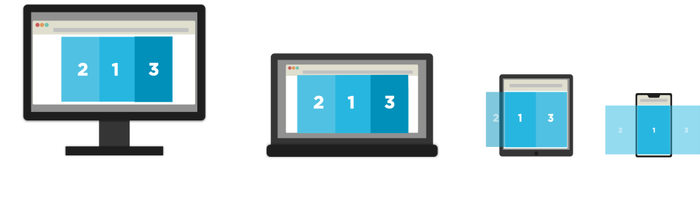

# Curso de Responsive Design

## Tabla de Contenido
- [쯈ué es Responsive Design?](#쯈ué-es-Responsive-Design?)
- [Patrones de Responsive Design](#Patrones-de-Responsive-Design)
    - [Mostly Fuild (Diseño Fluido)](#Mostly-Fuild-(Diseño-Fluido))
    - [Column Row (Colocación de Columnas)](#Column-Row-(Colocación-de-Columnas))
    - [Layout Shifter (Cambios de capas)](#Layout-Shifter-(Cambios-de-capas))
    - [Tiny Tweaks (Pequeños Cambios)](#Tiny-Tweaks-(Pequeños-Cambios))
    - [Off Canvas (Fuera del viewport)](#Off-Canvas-(Fuera-del-viewport))
- [Técnicas para hacer Responsive Design](#Técnicas-para-hacer-Responsive-Design)
    - [Mobile First](#Mobile-First)
    - [Desktop First](#Desktop-First)
- [Unidades Relativas de Texto](#Unidades-Relativas-de-Texto)
    - [Unidad EM](#Unidad-EM)
    - [Unidad REM](#Unidad-REM)
- [Tipos de Media Querys usadas en Responsive Design](#Tipos-de-Media-Querys-usadas-en-Responsive-Design)
    - [Valor por defecto](#Valor-por-defecto)
    - [Vista de impresión](#Vista-de-impresión)
    - [Soporte a pantallas](#Soporte-a-pantallas)
    - [Soporte para lectores de pantalla](#Soporte-para-lectores-de-pantalla)
    - [Soporte a Televisores](#Soporte-a-Televisores)
- [Reglas Para hacer Responsive Design](#Reglas-Para-hacer-Responsive-Design)
    - [Desktop First (Graceful degradation)](#Desktop-First-(Graceful-degradation))
    - [Mobile First (Progressive Enhancement)](#Mobile-First-(Progressive-Enhancement))
    - [Anotaciones](#Anotaciones)
    - [Algunas querys con operadores](#Algunas-querys-con-operadores)
    - [쮺칩mo incluir una media query?](#쮺칩mo-incluir-una-media-query?)
- [Notas Útiles](#Notas-Útiles)
- [쮺칩mo hacer imágenes Responsive?](#쮺칩mo-hacer-imágenes-Responsive?)
- [쮺칩mo hacer textos Responsive?](#쮺칩mo-hacer-textos-Responsive?)
- [Insertar Video en HTML5](#Insertar-Video-en-HTML5)
    - [Diferentes formatos](#Diferentes-formatos)
    - [Hacer responsive videos de HTML5](#Hacer-responsive-videos-de-HTML5)
- [Algunos selectores Avanzados](#Algunos-selectores-Avanzados)
    - [Explicación de las wildcards](#Explicación-de-las-wildcards)
- [Aspectos a tener en cuenta en la creación de un menú tipo Hamburguesa](#Aspectos-a-tener-en-cuenta-en-la-creación-de-un-menú-tipo-Hamburguesa)
- [쮺칩mo hacer un servidor con NodeJS?](#쮺칩mo-hacer-un-servidor-con-NodeJS?)
- [Añadiendo interactividad con JavaScript en el menú Hamburguesa](#Añadiendo-interactividad-con-JavaScript-en-el-menú-Hamburguesa)
- [Otra forma de añadir interactividad al menú hamburguesa](#Otra-forma-de-añadir-interactividad-al-menú-hamburguesa)
- [Optimizar el JavaScript](#Optimizar-el-JavaScript)
- [Lazy Loading de imágenes](#Lazy-Loading-de-imágenes)
- [Imágenes Responsive con CSS](#Imágenes-Responsive-con-CSS)
- [Colocar imágenes dependiendo de la densidad de pixeles](#Colocar-imágenes-dependiendo-de-la-densidad-de-pixeles)
- [Hacer Tablas Responsive](#Hacer-Tablas-Responsive)
- [Añadir Gestos al Responsive Design](#Añadir-Gestos-al-Responsive-Design)
- [Optimizando para Google Page Speed](#Optimizando-para-Google-Page-Speed)
    - [Optimizar imágenes](#Optimizar-imágenes)
    - [Optimizar el CSS del Above the Fold](#Optimizar-el-CSS-del-Above-the-Fold)


## 쯈ué es Responsive Design?
Son todas aquellas técnicas que se usan para adaptar una página web a la mayor cantidad de tamaños de pantallas.

<div align="right">
    <small>
        <a href="#tabla-de-contenido">
            🡡 volver al inicio
        </a>
    </small>
</div>

## Patrones de Responsive Design
Los patrones son guías que ayudan a que el diseño no se rompa, sino que mantenga su estructura en concreto cada vez que se va redimensionando. **Los sitios  NO necesariamente tienen que seguir un solo patrón**, sino que pueden hacer uso de varios o todos. Entre estos están los siguientes:

### Mostly Fuild (*Diseño Fluido*)
<div align="center">
    
    <small><p>Patrón Mostly Fluid</small>
</div>

### Column Row (*Colocación de Columnas*)
<div align="center">
    
    <small><p>Patrón Column Row</small>
</div>

### Layout Shifter (*Cambios de capas*)
<div align="center">
    
    <small><p>Patrón Layout Shifter</small>
</div>

### Tiny Tweaks (*Pequeños Cambios*)
<div align="center">
    
    <small><p>Patrón Tiny Tweaks</small>
</div>

>Nota: Aquí se producen pequeños cambios. Por ejemplo a nivel de fuentes, imágenes, etc.

### Off Canvas (*Fuera del viewport*)
<div align="center">
    
    <small><p>Patrón Off Canvas</small>
</div>

<div align="right">
    <small>
        <a href="#tabla-de-contenido">
            🡡 volver al inicio
        </a>
    </small>
</div>

## Técnicas para hacer Responsive Design

### Mobile First
Consiste en empezar desde la menor resolución hasta la mayor.

### Desktop First
Consiste en empezar desde la mayor resolución hasta la menor.

>Nota: "Técnicamente" es mejor Mobile First dado que en el diseño móvil carga la menor cantidad de código y mientras va creciendo la resolución, va aumentando paulatinamente  la carga de código a la par que va adaptándose.

<div align="right">
    <small>
        <a href="#tabla-de-contenido">
            🡡 volver al inicio
        </a>
    </small>
</div>

## Unidades Relativas de Texto

### Unidad `EM`
Es una unidad relativa al tamaño de fuente más cercano, ex:

```html
<nav> <!--con Font-size de 16px-->
    <ul><!--con Font-size de 2em | 32px-->
        <li><!--con Font-size de 1em | 32px-->
            <a href="#">Texto</a><!--con Font-size de .5em | 16px y padding: 2em | 32px-->
        </li>
    </ul>
</nav>

```
**Explicación:**
En el ejemplo anterior, se aprecia que el `padding` del elemento de ancla, tiene 32px. Esto sucede porque cuando se especifica el `font-size` de un elemento y se usan `em` para otras medidas, estas serán relativas a su propio `font-size`. En este caso, el ancla ya tenía un `font-size` declarado de .5em el cual equivale a 16px. Al decirle que tenga un padding de 2em, se toma el valor del font-size del elemento y se multiplica por los em.

<div align="right">
    <small>
        <a href="#tabla-de-contenido">
            🡡 volver al inicio
        </a>
    </small>
</div>

### Unidad `REM`
Es una unidad relativa al tamaño de fuente especificado en el ancestro más lejano (HTML o Body). Ex:

```html
<html lang="es"><!--Con Font-size de 32px-->
    <head>
    </head>
    <body> <!--Con Font-size de 16px-->
        <ul> <!--Con Font-size de 2rem | 64px-->
            <li><!--Con Font-size de 1rem | 32px-->
                <a href="#"></a><!--Con Font-size de .5rem | 16px-->
            </li>
        </ul>
    </body>
</html>
```

**Explicación:**
Todos los elementos están tomando como referencia al tamaño de fuente más lejano, es decir el del HTML. En otras palabras, se podría decir que es lo apuesto al `em`.

<div align="right">
    <small>
        <a href="#tabla-de-contenido">
            🡡 volver al inicio
        </a>
    </small>
</div>

## Tipos de Media Querys usadas en Responsive Design

### Valor por defecto
Se usa para todos los tipos de media querys:

```css
@media all and (condición)
{
    /*Valores*/
}

/*O también */

@media and (condición)
{
    /*Valores*/
}
```

### Vista de impresión
Se utiliza para generar la vista para imprimir:

```css
@media print and (condición)
{
    /*Valores*/
}
```

### Soporte a pantallas
Se utiliza para delimitar solo el tamaño de la pantalla:

```css
@media screen and (condición)
{
    /*Valores*/
}
```

### Soporte para lectores de pantalla
Se utiliza para lectores de pantallas que "leen" la página en voz alta:

```css
@media speech and (condición)
{
    /*Valores*/
}
```

### Soporte a Televisores
Utilizada únicamente para referirse a televisores:

```css
@media tv and (condición)
{
    /*Valores*/
}
```

<div align="right">
    <small>
        <a href="#tabla-de-contenido">
            🡡 volver al inicio
        </a>
    </small>
</div>

## Reglas Para hacer Responsive Design
### Desktop First (Graceful degradation)
Para este caso se suele usar `max-width` (<=) en todas sus reglas siguiendo el patrón del tamaño más grande al más pequeño:
```css
/*Versión del curso*/
@media screen and (max-width: 1024px){/*Estilos*/}
@media screen and (max-width: 768px){/*Estilos*/}
@media screen and (max-width: 480px){/*Estilos*/}
@media screen and (max-width: 320px){/*Estilos*/}

/*Otra versión*/
@media (max-width: 979px){/*Estilos*/}
@media (max-width: 767px){/*Estilos*/}
@media (max-width: 480px){/*Estilos*/}
```
<div align="right">
    <small>
        <a href="#tabla-de-contenido">
            🡡 volver al inicio
        </a>
    </small>
</div>

### Mobile First (Progressive Enhancement)
Para este caso se suele usar `min-width` (>=) en todas sus reglas, siguiendo el patrón del tamaño más pequeño al más grande:
```css
/*Versión del curso*/
@media screen and (min-width: 320px){/*Estilos*/}
@media screen and (min-width: 480px){/*Estilos*/}
@media screen and (min-width: 768px){/*Estilos*/}
@media screen and (min-width: 1024px){/*Estilos*/}

/*Otra versión*/
@media (min-width: 767px){/*Estilos*/}
@media (min-width: 979px){/*Estilos*/}
@media (min-width: 1200px){/*Estilos*/}
```
<div align="right">
    <small>
        <a href="#tabla-de-contenido">
            🡡 volver al inicio
        </a>
    </small>
</div>

### Anotaciones

**NOTA IMPORTANTE**: Si bien existen dichas reglas para hacer el Responsive Design un poco más fácil, esto no quiere decir que dichas reglas sean inquebrantables puesto que una buena manera de sacar media querys/breakpoints es estirar o achicar el sitio tanto como sea posible hasta encontrar un punto donde se rompa el diseño. Es en esa resolución donde debemos añadir una media query para que el sitio adapte y se siga viendo bien.

**NOTA IMPORTANTE 2**:
Por un <a href="https://zellwk.com/blog/media-query-units/">post</a> escrito por zellwk, se recomendaba hacer el cambio de PX o REM's a EM's. Sin embargo han salidos muchos otros post como <a href="https://medium.com/zoosk-engineering/to-em-or-not-to-em-that-is-the-media-query-question-22f4a65e9747">este</a> o <a href="https://adamwathan.me/dont-use-em-for-media-queries/">este otro</a> que aportan diferentes puntos de vistas. Actualmente (MAYO/2020) estoy probando los Em's sombre los PX's para ver si existe algún factor determinante aunque a simple vista ambos parecieran adaptarse de igual manera.


```
querys-em= (Tamaño en pixel) / 16

EX:

Desktop-em= 1024 / 16 = 64
@media screen and (max-width: 64em){/*Estilos*/}
```

<div align="right">
    <small>
        <a href="#tabla-de-contenido">
            🡡 volver al inicio
        </a>
    </small>
</div>

### Algunas querys con operadores
```css
/*Media query para una ventana con ancho mayor o igual a 700px Y con orientación horizontal*/
@media (min-width: 700px) and (orientation: landscape){/*Estilos*/}

/*Media query para una ventana con ancho mayor o igual a 700px O si el dispositivo esta en horizontal*/
@media (min-width: 700px), handheld and (orientation: landscape){/*Estilos*/}
```

<div align="right">
    <small>
        <a href="#tabla-de-contenido">
            🡡 volver al inicio
        </a>
    </small>
</div>

### 쮺칩mo incluir una media query?
Antes de pensar en incluir media querys a nuestra página web, debemos de tener **obligatoriamente** la etiqueta `viewport` en nuestro HTML para poder apreciar dichos cambios en dispositivos móviles:

```html
<meta name="viewport" content="width=device-width, initial-scale= 1.0, user-scalable=no" />
```

A través de dicha etiqueta estamos indicando lo siguiente:

- El ancho de la pantalla estará definida por el ancho del dispositivo (`width=device-width`).
- La escala inicial será de 1. Es decir, el contenido no se mostrará con un zoom por defecto (`initial-scale=1.0`).
- El usuario no podrá hacer zoom en el sitio web en móvil (`user-scalable=no`).

Una vez teniendo la etiqueta del `viewport`, se pueden agregar las querys de las siguientes maneras:

1. A través de una etiqueta link en el `head` del HTML:
    ```html
    <link rel="stylesheet" href="../ruta/style.css" media="screen and (CONDICION)" />

    <!--Dónde en el apartado de CONDICION colocamos la resolución o lo que necesitamos para que dicha query se active-->
    ```

2. A través de un solo archivo CSS **(Es lo más recomendado)**. Se hace colocando todos los estilos y las querys en un solo archivo CSS y enlazándolo con una etiqueta link dentro del `head` del HTML:

    ```html
    <link rel="stylesheet" href="../ruta/styel.css" />
    ```

3. Dentro de `head` del HTML con etiquetas de `style`:
    ```html
    <head>
        <style>
            /*...Otros estilos*/


            @media screen and (max-width: 720px)
            {
                /*Estilos*/
            }
        </style>
    </head>
    ```
<div align="right">
    <small>
        <a href="#tabla-de-contenido">
            🡡 volver al inicio
        </a>
    </small>
</div>

## Notas Útiles
- Al hacer Responsive Design con FlexBox es bueno usar la propiedad `flex-wrap: wrap;` para que los elementos "caigan" cuando ya no caben dentro de un contenedor.

- Es mejor usar contenedores con ancho dinámico.

- Es mejor tener un `display: block;` y `width: auto` que un `width: 100%` en cuestión de velocidad de render.

- Para arreglar el margin collapsing, se puede hacer con `padding: 1px;` o un `border: 1px solid transparent;`.

- `object-position: X Y;` es una propiedad que se usa con `object-fit` para mover un elemento.

- En el modelo de caja que aparece en las herramientas de desarrollador de Chrome, al usar `em` aparecerá cuánto vale la medida absoluta del mismo. Es decir, qué valor está usando de referencia.

- Las etiquetas recomendadas para colocar iconos es la `i` o los `span`. (Preferiblemente las `i`):

    ```html
    <i class="menu-icon"></i>
    <span class="menu"></span>
    ```

<div align="right">
    <small>
        <a href="#tabla-de-contenido">
            🡡 volver al inicio
        </a>
    </small>
</div>

## 쮺칩mo hacer imágenes Responsive?
En los estilos generales:
 - Declarar el `width` deseado de la imagen y el `max-width: 100%;`.
 - Declarar el `width` del contenedor de la imagen en medidas relativas.

En las Media Querys:
 - Declarar `width: auto;` o con la dimensión requerida para dicha query en la primera regla del contendor de la imagen.

<div align="right">
    <small>
        <a href="#tabla-de-contenido">
            🡡 volver al inicio
        </a>
    </small>
</div>

## 쮺칩mo hacer textos Responsive?
En los estilos generales:
 - Se declara un `font-size` en px al elemento que contiene los textos como guía para el `em`.
 - Se declaran el tamaño de fuente de cada texto en `em`.

En las Media Querys:
 - Se cambia el `font-size` del contenedor de los textos y estos se redimensionarán automáticamente por ser `em`.

<div align="right">
    <small>
        <a href="#tabla-de-contenido">
            🡡 volver al inicio
        </a>
    </small>
</div>

## Insertar Video en HTML5
Para insertar video en HTML5 se usa la etiqueta `<video></video>` de la siguiente manera:

```html
<video
    src="/video/intro.mp4"
    width="1280"
    height="720"
    controls
    autoplay
    poster="/img/poster.jpg">
</video>

<!--
    Dónde:
        controls => corresponde al atributo que se necesita para que aparezca la interfaz del reproductor (botones de play, pause, linea de tiempo, etc).

        autoplay => corresponde al atributo que se indica cuando se quiere que el video se reproduzca automáticamente a penas se muestre.

        poster => corresponde al atributo necesario cuando se quiere configurar una determinada imágen como "caratula" o miniatura del video antes de que se reproduzca.

        loop => corresponde al atributo que permite al video reproducirse infinitas veces.

        NOTA: Si no se declara el WIDTH y el HEIGHT del video, este tomará las medidas originales del video.

 -->
```
>Nota: El autoplay solo sirve en algunos navegadores siempre y cuando el video no tenga audio.

<div align="right">
    <small>
        <a href="#tabla-de-contenido">
            🡡 volver al inicio
        </a>
    </small>
</div>

### Diferentes formatos
Gracias a la etiqueta `<video></video>` de HTML5 es posible insertar un video diferente dependiendo del formato, EX:

```html
<video controls>
    <source src="videos/intro.ogg" type="video/ogg" />
    <source src="videos/intro.mp4" type="video/mp4" />
</video>
```

De esta manera si el navegador soporta .ogg se reproducirá **ese** video, y si no lo hace reproducirá el .mp4

<div align="right">
    <small>
        <a href="#tabla-de-contenido">
            🡡 volver al inicio
        </a>
    </small>
</div>


### Hacer responsive videos de HTML5
Se hace teniendo en cuenta lo siguiente:

```css
.video-html
{
    width: 100%;
    height: auto;
}
```
<div align="right">
    <small>
        <a href="#tabla-de-contenido">
            🡡 volver al inicio
        </a>
    </small>
</div>


### Hacer responsive videos embebidos/insertados
Se hace teniendo en cuenta lo siguiente:

```css
.contenedor-del-video
{
    width: 100%;
    height: 0;
    padding-top: /* (alturaDelVideo x 100) / anchoDelVideo*/;
    position: relative;
}
.video-embebido
{
    position: absolute;
    top: 0;
    bottom: 0;
    left: 0;
    right: 0;
    height: 100%;
    width: 100%;
}
```

<div align="right">
    <small>
        <a href="#tabla-de-contenido">
            🡡 volver al inicio
        </a>
    </small>
</div>

## Algunos selectores Avanzados

```css
[class^="icon-"]
{
    /* Seleccion de cualquier clase que contenga la palabra "icon-" ADELANTE */
}

[class*="icon-"]
{
    /*  Selecciona a cualquier clase que contenga la palabra "icon-" en CUALQUIER LUGAR */
}

[class$="icon-"]
{
    /*  Selecciona a  cualquier clase que contenga la palabra "icon-" DE ULTIMO*/
}
```
<div align="right">
    <small>
        <a href="#tabla-de-contenido">
            🡡 volver al inicio
        </a>
    </small>
</div>

### Explicación de las wildcards

- El asterisco (*): Se utiliza para seleccionar a los elementos cuyo valor de atributo CONTENGA al string indicado.

- El símbolo de potencia (^): Se utiliza para seleccionar a los elementos cuyo valor de atributo EMPIEZA por dicho string.

- El símbolo de dólar ($): Selecciona a los elementos cuyo valor de atributo TERMINA por esa cadena de texto.

<div align="right">
    <small>
        <a href="#tabla-de-contenido">
            🡡 volver al inicio
        </a>
    </small>
</div>

## Aspectos a tener en cuenta en la creación de un menú tipo Hamburguesa
1. Se crea el icono con una etiqueta `<i></i>` a la cual se le dan los estilos necesarios. (Esto será el icono de la hamburguesa).

2. Se posiciona en su lugar de manera fija o estática y se le da un `display:none;` por defecto y en la media query deseada se le indica que se muestre con un `display: block;` (o cualquier otro).

3. Se da estilos que tendrá el menú una vez que se muestre y se oculta con un `left: -100vw;` (Teniendo en cuenta el patrón Off Canvas).

4. Se crea la clase que tendrá el menú para darle el `left: 0;`.

5. Se añade el JavaScript para controlar el evento dinámicamente y que al hacer click aparezca y desaparezca respectivamente.

<div align="right">
    <small>
        <a href="#tabla-de-contenido">
            🡡 volver al inicio
        </a>
    </small>
</div>

## 쮺칩mo hacer un servidor con NodeJS?
1. Descargar e instalar NodeJS

2. A través de la terminal ejecutar `npm install -g static-server`.

3. Dirigirse con la terminal a la ruta del proyecto.

4. Encender el servidor escribiendo en la terminal `static-server`.

>Nota: Se accede a través de la dirección IP del PC donde corre el servidor seguido del puerto. Por defecto es el 9080. EX: 192.168.0.1:9080

<div align="right">
    <small>
        <a href="#tabla-de-contenido">
            🡡 volver al inicio
        </a>
    </small>
</div>

## Añadiendo interactividad con JavaScript en el menú Hamburguesa
Se debe tener en cuenta lo siguiente:

```javascript
// Añadimos una variable que seleccione (como css) el elemento
// que estará escuchando el evento que desplegará el menú:
const burguerButton = document.querySelector(".burguer-menu");

// Añadimos una variable que seleccione (como css) el elemento
// que queremos manipular
const menu = document.querySelector(".menu");

// Añadimos un escuchador de eventos a burguerButton para cuando se haga click en él y ejecute la función que mostrará el menú
burguerButton.addEventListener("click", hideShow);

// Creamos la función que se usará en el evento
function hideShow()
{
    // Si el menu contiene la clase que lo muestra
    if(menu.classList.contains("is-active"))
    {
        // Le quitamos la clase que lo muestra
        menu.classList.remove("is-active");
    }
    // Si no contiene la clase que lo muestra
    else
    {
        // Le añadimos la clase que lo muestra
        menu.classList.add("is-active");
    }
}

// .burguerButton es la Clase que hace referencia a la etiqueta <i> que contiene el icono del menu hamburguesa.

// .menu es la Clase que hace referencia al <nav> o dónde están los elementos del menu.

// is-active es la Clase que muestra el menú a la pantalla con un left: 0;
```
<div align="right">
    <small>
        <a href="#tabla-de-contenido">
            🡡 volver al inicio
        </a>
    </small>
</div>

## Otra forma de añadir interactividad al menú hamburguesa
Es posible agregarle interactividad de una forma más corta de la siguiente manera:

```javascript
// Añadimos una variable que seleccione (como css) el elemento
// que estará escuchando el evento que desplegará el menú:
const burguerButton = document.querySelector(".burguer-menu");

// Añadimos una variable que seleccione (como css) el elemento
// que queremos manipular
const menu = document.querySelector(".menu");

// Añadimos un escuchador de eventos a burguerButton para cuando se haga tap en el y ejecute la función que mostrará el menú
burguerButton.addEventListener("touchstart", hideShow);

// Creamos la función que se usará en el evento
function hideShow()
{
    // El método toggle permite añadir y quitar una clase
    // alternativamente
    menu.classList.toggle("is-active");
}
```
<div align="right">
    <small>
        <a href="#tabla-de-contenido">
            🡡 volver al inicio
        </a>
    </small>
</div>

## Optimizar el JavaScript
Es posible optimizar el JavaScript para que se activen las funcionalidades a determinadas media querys o breakpoints. Se hace de la siguiente manera:

```javascript
// Se crea una variable con el media query en el que deseamos
// que se cargue el JavaScript (Es el media query donde
// queremos que se active la funcionabilidad)
const ipad = window.mathMedia("screen and (max-width: 768px)");

// Creamos un escuchador de eventos que estará pendiente cuando
// se activa o desactiva la condición que tiene "ipad" y le
// asignamos la función necesaria
ipad.addListener(comprobacion);

// creamos la función necesaria para el escuchador de eventos
// y le pasamos una variable (event) para que la función lo
// llene con los datos del evento
function comprobacion(event)
{
    // Si estoy en una resolución <=768px
    if(event.matches==true)
    {
        // Le asigno el escuchador de eventos con su
        // respectiva funcion al icono
        burguerButton.addEventListener("click", hideShow);
    }
    // Si no estoy en una resolución >768px
    else
    {
        // Eliminamos el escuchador de eventos al icono
        burguerButton.removeEventListener("click", hideShow);
    }
}

// ejecutamos la función para que se ejecute la primera vez
// que cargue la página y por parametros le pasamos la
// condicion que queremos que vigile. En este caso la media query
comprobacion(ipad);
```
<div align="right">
    <small>
        <a href="#tabla-de-contenido">
            🡡 volver al inicio
        </a>
    </small>
</div>

## Lazy Loading de imágenes
El Lazy Loading es una técnica que consiste en cargar **solo** las imágenes que se encuentren visibles en el viewport, postergando la carga de las demás imágenes (las que no se han visto en el viewport) para el momento en que las mismas aparezcan en tal lugar. Optimizando de esta manera el proceso de carga del sitio.

### 쮺칩mo se hace?
1. Googleamos y descargamos la libreria "<a href="https://github.com/dinbror/blazy">beLazyJS</a>" y la guardamos en nuestro proyecto. O buscamos el CDN en cdnjs.com y lo enlazamos al proyecto a través de la etiqueta `<script></script>`.

2. En todas las imágenes a las cuales se le requiere añadir el lazy loading se le sustituye el "src" por "data-src".
    >Nota: Si se requiere añadir otra imágenes que sea 2x se hace usando el | de la siguiente manera: `data-src="imagen-normal.png | imagen-retina.png"`.

3. Configuramos el selector o etiqueta que queremos que el "beLazyJS" tenga en cuenta:
    ```javascript
    var bLazy = new Blazy({
        selector: "img"
    });
    //En este caso indicamos que todas las etiquetas
    // tendran lazy loading.
    ```

4. Para testear si quedó bien configurado, a través de Google Chrome y su inspector de elementos, seleccionamos el apartado de network, filtramos las imágenes y deben aparecer las imágenes que se están viendo en esa parte de la página y al ir scrolleando deberían de irse cargando las nuevas que aparezcan.

<div align="right">
    <small>
        <a href="#tabla-de-contenido">
            🡡 volver al inicio
        </a>
    </small>
</div>

## Imágenes Responsive con CSS
Se puede usar el atributo `srcset` de la etiqueta `` para cuando una pantalla tenga una determinada densidad de pixeles (device pixel radio) las imágenes cambien. También es posible cambiarlas si la pantalla tiene una determinada dimensión.

```html


<!-- En este ejemplo, se cargará imagen1x.png para pantallas con una densidad de 1.5x. Para pantallas con una densidad de 2x se cargará imagen2x.png y para todas las demás pantallas se cargará imagen.png -->
```

También es posible usar este atributo para hacer referencia a dimensiones del viewport:

```html


<!--  En este ejemplo, se cargará imagen5.png cuando el ancho de la pantalla sea menor o igual a 500px. Y cuando llegue a supere los 500px y siga siendo menor o igual a 800px se cargar la imagen8-->
```

Existe también otra etiqueta llamada `<picture></picture>` la cual puede usarse en conjunto con las media querys de CSS:

```html
<picture>
    <source srcset="imagen.png" media="(min-width: 800px)">
    <source srcset="imagen2.png" media="(min-width: 600px)">
    
</picture>

<!--
El  sirve como imagen predeterminada cuando ninguna condición se cumple.

Con esta etiqueta no se descarga todas las imágenes solo las que se requieran o cumplan las condiciones
-->
```
<div align="right">
    <small>
        <a href="#tabla-de-contenido">
            🡡 volver al inicio
        </a>
    </small>
</div>

## Colocar imágenes dependiendo de la densidad de pixeles
Se hace a través de la siguiente media query:


```css
@media screen and (webkit-min-device-pixel-radio:2)
{
    .background
    {
        background-image: url("../bg2x.png");
    }
}
```

### Prefijos de otros navegadores
- Para Opera: `(o-min-device-pixel-ratio:2)`
- Para Mozilla: `(moz-min-device-pixel-ratio:2)`
- Para IE/E: `(ms-min-device-pixel-ratio:2)`
- Para Safari/Chrome: `(webkit-min-device-pixel-ratio:2)`

>Nota: A medida que va aumentando el device-radio (densidad de pixeles) de una pantalla es posible que necesitemos unas imágenes más grande, y por consecuencia más pesada. En estos casos se recomienda declararle al contenedor de la imagen un color de fondo similar al de la propia imagen para cuando la página se previsualice con conexiones lentas, el usuario tenga "algo que ver" mientras la imagen carga.

<div align="right">
    <small>
        <a href="#tabla-de-contenido">
            🡡 volver al inicio
        </a>
    </small>
</div>

## Hacer Tablas Responsive
1. Se hace la tabla
2. Se crea un contenedor con las dimensiones o propiedades necesarias
3. A la tabla se le coloca `overflow: auto;`

<div align="right">
    <small>
        <a href="#tabla-de-contenido">
            🡡 volver al inicio
        </a>
    </small>
</div>

## Añadir Gestos al Responsive Design
Es posible detectar gestos y usarlos para escuchar eventos a través de una librería llamada HammerJS. Se hace de la siguiente manera:


1. Googleamos y descargamos la librería de <a href="https://hammerjs.github.io/">HammerJS</a> y la guardamos en nuestro proyecto o también se puede buscar el CDN en cdnjs.com y enlazarlo al proyecto con una etiqueta `<script></script>`.

2. Una vez enlazado al proyecto, y haciendo uso de la documentación y ejemplos disponibles en la página de HammerJS buscamos el nombre del gesto que necesitamos.

3. Configuramos la librería con dicho gesto. A continuación se muestra la configuración necesaria para el gesto de "deslizar a la izquierda":

    ```javascript
    //Guardamos en una variable el elemento que
    //queremos que reaccione a los gestos (En este caso
    //se usa el body para referirnos a cualquier parte de
    //la página)
    var body = document.body;

    //Creamos otra variable a quien le asignaremos
    //el HammerJS y le pasaremos el elemento que
    //reaccionará
    var gestos = new Hammer(body);

    //Creamos un escuchador de eventos (de la forma
    //en que se hace con HammerJS) y le pasamos
    //los gestos y la función necesaria
    gestos.on("swipeleft", mostraMenu);
    ```
<div align="right">
    <small>
        <a href="#tabla-de-contenido">
            🡡 volver al inicio
        </a>
    </small>
</div>

## Optimizando para Google Page Speed
Tras el examen de Google si aparecen los siguientes errores entonces:

### Optimizar imágenes
Se recomienda la herramienta "Tiny.jpg / Tiny.png" dependiendo del caso. El cual es una herramienta que permite comprimir las imágenes de forma que reduzca su peso pero sin perder su calidad. Optimizando así su proceso de carga.
>Nota: Este proceso se puede realizar tantas veces sea necesario con una misma imagen, dejando a nuestro juicio la relación peso / calidad.

<div align="right">
    <small>
        <a href="#tabla-de-contenido">
            🡡 volver al inicio
        </a>
    </small>
</div>

### Optimizar el CSS del Above the Fold
El Above The Fold es el CSS que se encarga de mostrar los estilos del PRIMER contenido visible de la página. Para realizar esta optimización se debe realizar lo siguiente:

#### Aplicar Critcal CSS
Es una técnica que consiste en extraer los estilos que se tienen a la vista a la hora que la página carga y no se ha hecho un scrolldown y colocarlos en el HTML con una etiqueta `<style></syle>` dentro del `<head></head>` (minimizado). Se hace de la siguiente manera:

1. En la página <a href="https://jonassebastianohlsson.com/criticalpathcssgenerator/">Critical Path CSS Generator By Jonas Onhlsson</a>:

    1.1 Colocamos el link de la página a la cual se le quiere sacar el CSS Crítico.

    1.2 Copiamos y pegamos todo el CSS en el apartado de CSS.

    1.3 Hacemos clic en "Create critical Path CSS".

    1.4 Corregimos las rutas relativas al CSS que nos arroja la herramienta (De ser necesario).

    1.5 <a href="https://csscompressor.com/">Minificamos el archivo</a>

    1.6 Copiamos y pegamos el CSS minificado dentro del `<head></head>` con sus respectivas etiquetas de `<style></style>`.

2. Aplicamos la carga diferida del archivo CSS: quitando la etiqueta `<link>` de los estilos que se encuentra en el `<head></head>` e incorporamos los estilos a través del siguiente script al final del body.

    ```javascript
    function loadCSS(e,t,n,o){"use strict";function r(){for(var e,t=0;t<l.length;t++)l[t].href&&l[t].href.indexOf(i.href)>-1&&(e=!0);e?i.media=n||"all":setTimeout(r)}var i=window.document.createElement("link"),d=t||window.document.getElementsByTagName("script")[0],l=window.document.styleSheets;return i.rel="stylesheet",i.href=e,i.media="only x",o&&(i.onload=o),d.parentNode.insertBefore(i,d),r(),i}
    loadCSS( "RUTA/ESTILOS.css" );
    ```

>**NOTA IMPORTANTE**: Cada vez que se haga una modificación al CSS de un elemento que se pueda ver en el Above The Fold (Estilos que aparecen al cargar la página por primera vez y sin hacer scrolldown) es necesario hacer el proceso completo del paso 1. Si las modificaciones no llegan al Above The Fold como por ejemplo un detalle incluido en el footer, en este caso no es necesario empezar desde el paso 2, ya que ese estilo no se encuentra el Critical CSS de dicha página. Solo se tendría que minificar el archivo y colocarlo al final del body.

<div align="right">
    <small>
        <a href="#tabla-de-contenido">
            🡡 volver al inicio
        </a>
    </small>
</div>

