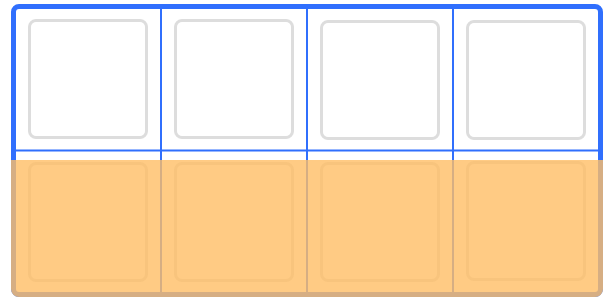

# Curso de CSS Grid Layout

## Tabla de Contenido
- [쯈ué es CSS Grid Layout?](#쯈ué-es-CSS-Grid-Layout?)
- [Elementos de una maquetación con CSS Grid Layout](#Elementos-de-una-maquetación-con-CSS-Grid-Layout)
    - [Grid container](#Grid-container)
    - [Grid item](#Grid-item)
    - [Grid columns](#Grid-columns)
    - [Grid rows](#Grid-rows)
    - [Grid lines](#Grid-lines)
    - [Grid track](#Grid-track)
    - [Grid cell](#Grid-cell)
    - [Grid area](#Grid-area)
    - [Grid gap](#Grid-gap)
 - [쮺칩mo indicarle a un elemento que use CSS Grid?](#쮺칩mo-indicarle-a-un-elemento-que-use-CSS-Grid?)
 - [쮺칩mo declarar columnas en CSS Grid?](#쮺칩mo-declarar-columnas-en-CSS-Grid?)
 - [쮺칩mo declarar filas en CSS Grid?](#쮺칩mo-declarar-filas-en-CSS-Grid?)
 - [쮺칩mo declarar filas y columnas al mismo tiempo?](#쮺칩mo-declarar-filas-y-columnas-al-mismo-tiempo?)
 - [Grid's anidados y otros tipos de displays](#Grid's-anidados-y-otros-tipos-de-displays)
    - [display: subgrid;](#display:-subgrid;)
    - [display: inline-grid;](#display:-inline-grid;)
    - [display: grid;](#display:-grid;)
- [Márgenes entre las filas y las columnas (gutter/gap)](#Márgenes-entre-las-filas-y-las-columnas-(gutter/gap))
    - [Espaciado entre columnas](#Espaciado-entre-columnas)
    - [Espaciado entre filas](#Espaciado-entre-filas)
    - [Shorthand](#Shorthand)
- [Unidad de medida: fr (fracciones)](#Unidad-de-medida:-fr-(fracciones))
- [Funciones dentro de CSS Grid Layout](#Funciones-dentro-de-CSS-Grid-Layout)
    - [repeat()](#repeat())
    - [minmax()](#minmax())
- [Declarando espacios a ocupar por los elementos](#Declarando-espacios-a-ocupar-por-los-elementos)
    - [1. Declarando los elementos](#1.-Declarando-los-elementos)
        - [Declarando el Grid container](#Declarando-el-Grid-container)
        - [Declarando los Grid items](#Declarando-los-Grid-items)
    - [2. De forma individual para filas y columnas](#2.-De-forma-individual-para-filas-y-columnas)
        - [Declarando columnas](#Declarando-columnas)
        - [Declarando filas](#Declarando-filas)
        - [Shorthand para filas y columnas a la vez](#Shorthand-para-filas-y-columnas-a-la-vez)
- [Declararle nombre a las líneas](#Declararle-nombre-a-las-líneas)
- [El Grid Implícito](#El-Grid-Implícito)
- [Alinear el contenido de un Grid](#Alinear-el-contenido-de-un-Grid)
- [Alinear la posición del Grid completo](#Alinear-la-posición-del-Grid-completo)
- [Notas del ejercicio de Layout Mansory](#Notas-del-ejercicio-de-Layout-Mansory)
- [Links de Interés](#Links-de-Interés)


## 쯈ué es CSS Grid Layout?
Es un módulo de CSS que permite hacer la maquetación de un sitio web a través de filas y columnas.

<div align="right">
    <small>
        <a href="#tabla-de-contenido">
            🡡 volver al inicio
        </a>
    </small>
</div>

## Elementos de una maquetación con CSS Grid Layout

### `Grid container`
Es el contenedor padre de los elementos. Es decir, es a quién se le aplica el `display: grid;` y la etiqueta HTML que hará de contenedor.

<div align="center">
    
    <small><p>Grid Container.</p></small>
</div>

Nótese que el `Grid container` usa todo el espacio designado para el contenedor.

<div align="right">
    <small>
        <a href="#tabla-de-contenido">
            🡡 volver al inicio
        </a>
    </small>
</div>

### `Grid item`
Son los componentes (hijos directos del `Grid container`) que manipulamos con CSS Grid Layout. Es decir, son los elementos HTML hijos del `Grid container`.

<div align="center">
    
    <small><p>Grid items.</p></small>
</div>

<div align="right">
    <small>
        <a href="#tabla-de-contenido">
            🡡 volver al inicio
        </a>
    </small>
</div>

### `Grid columns`
Corresponde a la forma en que el espacio está distribuido verticalmente.

<div align="center">
    
    <small><p>Grid columns</p></small>
</div>

En este ejemplo existe un total de 4 columnas, pero solo se está indicando la columna 1 en la imagen anterior.

<div align="right">
    <small>
        <a href="#tabla-de-contenido">
            🡡 volver al inicio
        </a>
    </small>
</div>

### `Grid rows`
Corresponde a la forma en la cual el espacio está distribuido horizontalmente.

<div align="center">
    
    <small><p>Grid rows</p></small>
</div>

En este ejemplo existe un total de 2 filas, pero solo se está indicando la fila 2 en la imagen anterior.

<div align="right">
    <small>
        <a href="#tabla-de-contenido">
            🡡 volver al inicio
        </a>
    </small>
</div>

###  `Grid lines`
Son las líneas invisibles y divisoras de la maquetación provenientes de nuestros ajustes.

<div align="center">
    
    <small><p>Grid lines.</p></small>
</div>

Nótese en este ejemplo que las líneas divisoras tanto horizontales (lin-h) como verticales (lin-v) son `Grid lines`.

<div align="right">
    <small>
        <a href="#tabla-de-contenido">
            🡡 volver al inicio
        </a>
    </small>
</div>

### `Grid track`
Es el espacio entre 2 líneas (`Grid lines`) adyacentes.

<div align="center">
    
    <small><p>Grid track.</p></small>
</div>

Nótese que en este ejemplo el `Grid track` corresponde al espacio atrapado entre la línea vertical 1 (ln-v 1) hasta la línea vertical 2 (ln-v 2) y la línea horizontal 1 (ln-h 1) hasta la línea horizontal 3 (ln-h 3). Dicho espacio puede ser horizontal y vertical.

<div align="right">
    <small>
        <a href="#tabla-de-contenido">
            🡡 volver al inicio
        </a>
    </small>
</div>

### `Grid cell`
Es el espacio adyacente entre 2 filas y 2 columnas, es decir, es el espacio atrapado entre filas y columnas. Es una sola unidad de CSS Grid.

<div align="center">
    
    <small><p>Grid cell.</p></small>
</div>

<div align="right">
    <small>
        <a href="#tabla-de-contenido">
            🡡 volver al inicio
        </a>
    </small>
</div>

### `Grid area`
Es el espacio compuesto por 4 `Grid lines`.

<div align="center">
    
    <small><p>Grid cell.</p></small>
</div>

En este ejemplo las cuatro líneas que representa el `Grid area` corresponden a la fila 1, la columna 3, la fila 3, y la columna 1.

<div align="right">
    <small>
        <a href="#tabla-de-contenido">
            🡡 volver al inicio
        </a>
    </small>
</div>

### `Grid gap`
Corresponde al margen entre las filas y columnas.

<div align="center">
    
    <small><p>Grid gap.</p></small>
</div>

<div align="right">
    <small>
        <a href="#tabla-de-contenido">
            🡡 volver al inicio
        </a>
    </small>
</div>

## 쮺칩mo indicarle a un elemento que use `CSS Grid`?
Al elemento que hará de `Grid container` o al contenedor padre se le agrega la siguiente propiedad:

```css
.padre
{
    display: grid;
}
```

Cabe destacar que una vez hecho esto, no hay ningún cambio visual que identifique que dicho elemento está usando `CSS Grid`. A menos que a través del inspector de elementos se inspeccione, dónde se podrá apreciar las `Grid lines`.

<div align="right">
    <small>
        <a href="#tabla-de-contenido">
            🡡 volver al inicio
        </a>
    </small>
</div>

## 쮺칩mo declarar columnas en `CSS Grid`?
Previamente declarado al contenedor padre con grid, se usa:

```css
.padre
{
    display: grid; /*Previamente*/
    grid-template-columns: 30px 50% 5em;
}
```

En este ejemplo se está indicando que se creen 3 columnas. Dónde la primera tendrá 30px de ancho, la segunda un 50% del contenedor padre y la última 5em de ancho. Siendo entonces la forma de declarar columnas la propiedad `grid-template-columns` seguido de la(as) dimensión (es) de la (as) columna (as) en cualquier unidad de medida.

<div align="right">
    <small>
        <a href="#tabla-de-contenido">
            🡡 volver al inicio
        </a>
    </small>
</div>

## 쮺칩mo declarar filas en `CSS Grid`?
Previamente declarado al contenedor padre con grid, se usa:

```css
.padre
{
    display: grid; /*Previamente*/
    grid-template-rows: 300px 25% 5em;
}
```

En este ejemplo se está indicando que se creen 3 filas. Dónde la primera tiene 300px del alto, la segunda un 25% del alto del contenedor y la tercera 5em de alto. Siendo la forma de declarar filas la propiedad `grid-template-rows` seguida de la(as) dimensión (es) de la (as) fila (as) en cualquier unidad de medida.

Cabe destacar que las filas declaradas son parte del "`Grid explícito`", es decir, el declarado. Si el contenido llegara a desbordarse de las 3 filas declaradas, se crearán más filas automáticamente que se ajusten al contenido, eso será el "`Grid implícito`", el cual pareciera tener un `height: auto;` pero respetando las columnas declaradas. (Se puede alterar pero este es el comportamiento por defecto).

<div align="right">
    <small>
        <a href="#tabla-de-contenido">
            🡡 volver al inicio
        </a>
    </small>
</div>

## 쮺칩mo declarar filas y columnas al mismo tiempo?
Es posible declarar filas y columnas al mismo tiempo haciendo uso del siguiente shorthand:

```css
.padre
{
    display: grid;
    /*grid-template: filas / columnas*/
    grid-template: 300px 25% 5em / 30px 50% 5em;
}
```

En dicho ejemplo se están creando 3 filas y 3 columnas cuyas dimensiones son:

- Fila 1: 300px de alto
- Fila 2: 25% de alto
- Fila 3: 5em de alto
- Columna 1: 30px de ancho
- Columna 2: 50% de ancho
- Columna 3: 5em de ancho

<div align="right">
    <small>
        <a href="#tabla-de-contenido">
            🡡 volver al inicio
        </a>
    </small>
</div>

## Grid's anidados y otros tipos de displays
Para anidar un grid se pueden usar las siguientes propiedades:

### `display: subgrid;`
Crea un Grid replicando la distribución de filas y columnas que tiene el padre en el hijo.

### `display: inline-grid;`
Crea un grid de una sola fila.

### `display: grid;`
Es posible declarar un grid dentro de un `Grid item` para realizar ciertos tipos de layout que lo requieran.

>**Nota:** `inline-grid` y `subgrid` hasta la fecha (12/AGO/19) SOLO están disponibles para <a href="https://www.mozilla.org/es-ES/firefox/channel/desktop/">Firefox Nightly</a>.

<div align="right">
    <small>
        <a href="#tabla-de-contenido">
            🡡 volver al inicio
        </a>
    </small>
</div>

## Márgenes entre las filas y las columnas (gutter/gap)
Para añadir márgenes en `CSS Grid Layout` se usan:

### Espaciado entre columnas
Para añadir espaciado entre las columnas del `Grid container` se aplica la siguiente propiedad:

```css
.padre
{
    column-gap: [valor];
    /* Antes se usaba => grid-column-gap: [valor] */
}
```

### Espaciado entre filas
Para añadir espaciado entre las filas del `Grid container` se aplica la siguiente propiedad:

```css
.padre
{
    row-gap: [valor];
    /* Antes se usaba => grid-row-gap: [valor] */
}
```

### Shorthand
Se puede agregar un espaciado tanto para filas como para columnas usando el siguiente shorthand:

```css
.padre
{
    gap: [valorFila valorColumnas]
    /* Antes se usaba => grid-gap [valorFila valorColumnas] */
}
```

Si solo se aplica un solo valor, entonces dicha propiedad lo aplicará tanto para las filas como para las columnas.

<div align="right">
    <small>
        <a href="#tabla-de-contenido">
            🡡 volver al inicio
        </a>
    </small>
</div>

## Unidad de medida: `fr` (fracciones)
El "`fr`" es una unidad de medida que se utiliza en `CSS Grid Layout` el cual se basa en el espacio disponible entre filas y columnas forzando a que siempre se tenga el mismo espacio sin importar el tamaño del contenido de sus elementos. Se usa de la siguiente manera: `[valor]fr`.

<div align="center">
    
    <small><p>Fracciones.</p></small>
</div>

<div align="right">
    <small>
        <a href="#tabla-de-contenido">
            🡡 volver al inicio
        </a>
    </small>
</div>

## Funciones dentro de `CSS Grid Layout`

### `repeat()`
Es una función de CSS que permite repetir lo que se le pasa por parámetros "n" cantidad de veces. Se usa de la siguiente manera:

```css
.padre
{
    /* repeat(VecesQueRepite, unidadDeMedida) */
    grid-template-columns: repeat(3, 1fr);
}
```
En el ejemplo anterior estamos creando 3 columnas donde cada una tiene un ancho de `1fr`. Es decir, es lo mismo que si estuviéramos declarando:

```css
.padre
{
    grid-template-columns: 1fr 1fr 1fr;
}
```

<div align="right">
    <small>
        <a href="#tabla-de-contenido">
            🡡 volver al inicio
        </a>
    </small>
</div>

### `minmax()`
Es una función que permite indicar cuál será el valor mínimo que tendrá una propiedad a la vez que se indica el valor máximo de la misma. Se usa de la siguiente manera:

```css
.padre
{
    /* minmax(valorMinimo, valorMaximo) */
    grid-template-columns: minmax(100px, 1fr);
}
```

De esta se esta creando una columna cuyo tamaño mínimo será de 100px y el máximo de `1fr`. Es decir, cuando la columna llegue a 100px ya no se redimensionará.

<div align="right">
    <small>
        <a href="#tabla-de-contenido">
            🡡 volver al inicio
        </a>
    </small>
</div>

## Declarando espacios a ocupar por los elementos
A continuación se mostrarán las formas de crear el siguiente layout, el cual consta de 3 filas y 2 columnas, usando `CSS Grid Layout`.

<div align="center">
    
    <small><p>Layout a realizar</p></small>
</div>

### 1. Declarando los elementos

#### Declarando el `Grid container`
A través de `CSS Grid Layout` se pueden declarar variables que identifiquen las áreas de los elementos. Esto se hace de la siguiente manera:

Previamente declarado en el .padre la cantidad de filas y columnas necesarias, se usa la propiedad "`grid-template-areas`" seguida del orden de las áreas y teniendo en cuenta las filas y columnas.

Es decir, según el ejemplo del layout a realizar se tienen 3 filas y 2 columnas (que deben de estar declaradas), entonces si un elemento abarca todo el espacio de una fila como es el caso del Header y el Footer, se repite el nombre del elemento tantas veces como columnas haya, y si hay dos o más elementos dentro de una misma fila se colocan todos los nombres de los elementos dentro de la declaración, como sería el caso del Sidebar y el Contenido.

Cabe destacar que podría ser necesario declarar un alto al .padre para que el layout ocupe las dimensiones correctamente si es para toda la pantalla.

Todo esto se denota de la siguiente manera:

```css
.padre
{
    /* Previamente */
    display: grid;
    grid-template: repeat(3, 1fr) / 200px 1fr;

    /* Hacemos la declaracion tal cual el layout */
    grid-template-areas: "header header"
                         "sidebar contenido"
                         "footer footer";

    /* Declaramos la altura */
    height: 100vh;
}
```

Nótese que se está haciendo la declaración de las `Grid areas` como si estuviésemos "ubicándolas" con las letras de la siguiente manera:


    |---------------------|
    |   Header   Header   |
    |---------------------|
    | Side |  Contenido   |
    |---------------------|
    |   Footer   Footer   |
    |---------------------|

Para dejar espacios en blanco, por ejemplo si no existiera el sidebar pero no quisiera que el Contenido ocupara todo el espacio de la segunda fila, se coloca con un "." (punto) quedando de la siguiente manera (y teniendo en cuenta que cada "." es un salto de columna o fila dependiendo como se use).

```css
.padre
{
    /* Previamente */
    display: grid;
    grid-template: repeat(3, 1fr) / 200px 1fr;

    /* Hacemos la declaración tal cual el layout */
    grid-template-areas: "header header"
                         ". contenido"
                         "footer footer";

    /* Declaramos la altura */
    height: 100vh;
}
```

Evidenciándose de la siguiente manera:

    |---------------------|
    |   Header   Header   |
    |---------------------|
    |      |  Contenido   |
    |---------------------|
    |   Footer   Footer   |
    |---------------------|

<div align="right">
    <small>
        <a href="#tabla-de-contenido">
            🡡 volver al inicio
        </a>
    </small>
</div>

#### Declarando los `Grid items`
Una vez declarado todos los ajustes del layout en el .padre, se procede a identificar los `Grid items` utilizando la propiedad "`grid-area`" de la siguiente manera:

```css
.hijo-header
{
    grid-area: header;
}
.hijo-sidebar
{
    grid-area: sidebar;
}
.hijo-contenido
{
    grid-area: contenido;
}
.hijo-footer
{
    grid-area: footer;
}
```

<div align="right">
    <small>
        <a href="#tabla-de-contenido">
            🡡 volver al inicio
        </a>
    </small>
</div>

### 2. De forma individual para filas y columnas

#### Declarando columnas

* De forma individual:</br>
En el .hijo a afectar se usa la propiedad "`grid-column-start`" para indicar el grid line vertical donde va a empezar y la propiedad "`grid-column-end`" para indicar el grid line vertical donde va a terminar. EX:

    ```css
    .hijo
    {
        /* Línea vertical donde empieza */
        grid-column-start: 1;
        /* Línea vertical donde termina */
        grid-column-end: 3;
    }
    ```

<div align="right">
    <small>
        <a href="#tabla-de-contenido">
            🡡 volver al inicio
        </a>
    </small>
</div>

* De forma abreviada (shorthand): </br>
En el .hijo a afectar se puede usar la propiedad "`grid-column`"
seguidamente del [grid-lineV-inicio] / [grid-lineV-final]. EX:

    ```css
    .hijo
    {
        /* grid-column: [grid-lineV-inicio] / [grid-lineV-final]; */
        grid-column: 1 / 3;
    }
    ```

<div align="right">
    <small>
        <a href="#tabla-de-contenido">
            🡡 volver al inicio
        </a>
    </small>
</div>

* Usando "`span`": </br>
Si no se sabe la cantidad de grid lines verticales que existe en el layout y se requiere que ocupe una cantidad determinada de **columnas** se usa "`span`" bien sea de forma individual o abreviada. EX:

    ```css
    .hijo-normal
    {
        grid-column-start: 1;
        grid-column-end: span 2;
    }

    .hijo-shorthand
    {
        grid-column: 1 / span 2;
    }
    ```

    >**Nota:** `span` no acepta números negativos.

<div align="right">
    <small>
        <a href="#tabla-de-contenido">
            🡡 volver al inicio
        </a>
    </small>
</div>

* Contando al revés: </br>
Podemos declarar las grid lines verticales en números negativos si las contamos de forma invertida, es decir, sabiendo que la última línea comienza en -1. De esta forma, por ejemplo si queremos que un elemento abarque desde dónde está ubicado hasta el final se haría de la siguiente manera:

    <div align="center">
        
        <small><p>Contando las líneas verticales</p></small>
    </div>

    ```css
    .hijo
    {
        grid-column: 1 / -1;
    }
    /*
        Dónde el -1 representa a la última línea
    */
    ```


En todas las formas anteriores el elemento .hijo comenzará en la grid line vertical N°1 y terminará en la grid line vertical N°3 (última).

<div align="right">
    <small>
        <a href="#tabla-de-contenido">
            🡡 volver al inicio
        </a>
    </small>
</div>

#### Declarando filas

* De forma individual </br>
En el .hijo a afectar se usa la propiedad "`grid-row-start`" para indicar en cual grid line horizontal va a empzar y con "`grid-row-end`" se indica en cual grid line horizontal terminará. EX:

    ```css
    .hijo
    {
        grid-row-start: 1;
        grid-row-end: 2;
    }
    ```

* De forma abreviada (shorthand) </br>
En el .hijo a afectar se puede usar la propiedad "`grid-row`" seguidamente de [grid-lineH-inicio] / [grid-lineH-final]. EX:

    ```css
    .hijo
    {
        /* grid-row: [grid-lineH-inicio] / [grid-lineH-final]; */
        grid-row: 1 / 2;
    }
    ```

<div align="right">
    <small>
        <a href="#tabla-de-contenido">
            🡡 volver al inicio
        </a>
    </small>
</div>

* Usando "`span`" </br>
Si no se sabe la cantidad de grid lines horizontales que tiene el layout y se requiere que ocupe una determinada cantidad de filas, se puede usar "`span`". EX:

    ```css
    .hijo-normal
    {
        grid-row-start: 1;
        grid-row-end: span 1;
    }

    .hijo-abreviado
    {
        grid-row: 1 / span 1;
    }
    ```

    >**Nota:** `span` no acepta números negativos.

<div align="right">
    <small>
        <a href="#tabla-de-contenido">
            🡡 volver al inicio
        </a>
    </small>
</div>

* Contado al revés </br>
Si no se sabe la cantidad de grid lines horizontales del layout y queremos que un elemento abarque desde donde está hasta cierto punto, podemos hacerlo contando de manera inversa las filas, es decir, sabiendo que la última fila está representada por un -1 y va decrementando a medida que se avanza de dicha forma en las líneas horizontales. EX:

    <div align="center">
        
        <small><p>Contando las líneas horizontales</p></small>
    </div>

    ```css
    .hijo
    {
        grid-row: 1 / -3;
    }
    ```
    Se coloca el -3 porque se conoce que el -1 representa a la última línea horizontal, sin embargo el layout requiere que el header termine (de forma horizontal) en la línea dónde comienza el "contenido", la cual en este caso (contando de forma inversa) está representada por el -3.

En todas las formas anteriores el .hijo comenzará en la grid line horizontal N°1 y terminará en la grid line horizontal N°2  como está requerido en el layout.

<div align="right">
    <small>
        <a href="#tabla-de-contenido">
            🡡 volver al inicio
        </a>
    </small>
</div>

#### Shorthand para filas y columnas a la vez
Si escribir `grid-column` y `grid-row` se te hace muy pesado se puede usar la siguiente propiedad para declarar el espacio que ocupará un .hijo en el layout:

```css
.hijo
{
    /* grid-area: grid-row-start / grid-row-end / grid-column-start / grid-column-end; */
    grid-area: 1 / 2 / 1 / 3;

}
```

<div align="right">
    <small>
        <a href="#tabla-de-contenido">
            🡡 volver al inicio
        </a>
    </small>
</div>

## Declararle nombre a las líneas
`CSS Grid Layout` permite darle nombre a las líneas para que sea mucho más fácil reconocer los límites del layout semánticamente en lugar de estar recordando cuál número es tal línea. Se hace indicándole al .padre el nombre de las líneas y luego a sus .hijos el respectivo orden.

Teniendo en cuanta que la declaración del nombre es de la siguiente manera: `grid-template-columns: [nombreLinea] unidadMedida`.

Se realiza de la siguiente manera:

<div align="center">
    
    <small><p>Nombres de líneas.</p></small>
</div>

```css
.padre
{
    grid-template-columns: [inicio-col] 1fr
                           repeat(3, 1fr)
                           [final-col];

    grid-template-rows: [inicio-row] 1fr
                        repeat(2, 1fr)
                        [final-row];
}
```

Se debe tener en cuenta lo siguiente:

1. El nombre de las líneas no puede contener espacios.
2. Se puede hacer uso de la función `repeat()`.
3. La primera línea bien sea fila o columna, se le indica su dimensión
4. La última línea bien sea fila o columna, no se le indica dimensión.
5. Al declarar los nombres de tanto filas o columnas es "n+fin" dónde "n" es la cantidad de filas/columnas deseadas que llevan nombre y dimensiones declaradas y "fin" es la última fila/columna a la cual no se le indica dimensión pero si su nombre. Esto quiere decir, que si se necesita 3 filas, se declararán 4 líneas, dónde 3 tendrán nombre y dimensión y 1 (la última) solo tendrá nombre (como se muestra en el ejemplo anterior).

Luego de haber declarado las líneas en el .padre, se proceden a ubicar a los .hijos de la siguiente manera:

```css
.hijo
{
    grid-column: inicio-col / final-col;
    grid-row: inicio-row / final-row;
}
```

<div align="right">
    <small>
        <a href="#tabla-de-contenido">
            🡡 volver al inicio
        </a>
    </small>
</div>

## El Grid Implícito

Es aquel que está formado por el contenido HTML que no está siendo contemplado en las filas o columnas declaradas en el CSS. Es decir, es el espacio generado por aquellos elementos "sobrantes" o que se "desbordan" por no caber en el layout.

<div align="center">
    
    <small><p>Grid Implícito.</p></small>
</div>

Por defecto los elementos que "sobran" son colocados en la misma o próxima fila con espacio suficiente disponible para el elemento. Es decir, si en la imagen anterior hubiesen elementos que se desborden del Grid Explicito, estos elementos se posicionarán hacia el espacio creado por el `grid-auto-row` (o sea hacia abajo).

Esto sucede porque el valor por defecto que "`grid-auto-flow`" tiene es "row" (filas), el cual indica el sentido en el que irán los elementos sobrantes.

Si se declara el grid implícito para filas se usa:

```css
.padre
{
    /* grid-auto-rows: [valor] unidad de medida; */
    grid-auto-rows: 300px;
}
```

Si se declara el grid implícito para las columnas se usa:

```css
.padre
{
    /* grid-auto-columns: [valor] unidad de medida; */
    grid-auto-columns: 100px;
}
```

**Nota importante:**

* Para Firefox solo funciona 1 solo valor declarado y para Chrome y Opera funcionan tantos como se hayan declarado.

* Si no se declaran filas o columnas explicitas pero si filas o columnas implícitas, esto quiere decir que todas serán implícitas y seguirán el patrón que se ha declarado.

<div align="right">
    <small>
        <a href="#tabla-de-contenido">
            🡡 volver al inicio
        </a>
    </small>
</div>

## Alinear el contenido de un Grid
Al igual que Flex, `CSS Grid Layout` permite el uso de propiedades que permitan alinear su contenido de forma vertical u horizontalmente. Se hace la siguiente manera:

```css
.padre
{
    /* Alineado horizontal */
    justify-items: center;

    /* Alineado vertical */
    align-items: center;
}
```

Si se desea alinear el **contenido** de un hijo en específico, se hace de la siguiente manera:

```css
.hijo:nth-of-type(2)
{
    /* Alinear horizontal */
    justify-self: start;

    /* Alinear vertical */
    align-self: start;
}
```

Cabe destacar que las propiedades tanto del .padre como las del .hijo reciben los mismos valores:

- `start`: Coloca al elemento al ancho de su contenido y al principio.

- `end`: Coloca al elemento al ancho de su contenido y al final.

- `center`: Coloca al elemento al ancho de su contenido y lo centra.

- `streech`: Ocupa todo el espacio disponible para el elemento (valor por defecto).

<div align="right">
    <small>
        <a href="#tabla-de-contenido">
            🡡 volver al inicio
        </a>
    </small>
</div>

## Alinear la posición del Grid completo

Existen propiedades que permiten alinear el Grid completo, las cuales son "`justify-content`" para la alineación horizontal y "`align-content`" para la alineación vertical. Dónde ambas reciben los mismos valores anteriormente descritos.

- `start`: Coloca el grid al principio de un eje (valor por defecto).

- `end`: Coloca el grid al final de su eje.

- `center`: Coloca el grid en el centro de su eje.

- `stretch`: Estira el grid en la dirección de su eje.

- `space-around`: Le da a los elementos del grid un espaciado al rededor.

- `space-between`: Le da a los elementos internos (no a los de los bordes) un espacio al rededor.

- `space-evenly`: Le da a los elementos del Grid un espacio alrededor homogéneo (todos tiene el mismo espaciado).

Se aplican de la siguiente manera:

```css
.padre
{
    /* Alineado horizontal */
    justify-content: [valor];

    /* Alineado vertical */
    align-content: [valor];
}
```

**Importante:**

* Se debe tener en cuenta que para que funcione el alineado vertical (`align-content`) se debe declarar el alto del .padre.

* Se debe tener en cuenta que para que funcione el alineado horizontal (`justify-content`) **no** se debe declarar el ancho del .padre.

<div align="right">
    <small>
        <a href="#tabla-de-contenido">
            🡡 volver al inicio
        </a>
    </small>
</div>

## Notas del ejercicio de Layout Mansory

* Si se desea configurar los elementos que están en un grid para que continúen (o empiecen) inmediatamente después del otro elemento se declara solo el `grid-row-end` seguido de la cantidad de espacios a ocupar. EX:

    ```css
    .hijo.level-1
    {
        grid-row-end: span 1;
    }
    ```

* Para que las columnas se distribuyan dependiendo de la cantidad de espacios disponibles en el viewport se usa el atributo "`auto-fill`" de la función "`repeat`" (que seria más o menos igual a lo que hace flex con el `wrap`). EX:

    ```css
    .padre
    {
        grid-template-columns: repeat(auto-fill, 250px);
    }
    ```

    >Nota: Esta forma de distribución llenará la pantalla de tantas columnas quepan en el viewport (así estén vacías).

* En caso de que quedasen espacios o no se ajustaran los elementos correctamente al layout deseado, se puede usar "`grid-auto-flow`" el cual es una propiedad que modifica la colocación automática de cada elemento en el Grid. Su valor por defecto es "sparce", el cual indica que si un elemento no cabe en el "espacio" que dejo otro elemento más grande para colocarlo, este saltará hasta encontrar un espacio donde quepa el elemento siguiente.

    Sin embargo con el valor "dense" esto se puede alterar ya que con este valor se indica que en el espacio disponible coloque cualquier elemento que quepa en dicho espacio sin importar su orden.

    >Nota: con "dense" se necesita declarar alto y ancho.

<div align="right">
    <small>
        <a href="#tabla-de-contenido">
            🡡 volver al inicio
        </a>
    </small>
</div>

## Links de Interés

- <a href="https://github.com/WuilfredoAz/GRID-Pinterest">Ejercicio de Layout Monsory</a>
- <a href="https://developer.mozilla.org/es/docs/Web/CSS/CSS_Grid_Layout/Conceptos_B%C3%A1sicos_del_Posicionamiento_con_Rejillas">Conceptos básicos de Grid</a>
- <a href="https://css-tricks.com/snippets/css/complete-guide-grid/">Complete guide grid</a>
- <a href="https://mozilladevelopers.github.io/playground/css-grid/">CSS Grid</a>
- <a href="https://developer.mozilla.org/en-US/docs/Web/CSS/CSS_Grid_Layout/Subgrid">Subgrid</a>
- <a href="https://www.w3schools.com/cssref/pr_grid-column-gap.asp">Column gap W3C</a>
- <a href="https://developer.mozilla.org/es/docs/Web/CSS/grid-column-gap">Column gap MDN (ES)</a>
- <a href="https://developer.mozilla.org/en-US/docs/Web/CSS/column-gap">Column gap MDN (EN)</a>
- <a href="http://cssgridgarden.com/#es">Grid Garden</a>
- <a href="https://developer.mozilla.org/en-US/docs/Web/CSS/CSS_Grid_Layout/Layout_using_Named_Grid_Lines">Layout using named grid lines</a>
- <a href="https://developer.mozilla.org/es/docs/Web/CSS/grid-template-rows">Grid template rows</a>
- <a href="https://scrimba.com/p/pWqLHa/cBq3PsP">An awesome image grid - CSS Grid tutorial</a>
- <a href="https://developer.mozilla.org/es/docs/Web/CSS/grid-auto-flow">Grid auto flow</a>
- <a href="https://webdesign.tutsplus.com/es/tutorials/understanding-the-css-grid-auto-placement-algorithm--cms-27563">Comprendiendo el "Algoritmo de Colocación Automática" de CSS Grid</a>
- <a href="https://developer.mozilla.org/es/docs/Web/HTML/Elemento/time">Time</a>


<div align="right">
    <small>
        <a href="#tabla-de-contenido">
            🡡 volver al inicio
        </a>
    </small>
</div>