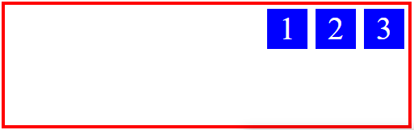
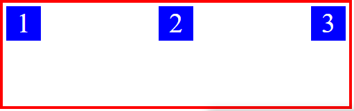

# CSS desde cero

## Tabla de contenido
- [쯈ué es CSS?](#쯈ué-es-CSS?)
- [쮺칩mo importar CSS a un HTML?](#쮺칩mo-importar-CSS-a-un-HTML?)
- [쮺uál es la sintaxis de CSS?](#쮺uál-es-la-sintaxis-de-CSS?)
- [Selectores](#Selectores)
- [쮺uales datos acepta CSS?](#쮺uales-datos-acepta-CSS?)
- [Variables CSS](#Variables-CSS)
- [Especificidad](#Especificidad)
- [Selectores del Curso](#Selectores-del-Curso)
    - [Sencillos](#Sencillos)
    - [Compuestos](#Compuestos)
    - [Selectores de atributo](#Selectores-de-atributo)
    - [Selectores de Pseudoclases](#Selectores-de-Pseudoclases)
- [쯈ué es el Box Model?](#쯈ué-es-el-Box-Model?)
- [Tipos de Displays](#Tipos-de-Displays)
    - [Inline (display: inline;)](#Inline-(display:-inline;))
    - [Block (display: block;)](#Block-(display:-block;))
    - [Inline-Block (display: inline-block;)](#Inline-Block-(display:-inline-block;))
- [Propiedad border](#Propiedad-border)
- [Propiedad border-radius](#Propiedad-border-radius)
- [Propiedad background](#Propiedad-background)
    - [Propiedad para que el fondo no se repita](#Propiedad-para-que-el-fondo-no-se-repita)
    - [Propiedad para posicionar el fondo dentro del elemento](#Propiedad-para-posicionar-el-fondo-dentro-del-elemento)
    - [Propiedad utilizada para declarar como fondo una imagen estrictamente](#Propiedad-utilizada-para-declarar-como-fondo-una-imagen-estrictamente)
    - [Propiedad utilizada para declarar como fondo un color estrictamente](#Propiedad-utilizada-para-declarar-como-fondo-un-color-estrictamente)
    - [Propiedad utilizada para establecer el tamaño de fondo](#Propiedad-utilizada-para-establecer-el-tamaño-de-fondo)
    - [Propiedad utilizada para establecer el área de visualización del fondo](#Propiedad-utilizada-para-establecer-el-área-de-visualización-del-fondo)
    - [Propiedad utilizada para establecer el área de dibujo del fondo](#Propiedad-utilizada-para-establecer-el-área-de-dibujo-del-fondo)
    - [Shorthand de background](#Shorthand-de-background)
- [Pseudoelementos ::before y ::after](#Pseudoelementos-::before-y-::after)
- [Elementos flotados (float)](#Elementos-flotados-(float))
    - [Flotar texto contorneando imágenes](#Flotar-texto-contorneando-imágenes)
- [Propiedad white-space: nowrap](#Propiedad-white-space:-nowrap)
- [Propiedad position](#Propiedad-position)
    - [Posicionamiento relativo (position: relative)](#Posicionamiento-relativo-(position:-relative))
    - [Posicionamiento absoluto (position: absolute)](#Posicionamiento-absoluto-(position:-absolute))
    - [Posicionamiento fijo (position: fixed)](#Posicionamiento-fijo-(position:-fixed))
    - [Posicionamiento sticky (position: stiky)](#Posicionamiento-sticky-(position:-stiky))
- [Propiedad z-index](#Propiedad-z-index)
- [Propiedad Flexbox](#Propiedad-Flexbox)
    - [Elementos de Flexbox](#Elementos-de-Flexbox)
    - [Dirección de los ejes en Flexbox](#Dirección-de-los-ejes-en-Flexbox)
        - [Valores por defecto de la dirección](#Valores-por-defecto-de-la-dirección)
        - [Valor row-reverse](#Valor-row-reverse)
        - [Valor column](#Valor-column)
        - [Valor column-reverse](#Valor-column-reverse)
    - [Líneas en FlexBox](#Líneas-en-FlexBox)
        - [Valores por defecto de las líneas](#Valores-por-defecto-de-las-líneas)
        - [Valor wrap](#Valor-wrap)
        - [Valor wrap-reverse](#Valor-wrap-reverse)
    - [Shorthand para flex-wrap y flex-direction](#Shorthand-para-flex-wrap-y-flex-direction)
    - [Alineación en los ejes de Flexbox](#Alineación-en-los-ejes-de-Flexbox)
    - [Valores que recibe las propiedades anteriores](#Valores-que-recibe-las-propiedades-anteriores)
    - [Flexibilidad de los elementos](#Flexibilidad-de-los-elementos)
        - [Valor grow](#Valor-grow)
        - [Valor shrink](#Valor-shrink)
    - [Valor basis](#Valor-basis)
    - [Shorthand flex](#Shorthand-flex)
- [Propiedad table](#Propiedad-table)
    - [Algunos usos de display: table](#Algunos-usos-de-display:-table)
- [Estilos para tablas HTML](#Estilos-para-tablas-HTML)
- [Color en CSS](#Color-en-CSS)
    - [Palabras clave](#Palabras-clave)
    - [Hexadecimal](#Hexadecimal)
    - [RGB / RGBA](#RGB-/-RGBA)
    - [HSL / HSLA](#HSL-/-HSLA)
- [Degradados en CSS](#Degradados-en-CSS)
    - [Degradado lineal](#Degradado-lineal)
        - [Otras propiedades adicionales](#Otras-propiedades-adicionales)
    - [Degradado radial](#Degradado-radial)
- [Propiedad CSS Grid](#Propiedad-CSS-Grid)
    - [Terminología en CSS Grid](#Terminología-en-CSS-Grid)
        - [grid-container](#grid-container)
        - [grid-columns](#grid-columns)
        - [grid-rows](#grid-rows)
        - [grid-lines](#grid-lines)
        - [grid-cells](#grid-cells)
        - [grid-areas](#grid-areas)
        - [grid-gap](#grid-gap)
    - [Uso de CSS Grid](#Uso-de-CSS-Grid)
    - [Nueva propiedad y valores de CSS Grid](#Nueva-propiedad-y-valores-de-CSS-Grid)
        - [Valor fr](#Valor-fr)
        - [Función repeat()](#Función-repeat())
    - [Posicionar hijos](#Posicionar-hijos)
        - [Forma específica](#Forma-específica)
        - [Forma abreviada (con shorthand)](#Forma-abreviada-(con-shorthand))
- [Fundamentos de la propiedad transform](#Fundamentos-de-la-propiedad-transform)
    - [Propiedad transform-origin](#Propiedad-transform-origin)
    - [Propiedad transition](#Propiedad-transition)
- [Fundamentos de Animaciones en CSS](#Fundamentos-de-Animaciones-en-CSS)
- [Fundamentos de 3D en CSS](#Fundamentos-de-3D-en-CSS)
- [Algunas notas](#Algunas-notas)
- [Links de interés](#Links-de-interés)

## 쯈ué es CSS?
Es un lenguaje de estilos interpretados y de código abierto. Acrónimo de "Cascade Style Sheet". Es el lenguaje que describe el renderizado de documentos estructurados como HTML y XML (SVG).

Con "lenguaje interpretado" se quiere decir que se necesita de un software que interprete el código CSS, en este caso lo hace el agente/navegador.

Con "cascada" se quiere decir que "lo que viene después sobrescribe lo que estaba antes".

<div align="right">
    <small>
        <a href="#tabla-de-contenido">
            🡡 volver al inicio
        </a>
    </small>
</div>

## 쮺칩mo importar CSS a un HTML?
Existen tres formas de implementar el CSS:

1. <b>Haciendo uso de la etiqueta `style`</b></br>
Se refiere a ubicar los estilos dentro de la etiqueta `style` de HTML, la cual por convención está destinada a utilizarse dentro del `head` del HTML (aunque técnicamente podría estar ubicada en cualquier parte del `body`) de la siguiente manera. Ex:

    ```html
    <!DOCTYPE html>
    <html>
        <head>
            <!-- Metadatos -->

            <style>
                /* Estilos a implementar */
            </style>
        </head>
        <body>
            <!-- Contenido del documento -->
        </body>
    </html>
    ```

    Esta forma se usa generalmente para implementar los estilos del "critical path" el cual es una técnica para optimizar la carga del sitio web.

<div align="right">
    <small>
        <a href="#tabla-de-contenido">
            🡡 volver al inicio
        </a>
    </small>
</div>

2. <b>Escribiendo los estilos en la misma línea de la etiqueta</b></br>
Donde los estilos son aplicados en la misma etiqueta HTML a través del atributo `style`, el cual por especificidad ganará a cualquier otra regla de CSS. Ex:

    ```html
    <h1 style="background:black; color:yellow;">Título con estilos en línea</h1>
    ```

    >Es importante recordar que esta no es la manera recomendable de emplear estilos a los elementos HTML.

<div align="right">
    <small>
        <a href="#tabla-de-contenido">
            🡡 volver al inicio
        </a>
    </small>
</div>

3. <b>Utilizando la etiqueta `link` para traer estilos desde un archivo externo</b></br>
Es la forma más recomendable de implementar estilos a los elementos HTML. Se logran vincular haciendo uso de la etiqueta `link` la cual recibe a través de sus atributos la relación el documento (`stylesheet`/Hoja de estilo) y la ruta donde se encuentra el archivo. Ex:

    ```html
    <!DOCTYPE html>
    <html>
        <head>
            <!-- Metadatos -->

            <link rel="stylesheet" href="ruta/documento.css">
        </head>
        <body>
            <!-- Contenido del documento -->
        </body>
    </html>
    ```
    Esta etiqueta se ubica por convención en el `head` del documento junto con los metadatos, sin embargo puede estar ubicada también al final del `body` como si se tratase de un `script`.

<div align="right">
    <small>
        <a href="#tabla-de-contenido">
            🡡 volver al inicio
        </a>
    </small>
</div>

## 쮺uál es la sintaxis de CSS?
Una regla CSS se ve de la siguiente manera:

```css
body
{
    font-size: 12px;
}
```

Donde:

`body`: Corresponde al selector. Es el elemento que a recibir los estilos declarados en la regla CSS.

`{ }`: Lo que está ubicado dentro de las llaves "{}" se le conoce como bloque de declaraciones, el cual corresponde desde donde se abre "{" hasta donde se cierra "}". Representa el contenido de la regla CSS.

`font-size`: Corresponde a la propiedad a modificar. (Lo que está antes del ":").

`16px`: Corresponde al valor que va a recibir la propiedad a utilizar. (Lo que está después del ":").

<div align="right">
    <small>
        <a href="#tabla-de-contenido">
            🡡 volver al inicio
        </a>
    </small>
</div>

## Selectores
Son palabras clave que permiten identificar a los elementos que se le aplicarán las reglas CSS. Existen muchos tipos de selectores, los cuales están agrupados en niveles. Ex:

1. Selectores de nivel 1</br>
    - De tipo: `E`.
    - Combinación descendente: `E F`.
    - De clase: `.clase`.
    - De ID: `#elementoID`.
    - De acción por el usuario (pseudoclase): `:active`.
    - De historial del link (pseudoclase): `:link`.

2. Selectores de nivel 2 </br>
    - Selector universal: `*`.
    - Pseudoclase de idioma: `lang(en)`.
    - Pseudoclase de acciones: `:hover`, `:focus`.
    - Pseudoclase de estructura: `:first-child`.
    - Combinación de hijos: `E > F`.
    - Selectores de atributos: `[foobar]`, `[atributo="valor"]`, `[foo~="bar"]`, `[foo|="en"]`.
    - Selectores ascendente combinados: `E + F`.

3. Selectores de nivel 3</br>
    - Atributos que comienzan con: `[atributo^="palabra"]`.
    - Atributo que terminan con: `[atributo$="palabra"]`.
    - Atributo que contiene la palabra: `[atributo*="palabra"]`.
    - Pseudoclase target: `:target`.
    - Pseudoclase de negación: `:not(elemento)`.
    - Combinación general de hermanos: `E ~ F`.
    - Pseudoclase de activado: `:enable`.
    - Pseudoclase de desactivado: `:disable`.
    - Pseudoclase de opción seleccionada: `:checked`.
    - Pseudoclases estructuradas: `:root`, `:empty`, `:last-child`, `:only-child`, `:first-of-type`, `:last-of-type`, `only-of-type`, `nth-child(n)`, `nth-last-child(n)`, `nth-of-type(n)`, `nth-last-of-type(n)`.

<div align="right">
    <small>
        <a href="#tabla-de-contenido">
            🡡 volver al inicio
        </a>
    </small>
</div>

## 쮺uales datos acepta CSS?
CSS acepta una variedad de tipos de datos, los cuales no están disponibles para todas las propiedades por igual. Sin embargo es buena idea conocerlos para saber los valores que podrían aceptar las propiedades. Ex:

>Nota: Una propiedad podría tener como valor un tipo de dato errado y CSS no mostraría ningún tipo de error y compilaría el código completo pero la propiedad en sí no se aplicaría.

1. Colores</br>
    - Hexadecimal: `#FF0000`.
    - Palabreas clave: `red`.
    - Funciones: `hsl(0,100%,50%)`, `rgba(255,0,0,1)`.

2. Unidades de tiempo</br>
    - Segundos: `1s`.
    - Milisegundos: `1000ms`.

3. Grados</br>
    - Grados/Ángulos: `10deg`.
    - Vueltas: `2turn`.

4. Strings(textos)</br>
    - Strings: `content: "Aquí va el texto";`.

5. Otras unidades</br>
    - Píxeles: `10px`.
    - Unidad relativa al tamaño de fuente más cercano: `10em`.
    - Unidad relativa al tamaño de fuente más lejano: `10rem`.
    - Porcentaje: `10%`.
    - Unidad relativa al ancho de la pantalla: `10vw`.
    - Unidad relativa al alto de la pantalla: `10vh`.
    - Números: `10`.
    - Etc.

<div align="right">
    <small>
        <a href="#tabla-de-contenido">
            🡡 volver al inicio
        </a>
    </small>
</div>

## Variables CSS
Las variables son espacio que se crean en memoria para almacenar un valor y usarlo en posterioridad con mayor facilidad. Es decir, son como unos contenedores que almacenan valores que se quieren recordar con una palabra.

CSS admite el uso de variables para almacenar distintos tipos de datos. Para declararlas en CSS se hace de la siguiente manera:

```css
:root
{
    --nombreVariable: valorAGuardar;
}
```

Donde:</br>
- `:root` => Corresponde  al bloque y `scope` que contendrá todas las declaraciones de las variables.

- Cabe destacar que es obligatorio anteponer el doble guión (--) al declarar las variables.

- Hay que tener en cuentas que las variables tienen un `scope` al nivel del `DOM`.

Para usarlas se hace de la siguiente manera:

```css
body
{
    background: var(--nombreVariable);
}
```

>Nota: Las variables CSS son soportadas por todos los navegadores (menos IE 🙄). Por tanto es recomendable su uso. Pueden ser declarados en el body.

<div align="right">
    <small>
        <a href="#tabla-de-contenido">
            🡡 volver al inicio
        </a>
    </small>
</div>

## Especificidad
Se refiere a la forma por la cual CSS resuelve los conflictos de estilos, los cuales son resueltos a través de algoritmos que asigna valores dependiendo del selector. Ex:

<table style="margin: 0 auto">
    <thead>
        <tr>
            <th>Selector</th>
            <th>Valor</th>
        </tr>
    </thead>
    <tbody>
        <tr>
            <td>Selectores de tipo (de etiqueta)</td>
            <td>1</td>
        </tr>
        <tr>
            <td>Selectores de clase</td>
            <td>10</td>
        </tr>
        <tr>
            <td>Selectores de ID</td>
            <td>100</td>
        </tr>
        <tr>
            <td>Estilos en línea</td>
            <td>1000</td>
        </tr>
        <tr>
            <td><code>!important</code></td>
            <td>100000000000000000000</td>
        </tr>
</table>

<div align="right">
    <small>
        <a href="#tabla-de-contenido">
            🡡 volver al inicio
        </a>
    </small>
</div>

## Selectores del Curso
Para efectos de este curso englobaremos los selectores a describir en sencillos, compuestos, de atributos y pseudoclases.

### Sencillos
- Selector de etiqueta HTML</br>
Es una etiqueta HTML o XML. Ex:
    ```css
    h1
    {
        /* reglas css */
    }
    p
    {
        /* reglas css */
    }
    ```
<div align="right">
    <small>
        <a href="#tabla-de-contenido">
            🡡 volver al inicio
        </a>
    </small>
</div>

- Selector de clase</br>
Selecciona los elementos por su clase. Ex:
    ```css
    .banner
    {
        /* reglas css */
    }
    .banner__contenedor
    {
        /* reglas css */
    }
    ```

<div align="right">
    <small>
        <a href="#tabla-de-contenido">
            🡡 volver al inicio
        </a>
    </small>
</div>

- Selector de ID</br>
Son identificadores <span style="text-decoration: underline;">únicos</span> que no se pueden repetir en el HTML, es decir no se pueden reasignar a otros elementos. Generalmente se usan para JavaScript y no para CSS. Ex:
    ```css
    #js-menu
    {
        /* reglas css */
    }
    #js-kebak
    {
        /* reglas css */
    }
    ```

<div align="right">
    <small>
        <a href="#tabla-de-contenido">
            🡡 volver al inicio
        </a>
    </small>
</div>

- Selector universal</br>
Es un selector que selecciona todo. No se recomienda su uso sin tener conocimientos de él. Ex:
    ```css
    /* Selecciona a todos los elementos HTML */
    *
    {
        /* reglas css */
    }
    /* Selecciona a todos los elementos dentro del UL */
    .ul *
    {
        /* reglas css */
    }
    ```

<div align="right">
    <small>
        <a href="#tabla-de-contenido">
            🡡 volver al inicio
        </a>
    </small>
</div>

- Selectores case sensitive e insentive</br>
    * Los selectores (escritos en el documento CSS) de clase o ID son case sensitive.
    * Los selectores (escritos en el documento CSS) de etiqueta son case insensitive.
    * Los atributos HTML y XML (escritos en el documento HTML) son case sensitive.
    * Las etiquetas HTML y XML (escritos en el documento HTML) son case insensitive.

<div align="right">
    <small>
        <a href="#tabla-de-contenido">
            🡡 volver al inicio
        </a>
    </small>
</div>

### Compuestos
- Selectores agrupados</br>
Es cuando se le quiere aplicar estilos a varios elementos a la vez. Ex:
    ```css
    .titulo,
    .subtitulo,
    .epigrafe
    {
        /* reglas css */
    }
    ```
    >Nota: es buena práctica separar los elementos con saltos de línea cuando se da este caso.

<div align="right">
    <small>
        <a href="#tabla-de-contenido">
            🡡 volver al inicio
        </a>
    </small>
</div>

- Selectores combinados</br>
Es cuando se quiere aplicar estilos a uno o varios elementos haciendo uso de varias de sus características seleccionables. Ex:
    ```css
    h1.titulo
    {
        /* reglas css */
    }
    ```
    >Nota: a diferencia de los selectores agrupados que seleccionan todos los elementos que contengan la clase "`titulo`" y "`subtitulo`", aquí solo se aplicarán estilos a los elementos `h1` que contengan la clase "`titulo`".

<div align="right">
    <small>
        <a href="#tabla-de-contenido">
            🡡 volver al inicio
        </a>
    </small>
</div>

- Selectores descendientes</br>
Es cuando se selecciona un elemento que es hijo, nieto o bisnieto (no importa el nivel), de otro, recorriendo todas las clases/etiquetas que hay entre el elemento a seleccionar y sus padres. Ex:
    ```css
    .list .list__item span
    {
        /* reglas css */
    }
    ```
    >Nota: Las buenas prácticas recomiendan tratar en lo posible de evitar selectores descendientes salvo que no quede otra opción.

<div align="right">
    <small>
        <a href="#tabla-de-contenido">
            🡡 volver al inicio
        </a>
    </small>
</div>

- Selector hijo directo</br>
Son los elementos que son hijos directos de un elemento. Por ejemplo una lista (ul) que está contenida en un elemento (li). Ex:
    ```css
    li > ul
    {
        /* reglas css */
    }
    ```

<div align="right">
    <small>
        <a href="#tabla-de-contenido">
            🡡 volver al inicio
        </a>
    </small>
</div>

- Selector hermano siguiente (adyacente)</br>
Es aquel que selecciona al elemento que está <span style="text-decoration: underline">justo después de otro</span> (hermano). Por ejemplo en la siguiente declaración se está seleccionando al elemento que está después del título (subtitulo).
    ```css
    .titulo + .subtitulo
    {
        /* reglas css */
    }
    ```

<div align="right">
    <small>
        <a href="#tabla-de-contenido">
            🡡 volver al inicio
        </a>
    </small>
</div>

- Selector de hermanos siguientes</br>
Selecciona a <span style="text-decoration: underline">todos</span> los hermanos que están al mismo nivel y cumplen la condición. Ex:
    ```css
    .hermano-a ~ .hermano-b
    {
        /* reglas css */
    }
    ```
    >Nota: a diferencia del selector de hermano siguiente (adyacente) que solo selecciona a 1 hermano, este selecciona a todos los hermanos.

<div align="right">
    <small>
        <a href="#tabla-de-contenido">
            🡡 volver al inicio
        </a>
    </small>
</div>

### Selectores de atributo
Son aquellos selectores que permiten vincular a reglas CSS atributos propios de HTML que no son necesariamente las clases o ID. Ex:
>Nota: Estos selectores son case sensitive.

```css
[atributo="valor-deseado"]
{
    /* reglas css */
}

[atributo]
{
    /* reglas css */
}
```

Algunos ejemplos de implementación de selectores de atributos:

- Selecciona a todos los elementos que contengan el atributo `href`:</br>
    ```css
    [href]
    {
        /* reglas css */
    }
    ```

- Selecciona a todos los elementos que contengan la URL de google en su `href`:
    ```css
    [href="https://google.co.ve"]
    {
        /* reglas css */
    }
    ```

- Selecciona a todos los elementos que contengan el atributo `title` y `href`:
    ```css
    [title][href]
    {
        /* reglas css */
    }
    ```

<div align="right">
    <small>
        <a href="#tabla-de-contenido">
            🡡 volver al inicio
        </a>
    </small>
</div>

Implementando comodines junto a los atributos:

- Uso de `^` (caret)</br>
Sirve para indicar que el atributo "comienza con". Ex:
    ```css
    [title^="Google"]
    {
        /* reglas css */
    }
    ```
    Este selector aplica la regla CSS a todos los elementos que en el atributo `title` comiencen con "Google".

- Uso de `$`</br>
Sirve para indicar que el atributo "termina con". Ex:
    ```css
    [href$=".pdf"]
    {
        /* reglas css */
    }
    ```
    Este selector aplica la regla CSS a todos los elementos que en el atributo `href` terminen en ".pdf".

- Uso de `*`</br>
Sirve para indicar que el atributo "contiene". Ex:
    ```css
    [href*="textoABuscar"]
    {
        /* reglas css */
    }
    ```
    Este selector busca en el valor del atributo `href` el texto que se busca sin importar el orden donde lo encuentre.

<div align="right">
    <small>
        <a href="#tabla-de-contenido">
            🡡 volver al inicio
        </a>
    </small>
</div>


**Tips**: Por defecto las búsquedas se hacen siendo case sensitive dado que el valor que reciben los atributos es case sensitive. Para aplicar una regla y omitir esto se usa la bandera "`i`" de la siguiente manera:
```css
[title="Google" i]
{
    /* reglas css */
}
```

De esta forma se aplican los estilos a todas las etiquetas que contengan "Google" sin importar como este escrito en su atributo `title`.

<div align="right">
    <small>
        <a href="#tabla-de-contenido">
            🡡 volver al inicio
        </a>
    </small>
</div>

### Selectores de Pseudoclases
Son selectores dinámicos dado que responde al contexto, a la interacción del usuario o algunas propiedades del elemento. Se indican anteponiendo ":". Entre estos están:

>Nota: Las pseudoclases no necesitan de un elemento antepuesto para su declaración, dado que si se coloca sin un elemento se interpretará dicha regla CSS para todo elemento que pudiera hacer uso de dicha pseudoclase.

```css
:hover
{
    /* reglas css */
}
```

En dicha regla CSS estamos indicando que a cualquier elemento que se la haga `hover` dentro del documento HTML se le apliquen las reglas CSS declaradas.

Entre estos selectores tenemos:

* Pseudoclase `hover`</br>
Aplica una regla CSS cuando el mouse se posa encima del elemento. Ex:
    ```css
    a:hover
    {
        /* reglas css */
    }
    ```

<div align="right">
    <small>
        <a href="#tabla-de-contenido">
            🡡 volver al inicio
        </a>
    </small>
</div>

* Pseudoclase `active`</br>
Aplica una regla CSS en el momento que se está haciendo click en un elemento. Ex:
    ```css
    a:active
    {
        /* reglas css */
    }
    ```

<div align="right">
    <small>
        <a href="#tabla-de-contenido">
            🡡 volver al inicio
        </a>
    </small>
</div>

* Pseudoclase `visited`</br>
Aplica una regla CSS cuando el navegador detecta que un enlace ha sido visitado por el usuario. Ex:
    ```css
    a:visited
    {
        /* reglas css */
    }
    ```

<div align="right">
    <small>
        <a href="#tabla-de-contenido">
            🡡 volver al inicio
        </a>
    </small>
</div>

* Pseudoclase `target`</br>
Aplica una regla CSS cuando un elemento ha sido alcanzado a través de un `link` (o etiqueta de ancla). Ex:
    ```css
    #parrafo:target
    {
        margin-top: 100px;
    }
    ```
    >Nota: Esta pseudoclase es útil para resolver el issue que se genera al usar un sticky menu con los links a marcadores HTML dentro de la página que al hacer click sobre ellos el propio menu los tapa.

<div align="right">
    <small>
        <a href="#tabla-de-contenido">
            🡡 volver al inicio
        </a>
    </small>
</div>

* Pseudoclase `root`</br>
Hace referencia a la raíz del documento, es decir, a la etiqueta HTML. Es la utilizada generalmente para hacer declaraciones globales como las variables CSS. Ex:
    ```css
    :root
    {
        --variable: valorVariable;
    }
    ```

<div align="right">
    <small>
        <a href="#tabla-de-contenido">
            🡡 volver al inicio
        </a>
    </small>
</div>

* Pseudoclase `empty`</br>
Aplica una regla CSS si un elemento está vacío de hijos o de texto.
    ```css
    p:empty
    {
        display: none;
    }
    ```
    Esta regla CSS ocultará a todos los elementos "`p`" que no tengan contenido dentro.

<div align="right">
    <small>
        <a href="#tabla-de-contenido">
            🡡 volver al inicio
        </a>
    </small>
</div>

* Pseudoclase `not`</br>
Es una función de CSS que recibe como parámetro un selector. Dicha función se interpreta como: "Cualquier elemento que no cumple con el selector indicado por parámetro". Ex:
    ```css
    /* :not(selector){  }*/

    p:not(:empty)
    {
        /* reglas css */
    }
    ```
    Esta regla CSS selecciona a todos los elementos "`p`" que no estén vacios.

    >Nota: A este selector se le puede pasar por parámetros cualquier selector a **excepción de otra negación**, es decir otro "`:not`" anidado.

<div align="right">
    <small>
        <a href="#tabla-de-contenido">
            🡡 volver al inicio
        </a>
    </small>
</div>

* Pseudoclase `focus`</br>
Aplica una regla CSS cuando un elemento de un formulario ha sido seleccionado con el cursor o con tab. Ex:
    ```css
    input:focus
    {
        /* reglas css */
    }
    ```

<div align="right">
    <small>
        <a href="#tabla-de-contenido">
            🡡 volver al inicio
        </a>
    </small>
</div>


* Pseudoclase `enabled`/`disabled`</br>
Aplica una regla CSS cuando un elemento de un formulario está activado o desactivado. Ex:
    ```css
    /* activados */
    input:enabled
    {
        /* reglas css */
    }
    /* desactivados */
    input:disabled
    {
        /* reglas css */
    }
    ```

<div align="right">
    <small>
        <a href="#tabla-de-contenido">
            🡡 volver al inicio
        </a>
    </small>
</div>

* Pseudoclase `checked`</br>
Aplica una reglas CSS cuando un elemento `radio`/`checkbox` está seleccionado. Ex:
    ```css
    input:checked
    {
        /* reglas css */
    }
    ```

<div align="right">
    <small>
        <a href="#tabla-de-contenido">
            🡡 volver al inicio
        </a>
    </small>
</div>

* Pseudoclase `optional`/`required`</br>
Aplica una regla CSS cuando un elemento de un formulario es opcional u obligatorio. Ex:
    ```css
    /* opcional */
    input:optional
    {
        /* reglas css */
    }
    /* obligatorio */
    input:required
    {
        /* reglas css */
    }
    ```

<div align="right">
    <small>
        <a href="#tabla-de-contenido">
            🡡 volver al inicio
        </a>
    </small>
</div>

* Pseudoclase `valid`/`invalid`</br>
Aplica una regla CSS cuando un elemento de un formulario es validado por el navegador (la navegación de un `input` de tipo email por ejemplo). Ex:
    ```css
    /* válido */
    input:valid
    {
        /* reglas css */
    }
    /* invalido */
    input:invalid
    {
        /* reglas css */
    }
    ```

<div align="right">
    <small>
        <a href="#tabla-de-contenido">
            🡡 volver al inicio
        </a>
    </small>
</div>

* Pseudoclase `in-range`/`out-of-range`</br>
Aplica una regla CSS cuando un elemento (`input` de tipo numérico) está fuera del rango establecido por sus atributos.
    ```css
    /* dentro del rango */
    input:in-range
    {
        /* reglas css */
    }
    /* fuera de rango */
    input:out-of-range
    {
        /* reglas css */
    }
    ```

<div align="right">
    <small>
        <a href="#tabla-de-contenido">
            🡡 volver al inicio
        </a>
    </small>
</div>

* Pseudoclase `first-child`</br>
Aplica una regla CSS al primer hijo que encuentre de una lista de elementos sin tener en cuenta el tipo de etiqueta HTML. Ex:
    ```css
    p:first-child
    {
        /* reglas css */
    }
    ```
    Esta regla CSS aplicada a un conjunto de elementos, seleccionará el primer hijo que sea un "`p`" y le aplicará los estilos correspondientes a la regla.

<div align="right">
    <small>
        <a href="#tabla-de-contenido">
            🡡 volver al inicio
        </a>
    </small>
</div>

* Pseudoclase `last-child`</br>
Aplica una regla CSS al último hijo que encuentre de una lista de elementos sin tener en cuenta el tipo de etiqueta HTML. Ex:
    ```css
    p:last-child
    {
        /* reglas css */
    }
    ```

<div align="right">
    <small>
        <a href="#tabla-de-contenido">
            🡡 volver al inicio
        </a>
    </small>
</div>

* Pseudoclase `nth-child()`</br>
Es una función de CSS que recibe por parámetros bien sea el número de hijo a seleccionar, o una ecuación como patrón de elementos a seleccionar, o las palabras reservadas para seleccionar elementos pares (`even`) e impares (`odd`). Ex:

    Buscar por el N° de hijo:
    ```css
    .contenedor:nth-child(1)
    {
        /* reglas css */
    }
    ```

    Buscar elementos pares e impares:
    ```css
    /* elementos pares */
    .contenedor:nth-child(even)
    {
        /* reglas css */
    }
    /* elementos impares */
    .contenedor:nth-child(odd)
    {
        /* reglas css */
    }
    ```

    <div align="right">
        <small>
            <a href="#tabla-de-contenido">
                🡡 volver al inicio
            </a>
        </small>
    </div>

    Buscar elementos con un patrón de búsqueda (ecuación):
    ```css
    .contenedor:nth-child(3n)
    {
        /* reglas css */
    }
    ```
    Dicha regla CSS aplicará los estilos CSS a los elementos de 3 en 3. Es decir, a los múltiplos de 3. Cabe destacar que el valor por defecto de "`n`" al empezar la función es 0. Y la función interpretará la ecuación de la siguiente manera: 3x0 (primer intento), 3x1 (segundo intento), 3x2 (tercer intento)... etc. Donde 3 es el número que hemos seleccionado para nuestro patrón y 0, 1, 2 es el valor de "`n`" que va incrementando a medida que itera automáticamente la función.

    Buscar elementos con un patrón de búsqueda en reversa (ecuación):</br>
    Trabaja de la misma manera que la función `nth-child()` solo que en reversa. Ex:
    ```css
    .contenedor:nth-last-child(3n+1)
    {
        /* reglas css */
    }
    ```

    Dicha regla CSS aplicará los estilos CSS a los elementos con un patrón de 3xn+1 de abajo hacia arriba (en reversa). Es decir, la multiplicación de 3xn + 1. Cabe destacar que el valor por defecto de "`n`" al empezar la función es 0. Y la función interpretará la ecuación de la siguiente manera: 3x0+1 (primer intento), 3x1+1(segundo intento), 3x2+1(tercer intento)... etc. Donde 3 es el número que hemos seleccionado para nuestro patrón y 0, 1, 2 es el valor de "`n`" que va incrementando a medida que itera automáticamente la función y el 1 que se suma al final es parte de la ecuación del patrón a seguir.

<div align="right">
    <small>
        <a href="#tabla-de-contenido">
            🡡 volver al inicio
        </a>
    </small>
</div>

* Pseudoclase `only-child`</br>
Aplica una regla CSS a un elemento hijo único. Ex:
    ```css
    .contenedor:only-child
    {
        /* reglas css */
    }
    ```

<div align="right">
    <small>
        <a href="#tabla-de-contenido">
            🡡 volver al inicio
        </a>
    </small>
</div>

* Pseudoclase `first-of-type`</br>
Selecciona al primer elemento siempre y cuando sea del mismo tipo del que se está buscando. Es decir, toma en cuenta el tipo de etiqueta HTML. Funciona de la siguiente manera:

    <div style="display:flex;">
    <div style="width:50vw;padding: 20px">

    ### Código base

    ```html
    <div>DIV 1</div>
    <div>DIV 2</div>
    <p>Párrafo 1</p>
    <p>Párrafo 2</p>
    <p>Párrafo 3</p>
    <p>Párrafo 4</p>
    <div>DIV 3</div>
    ```
    ```css
    p:first-child
    {
        background: blue;
        color: #fff;
    }
    ```

    </div>
    <div style="width:50vw;padding: 20px">

    ### Salida

    <div>DIV 1</div>
    <div>DIV 2</div>
    <p>Párrafo 1</p>
    <p>Párrafo 2</p>
    <p>Párrafo 3</p>
    <p>Párrafo 4</p>
    <div>DIV 3</div>


    </div>
    </div>

    Nótese como ningún elemento es seleccionado dado que si existe un primer hijo pero no es un elemento "`p`" como lo exige el `first-child`.


    <div style="display:flex;">
    <div style="width:50vw;padding: 20px">

    ### Código base

    ```html
    <div>DIV 1</div>
    <div>DIV 2</div>
    <p>Párrafo 1</p>
    <p>Párrafo 2</p>
    <p>Párrafo 3</p>
    <p>Párrafo 4</p>
    <div>DIV 3</div>
    ```
    ```css
    p:first-of-type
    {
        background: blue;
        color: #fff;
    }
    ```

    </div>
    <div style="width:50vw;padding: 20px">

    ### Salida

    <div>DIV 1</div>
    <div>DIV 2</div>
    <p style="background:blue;color:#fff;">Párrafo 1</p>
    <p>Párrafo 2</p>
    <p>Párrafo 3</p>
    <p>Párrafo 4</p>
    <div>DIV 3</div>


    </div>
    </div>

    Nótese como en este caso con `first-of-type` se selecciona el primer hijo que sea de tipo "`p`".


<div align="right">
    <small>
        <a href="#tabla-de-contenido">
            🡡 volver al inicio
        </a>
    </small>
</div>


* Pseudoclase `last-of-type`</br>
Selecciona el último elemento siempre y cuando sea del mismo tipo del que se está buscando. Es decir, toma en cuenta el tipo de etiqueta HTML. Funciona de la siguiente manera:

    <div style="display:flex;">
    <div style="width:50vw;padding: 20px">

    ### Código base

    ```html
    <div>DIV 1</div>
    <div>DIV 2</div>
    <p>Párrafo 1</p>
    <p>Párrafo 2</p>
    <p>Párrafo 3</p>
    <p>Párrafo 4</p>
    <div>DIV 3</div>
    ```
    ```css
    p:last-child
    {
        background: blue;
        color: #fff;
    }
    ```

    </div>
    <div style="width:50vw;padding: 20px">

    ### Salida

    <div>DIV 1</div>
    <div>DIV 2</div>
    <p>Párrafo 1</p>
    <p>Párrafo 2</p>
    <p>Párrafo 3</p>
    <p>Párrafo 4</p>
    <div>DIV 3</div>


    </div>
    </div>

    Nótese como ningún elemento es seleccionado dado que si existe un último hijo pero no es un elemento "`p`" como lo exige el `last-child`.


    <div style="display:flex;">
    <div style="width:50vw;padding: 20px">

    ### Código base

    ```html
    <div>DIV 1</div>
    <div>DIV 2</div>
    <p>Párrafo 1</p>
    <p>Párrafo 2</p>
    <p>Párrafo 3</p>
    <p>Párrafo 4</p>
    <div>DIV 3</div>
    ```
    ```css
    p:last-of-type
    {
        background: blue;
        color: #fff;
    }
    ```

    </div>
    <div style="width:50vw;padding: 20px">

    ### Salida

    <div>DIV 1</div>
    <div>DIV 2</div>
    <p>Párrafo 1</p>
    <p>Párrafo 2</p>
    <p>Párrafo 3</p>
    <p style="background:blue;color:#fff;">Párrafo 4</p>
    <div>DIV 3</div>


    </div>
    </div>

    Nótese como en este caso con `last-of-type` se selecciona el último hijo que sea de tipo "`p`".

<div align="right">
    <small>
        <a href="#tabla-de-contenido">
            🡡 volver al inicio
        </a>
    </small>
</div>

* Pseudoclase `nth-of-type()`</br>
Es una función de CSS que recibe por parámetros bien sea el número de hijo a seleccionar, o una ecuación como patrón de elementos a seleccionar, o las palabras reservadas para seleccionar elementos pares (`even`) e impares (`odd`). A diferencia de `nth-child` en este caso se toma en cuenta el tipo de etiqueta a seleccionar.

    La función `nth-of-type()` puede buscar por clases pero empezará a contar teniendo en cuenta la cantidad de elementos del mismo tipo sin importar si tiene la misma clase o no. Ex:


    <div style="display:flex;">
    <div style="width:50vw;padding: 20px">

    ### Código base

    ```html
    <div class="primary">
        <a class="primary__link-rs" href="#">Facebook</a>
        <a class="primary__link-nav" href="#">Home</a>
        <a class="primary__link-nav" href="#">Products</a>
    </div>
    ```
    ```css
    .primary__link-nav:nth-of-type(1)
    {
        background: blue;
        color: #fff;
    }
    ```

    </div>
    <div style="width:50vw;padding: 20px">

    ### Salida

    <a class="primary__link-rs" href="#">Facebook</a>
    <a class="primary__link-nav" href="#">Home</a>
    <a class="primary__link-nav" href="#">Products</a>


    </div>
    </div>

    En este ejemplo nótese como no se selecciona ningún elemento dado que el **primer hijo es del mismo tipo que el de la clase que se busca**, es decir, el elemento con clase `.primary__link-rs` es un ancla al igual que el elemento con la clase `.primary__link-nav` por tanto la condición falla puesto que: Sí encuentra el primer elemento de tipo ancla que resulta ser `.primary__link-rs` que no contiene la clase solicitada en la regla CSS.

    Sabiendo esto, se puede decir que el selector busca "Al primer hijo que sea del mismo tipo y contenga la clase a buscar".

<div align="right">
    <small>
        <a href="#tabla-de-contenido">
            🡡 volver al inicio
        </a>
    </small>
</div>

* Pseudoclase `last-of-type`</br>
Trabaja de la misma manera que `nth-of-type` o `nth-child` solo que empieza a contar de abajo hacia arriba, es decir, en reversa. Es similar al `nth-last-child` solo que en este caso se toma en cuenta el tipo de elemento HTML.

<div align="right">
    <small>
        <a href="#tabla-de-contenido">
            🡡 volver al inicio
        </a>
    </small>
</div>

## 쯈ué es el Box Model?
Significa "Modelo de Caja" en español. Es un algoritmo que utiliza el agente (navegador) para saber cómo mostrar los elementos en pantalla.

Cabe destacar que todos los elementos HTML son rectangulares y es a través de *trucos CSS* que se muestran con otra forma, sin embargo, internamente estos siguen siendo rectangulares.

Todos los elementos están compuestos por:

<div align="center">
    
    <small><p>Elementos que conforman el Box Model.</p></small>
</div>

Donde se pueden clasificar en:

**Elementos internos**
- Contenido.
- Padding.
- Border.

**Elementos externos**
- Margin.

Donde:

Contenido: Hace a las dimensiones que obtiene el elemento del tamaño puro del elemento.

Padding: Es el relleno que se le aplica al elemento.

Border: Es el trazo que se le aplica alrededor del elemento.

Margin: Es la distancia entre un elemento y otro.

<span style="text-decoration:underline">Nota:</span>

- Es posible aplicar los valores de las propiedades `margin` y `padding`, de la siguiente manera:

        [propiedad]: valorParaTodos;

        [propiedad]: valorArriba valorDerecha valorAbajo valorIzquierda;

        [propiedad]: valorEjeX valorEjeY;

        [propiedad]: valorArriba valorEjeX valorAbajo;

- Los márgenes horizontales se suman.

- Los márgenes verticales *colapsan* tomando solo el valor mayor. **NO SE SUMAN**.

- Por defecto el `width` del elemento cuyo ancho no ha sido declarado es: contenido+`padding`+`border`.

- Por defecto el `height` del elemento cuyo alto no ha sido declarado es: contenido+`padding`+`border`.

- El `width` de un elemento cuyo ancho ha sido declarado `width`+`padding`+`border`.

- El `height` de un elemento cuyo alto ha sido declarado es `height`+`padding`+`border`.

<div align="right">
    <small>
        <a href="#tabla-de-contenido">
            🡡 volver al inicio
        </a>
    </small>
</div>

## Tipos de Displays
La propiedad "`display`" puede recibir varios valores los cuales modifican el posicionamiento de los elementos mostrados en pantalla, sin embargo en esta ocasión se mencionarán los más comunes y los que HTML asigna a algunos elementos por defecto.

<div align="right">
    <small>
        <a href="#tabla-de-contenido">
            🡡 volver al inicio
        </a>
    </small>
</div>

### Inline (`display: inline;`)
Es el tipo de `display` que asigna el navegador a los elementos que se visualizan "en línea", es decir, los que se dibujan teniendo en cuenta el tamaño que ocupa su contenido permitiendo colocarse uno al lado del otro. Entre estos están:

- Los `span`.
- Los `a`.
- Las `img`.
- Etc.

Cabe destacar que los elementos de tipo `inline` no respetan el uso de las propiedades que asignan el `width` y el `height`.

Por defecto estos elementos se posicionan así:

<div align="center">
    
    <small><p>Elementos inline.</p></small>
</div>

<div align="right">
    <small>
        <a href="#tabla-de-contenido">
            🡡 volver al inicio
        </a>
    </small>
</div>

### Block (`display: block;`)
Es el tipo de `display` que asigna el navegador a los elementos que se visualizan "en bloque", es decir, los que se dibujan horizontalmente de un extremo a otros sin importar si su contenido ocupa dicho espacio, por tanto se muestran uno debajo del otro. Entre estos están:

- Los `div`.
- Los encabezados (`h1`-`h6`).
- Los `p`.
- Etc.

Cabe destacar que los elementos de tipo `block` si respetan el uso de las propiedades que asignan el `width` y el `height`.

Por defecto estos elementos se posicionan así:

<div align="center">
    
    <small><p>Elementos block.</p></small>
</div>

<div align="right">
    <small>
        <a href="#tabla-de-contenido">
            🡡 volver al inicio
        </a>
    </small>
</div>

### Inline-Block (`display: inline-block;`)
Es el tipo de `display` que combina lo mejor de ambos mundos, es decir, el elemento que lo recibe no interfiere el flujo en que se visualiza, es decir, sigue viéndose "en línea" pero se puede modificar su `width` y su `height`.

Por defecto estos elementos se posicionan así:

<div align="center">
    
    <small><p>Elementos inline-block.</p></small>
</div>

<div align="right">
    <small>
        <a href="#tabla-de-contenido">
            🡡 volver al inicio
        </a>
    </small>
</div>

## Propiedad `border`
Aplica un borde alrededor del elemento. La forma más sencilla de implementarlo es a través de su shorthand:

```css
.elemento
{
    border: [grosor] [estilo] [color]
}

/*
    Donde:

    [grosor]=> Recibe el grosor que tendrá el borde en píxeles (por lo general).

    [estilo]=> Recibe el estilo que tendrá el borde según sus palabras claves: solid, dotted y dashed.

    [color]=> Recibe algún color.

*/
```
>Nota: Si no se declara el color en el shorthand, se tomará el color del borde del color de la fuente declarada.

<div align="right">
    <small>
        <a href="#tabla-de-contenido">
            🡡 volver al inicio
        </a>
    </small>
</div>

Es posible declarar `border` haciendo uso de sus propiedades individuales de la siguiente manera:

```css
.elemento
{
    border-style: [estilo];
    border-width: [grosor];
    border-color: [color];
}
```

Las propiedades de los bordes se pueden declarar también de forma individual (por cada lado) o abreviándolos como se ha explicado con anterioridad con `margin` y `padding`. Ex:

        border-aaaa: valorParaTodos;

        border-aaaa: valorArriba valorDerecha valorAbajo valorIzquierda;

        border-aaaa: valorEjeX valorEjeY;

        border-aaaa: valorArriba valorEjeX valorAbajo;

Donde "`border-aaaa`" puede ser `border-width`, `border-style` o `border-color`.

También es posible hacer declaraciones de un solo lado combinando todas sus propiedades. Ex:

```css
.elemento
{
    border-[lado]: [grosor] [estilo] [color];
}
/*
    Donde:

    [lado]=> Puede recibir el valor de alguno de sus lados como son left, right, top o bottom de la siguiente manera, Ex: "border-top"
*/
```

<div align="right">
    <small>
        <a href="#tabla-de-contenido">
            🡡 volver al inicio
        </a>
    </small>
</div>

## Propiedad `border-radius`
Aplica al elemento bordes/esquinas redondeadas. La forma más común de implementarlo es a través de su shorthand:

```css
.elemento
{
    border-radius: [valorParaTodos]
}
```

Cabe destacar que en lugar de requerir esquinas redondeadas se quisiera esquinas ovaladas, diferenciándose de las redondeadas de la siguiente manera:

<div style="display:flex;">
<div style="width:50vw;padding: 20px">

### Código base

```html
<div class="redondeadas"></div>

<div class="ovaladas"></div>
```
```css
div
{
    height: 100px;
    width: 250px;
    border: 1px solid crimson;
}

.redondeadas
{
    border-radius: 10px;
}

.ovaladas
{
    border-radius: 50px / 30px;
    /*[valorEjeX] / [valorEjeY]*/
}
```

</div>
<div style="width:50vw;padding: 20px">

### Salida

<div style="height:100px;width:250px;border:4px solid crimson;border-radius:10px"></div>
<br>
<div style="height:100px;width:250px;border:4px solid crimson;border-radius:50px/30px"></div>

</div>
</div>

<div align="right">
    <small>
        <a href="#tabla-de-contenido">
            🡡 volver al inicio
        </a>
    </small>
</div>

Sin embargo se pueden declarar ambos estilos de las siguientes maneras:

        border-radius: [valorParaTodos]

        border-radius: [topLeft-BottomRight] [topRight-bottomLeft]

        border-radius: [topLeft] [topRight - bottomLeft] [bottom-right]

        border-radius: [topLeft] [topRight] [bottomRight] [bottomLeft]

<div align="right">
    <small>
        <a href="#tabla-de-contenido">
            🡡 volver al inicio
        </a>
    </small>
</div>

## Propiedad `background`
Es el fondo que se le declara al elemento. El cual dependiendo del estilo que se le quiera dar al fondo se deberían de declarar junto a  algunas de las siguientes propiedades:

<div align="right">
    <small>
        <a href="#tabla-de-contenido">
            🡡 volver al inicio
        </a>
    </small>
</div>

### Propiedad para que el fondo no se repita
Previamente de haber declarado algún `background` de fondo se utiliza la siguiente propiedad:
```css
.elemento
{
    /* previamente de haber declarado */
    background: url(img/imagen.png);

    background-repeat: no-repeat;
}
```
Esta propiedad impide que el fondo se repita indefinidamente por todo la superficie del elemento impidiendo así el efecto "mosaico".

<div align="right">
    <small>
        <a href="#tabla-de-contenido">
            🡡 volver al inicio
        </a>
    </small>
</div>

### Propiedad para posicionar el fondo dentro del elemento
Previamente de haber declarado algún `background` de fondo se utiliza la siguiente propiedad:
```css
.elemento
{
    /* previamente de haber declarado */
    background: url(img/imagen.png);

    background-position: [ejeX] [ejeY];
}
```
>Nota: Esta propiedad puede recibir tanto valor para X como para Y individualmente o recibir un solo valor que se aplique a ambos ejes.

<div align="right">
    <small>
        <a href="#tabla-de-contenido">
            🡡 volver al inicio
        </a>
    </small>
</div>

### Propiedad utilizada para declarar como fondo una imagen estrictamente
Se utiliza la siguiente propiedad:

```css
.elemento
{
    background-image: url(img/imagen.png);
}
```

<div align="right">
    <small>
        <a href="#tabla-de-contenido">
            🡡 volver al inicio
        </a>
    </small>
</div>

### Propiedad utilizada para declarar como fondo un color estrictamente
Se utiliza la siguiente propiedad:

```css
.elemento
{
    background-color: [color];
}
```

<div align="right">
    <small>
        <a href="#tabla-de-contenido">
            🡡 volver al inicio
        </a>
    </small>
</div>

### Propiedad utilizada para establecer el tamaño de fondo
Previamente de haber declarado algún `background` de fondo se utiliza la siguiente propiedad:
```css
.elemento
{
    /* previamente de haber declarado */
    background: url(img/imagen.png);

    background-size: [valor];
}
```
Esta propiedad podría como unidades de valor las siguientes:

- Porcentaje (%): Corresponde al porcentaje en relación a su contenedor.

- Píxeles (px): Recibe una medida específica que puede ser tanto para el ejeX como para el ejeY o un solo valor para ambos.

- Palabras clave: Las cuales son:
    - `cover`: hace que el fondo abarque todo el tamaño **sin importar si se sale** del contenedor.

    - `contain`: Hace que el fondo abarque todo el tamaño necesario para que la imagen conserve su relación de aspecto **sin salirse** del contenedor.


<div align="right">
    <small>
        <a href="#tabla-de-contenido">
            🡡 volver al inicio
        </a>
    </small>
</div>

### Propiedad utilizada para establecer el área de visualización del fondo
Es posible declarar a través de la siguiente propiedad los límites de la visualización de fondo con respecto al contenedor. Se hace de la siguiente manera:
```css
.elemento
{
    /* previamente de haber declarado */
    background: url(img/imagen.png);

    background-clip: [valor];
}
```

Donde `[valor]` podría tomar cualquiera de los siguientes valores:

- `content-box`: Mostraría el fondo solo en el tamaño del contenido y de haber `padding` y/o `border` el fondo no abarcaría dichas áreas.

- `border-box`: Es el valor por defecto. Muestra el fondo cubriendo el `padding` hasta llegar al `border`.

- `padding-box`: Muestra el fondo hasta donde llega el `padding` del elemento sin subir los `border` (si los tuviese).

<div align="right">
    <small>
        <a href="#tabla-de-contenido">
            🡡 volver al inicio
        </a>
    </small>
</div>

### Propiedad utilizada para establecer el área de dibujo del fondo
Es similar al `background-clip` y recibe los mismos `[valores]` solo que en este caso con  `background-origin` se establece desde donde se va a empezar a dibujar el fondo y el `background-clip` hasta donde se va a dibujar el fondo.

<div align="right">
    <small>
        <a href="#tabla-de-contenido">
            🡡 volver al inicio
        </a>
    </small>
</div>

### Shorthand de `background`
Recibe todos los valores admitidos por la propiedad `background`. Suele utilizarse cuando se requiere resumir el uso de varias propiedades a la vez como podría ser unas imágenes de fondo en conjunto con un color. Ex:
```css
.elemento
{
    background: [url-imagen-1], [url-imagen-2], [color];
}
```

Notas:

- Se puede añadir cuantas imágenes se requieran pero el color de ir después de las imágenes.

- Si se quiere utilizar las propiedades anteriormente nombradas, se utilizan pero separando los valores por "," (coma). Ex:
    ```css
    .elemento
    {
        /* previamente de haber declarado */
        background: [url-imagen-1], [url-imagen-2], [color];

        background-position: [valor-imagen-1], [valor-imagen-2];
        background-repeat: [valor-imagen-1], [valor-imagen-2];
        background-size: [valor-imagen-1], [valor-imagen-2];
    }
    ```

- Al tener varios fondos se crearán capas, las cuales se solaparán en orden de "la primera imagen declarada irá arriba y las demás abajo".

<div align="right">
    <small>
        <a href="#tabla-de-contenido">
            🡡 volver al inicio
        </a>
    </small>
</div>

## Pseudoelementos `::before` y `::after`
Son elementos que son creados a través de CSS y no existen a nivel del `DOM`. Todos los elementos tienen el pseudoelemento `::before` y `::after`. Se crean anteponiendo "::" después del selector o elemento al que se le quiere asociar el pseudoelemento. Técnicamente estos pseudoelementos son hijos del elemento del cual se han creado. Su sintaxis es la siguiente:
```css
.titulo::before
{
    content: "Hola";
}
.titulo::after
{
    content: " mundo";
}
```

Donde:

- `content`: Corresponde a una propiedad obligatoria a declarar a los pseudoelementos para que se visualicen. Puede recibir texto, una función `url()`, una función para mostrar la clase o ID del elemento `attr(class)`, o estar vacío (""). Sea cual sea el caso del uso **siempre** debe declararse en los pseudoelementos.

Cabe destacar que:

- Ambos pseudoelementos son de tipo `inline`.
- El pseudoelemento `::before` aparece antes del primer elemento declarado en el HTML.
- El pseudoelemento `::after` aparece después del último elemento declarado en el HTML.
- **Los pseudoelementos en las etiquetas de imágenes (`img`) no se visualizan correctamente.**


<div align="right">
    <small>
        <a href="#tabla-de-contenido">
            🡡 volver al inicio
        </a>
    </small>
</div>

## Elementos flotados (`float`)
Es una propiedad CSS que rompe el "Flujo" de los elementos y permite que los elementos que se encuentren a su lado lo "bordeen" o se vayan hacia los espacios en blanco que deja el elemento flotado. Su sintaxis es la siguiente:
```css
.elemento
{
    float: [valor];
}
```
>Nota: Un elemento padre por defecto **nunca** envuelve/contiene dentro de sí a sus hijos flotados.

Donde el `[valor]` que recibe podría ser:

- `left`: Flota el elemento a la izquierda.
- `right`: Flota el elemento a la derecha.
- `none`: Deshabilita la propiedad.


Tips:

- Para que el elemento padre que contiene el elemento flotado "contengan/envuelva" dentro de él a su hijo flotado y permita continuar con el "flujo" de caja es necesario darle la siguiente propiedad:
    ```css
    /* recomendado */
    .padreElementoFlotado
    {
        overflow: hidden;
    }
    /* o también */
    .padreElementoFlotado
    {
        display: table;
    }
    ```
    Cualquiera de las dos opciones realiza la función deseada, sin embargo se recomienda decantarse por la opción de `overflow`.

    `overflow` es la propiedad con la que se controla la forma en la que se "escapa" el contenido que no cabe dentro del elemento padre que lo contiene. Con el valor `hidden` se indica que toda lo que se salga de dicho elemento no se vea.

<div align="right">
    <small>
        <a href="#tabla-de-contenido">
            🡡 volver al inicio
        </a>
    </small>
</div>

### Flotar texto contorneando imágenes
<div style="display:flex;">
<div style="width:50vw;padding: 20px">

### Código base

```html

<div>
        <p> Lorem ipsum dolor sit, amet consectetur adipisicing elit.
        Ex ut sed earum suscipit itaque ea cumque mollitia repellendus
        voluptatibus quas pariatur fuga cum, enim nesciunt, iure sint! Voluptates,
        quia ratione.
    </p>
</div>
```
```css
img
{
    float: left;
    shape-outside: url("./circle.png");
    shape-margin: 2%;
}
/* Estilos para que el parrafo no se escape hacia los lados (opcionales) */
p
{
    font-size:16px;
    width: 350px;
}
```

</div>
<div style="width:50vw;padding: 20px">

### Salida


<div>
        <p style="font-size:16px; width: 350px;"> Lorem ipsum dolor sit, amet consectetur adipisicing elit.
        Ex ut sed earum suscipit itaque ea cumque mollitia repellendus
        voluptatibus quas pariatur fuga cum, enim nesciunt, iure sint! Voluptates,
        quia ratione.
    </p>
</div>

</div>
</div>

<div align="right">
    <small>
        <a href="#tabla-de-contenido">
            🡡 volver al inicio
        </a>
    </small>
</div>

## Propiedad `white-space: nowrap`
Aplica a un texto impide que ocurra un salto línea por muy largo que sea la palabra. Ex:
```css
.menu__link
{
    white-space: nowrap;
}
```

<div align="right">
    <small>
        <a href="#tabla-de-contenido">
            🡡 volver al inicio
        </a>
    </small>
</div>

## Propiedad `position`
Es la propiedad que permite posicionar a los elementos donde se requiera a través de un conjunto de propiedades vinculadas a los elementos posicionados, rompiendo así (generalmente) el "flujo" de los elementos HTML.

Se considera que un elemento está "*posicionado*" cuando en su propiedad "`position`" contiene como valor: `relative`, `absolute`, `fixed`, o `sticky`. No se considera que un elemento esté posicionado cuando contiene el valor "`static`" puesto que éste es el valor por defecto en todos los elementos.

Los elementos "*posicionados*" adquieren el uso de 5 nuevas propiedades, las cuales son: `top`, `left`, `right`, `bottom`, y `z-index`.

`top`, `left`, `right` y `bottom` indican desde donde se va a empezar a contar para que el elemento se mueva. Contando siempre en positivo de izquierda a derecha y de arriba hacia abajo, y en negativos de derecha a izquierda y de abajo hacia arriba.

Cuando hay conflictos, es decir, se una las dos propiedades del mismo eje simultáneamente. Por ejemplo:
```css
.elemento
{
    /* previamente declarado*/
    position: absolute;

    top: 30px;
    bottom: 30px;
}
```
Gana siempre `top` o `left` dado que se prioriza en el sentido de que se lee, es decir, de izquierda (`left`) hacia la derecha y de arriba (`top`) hacia abajo.

<div align="right">
    <small>
        <a href="#tabla-de-contenido">
            🡡 volver al inicio
        </a>
    </small>
</div>

### Posicionamiento relativo (`position: relative`)
Es aquel que:

1. Recibe la declaración "`position: relative`".
2. Conserva su espacio en el flujo.
3. Conserva las dimensiones originales del elemento.
4. Tiene como contexto su posición inicial, es decir, se mueve desde su posición original.

<div align="right">
    <small>
        <a href="#tabla-de-contenido">
            🡡 volver al inicio
        </a>
    </small>
</div>

### Posicionamiento absoluto (`position: absolute`)
Es aquel que:

1. Recibe la declaración "`position: absolute`".
2. No conserva su espacio en el flujo.
3. Sus dimensiones se adaptan al contenido.
4. Tiene como contexto su ancestro posicionado más cercano y si ningún elemento está posicionado, tendrá como contexto al `body`.

<div align="right">
    <small>
        <a href="#tabla-de-contenido">
            🡡 volver al inicio
        </a>
    </small>
</div>

### Posicionamiento fijo (`position: fixed`)
Es aquel que:

1. Recibe la declaración "`position: fixed`".
2. No conserva su espacio en el flujo.
3. Sus dimensiones se adaptan al contenido.
4. Su contexto es el `viewport`.
5. Se queda dijo en el `viewport` **sin moverse** con el scroll.

<div align="right">
    <small>
        <a href="#tabla-de-contenido">
            🡡 volver al inicio
        </a>
    </small>
</div>

### Posicionamiento sticky (`position: stiky`)
Es una mezcla entre `position: relative` y `position: fixed` donde el elemento:

1. Recibe la declaración `position: sticky`.
2. El elemento que recibe dicho posicionamiento debe recibir  su propiedad `top` el "alto" en el cuál se volverá `fixed`. Ex:
    ```css
    .ele-stiky
    {
        position: stiky;
        top: 100px;
    }
    ```
    A través de la regla CSS anterior, el elemento cuando este a un alto de 100px del `viewport` se volverá `fixed`.


<div align="right">
    <small>
        <a href="#tabla-de-contenido">
            🡡 volver al inicio
        </a>
    </small>
</div>

## Propiedad `z-index`
Es una propiedad de los elementos "*posicionados*" que permiten controlar el orden de apilamiento de los elementos superpuestos entre sí. Su sintaxis es la siguiente:
```css
.elemento
{
    /* previamente posicionado */

    z-index: [valor];
}
```

Donde `[valor]` es un número entero tanto negativo como positivo que indica el orden de la capa en el eje Z.

Por defecto los elementos declarados de último no estarán superpuestos por ningún otro elemento, en cabio los declarados primero en el HTML por defecto estarán superponiendo a todos los elementos hermanos que estén después de él en el flujo del HTML. Es decir, las capas aparecen/se superponen según el orden del "flujo" del HTML.

Tips:

- No usar `z-index` correlativo, es decir, 1, 2, 3, 4... sino abarcar rangos como por ejemplo de 10 en 10.

- Los pseudoelementos no responden a la propiedad `z-index` si su padre también posee dicha propiedad.


<div align="right">
    <small>
        <a href="#tabla-de-contenido">
            🡡 volver al inicio
        </a>
    </small>
</div>

## Propiedad Flexbox
Es un modelo de layout que introduce el concepto de "caja flexible" e involucra el uso de nuevas propiedades asociadas a él.

Antes de usar Flexbox hay que tener en cuenta que el mismo requiere:

- Un `flex-container` o elemento padre a quien se le asigna la propiedad `flex`.
- Al menos 1 `flex-item` o hijo directo del `flex-container`. (Se consideran `flex-item` los pseudoelementos `::before`,  `::after` y los textos).

Sabiendo lo necesario para utilizarse, se aplica de la siguiente manera:
```css
.padre
{
    display: flex;
}
```

También podría aplicarse:
```css
.padre
{
    display: inline-flex;
}
```

Donde ambos son contenedor "Flexibles" que usan Flexbox, pero se diferencian en que:

- Los hermanos del `flex-container` con `display: flex` lo identifican como un elemento de bloque (`block`).
- Los hermanos del `flex-container` con `display: inline-flex` lo identifican como un elemento de línea (`inline`).

<div align="right">
    <small>
        <a href="#tabla-de-contenido">
            🡡 volver al inicio
        </a>
    </small>
</div>


### Elementos de Flexbox

<div align="center">
    
    <small><p>Elementos de Flexbox.</p></small>
</div>


Donde:

- `main axis`: Corresponde al eje principal del `flex-container` que por defecto es horizontal y tiene una dirección de izquierda a derecha.

- `cross axis`: Corresponde al eje secundario del `flex-container` que por defecto es vertical y tiene una dirección de arriba hacia abajo.

- `main start`: Corresponde al inicio del `main axis`.

- `main end`: Corresponde el final del `main axis`.

- `cross start`: Corresponde el inicio del `cross axis`.

- `cross end`: Corresponde al final del `cross axis`.

- `main sizes`: Corresponde al tamaño de los elementos que tienen en el `main axis` y se sustituirán en el `flex-basis`. Al haber conflictos, este valor gana ante `width` o `height` dependiendo del `main axis`.

- `cross size`: Corresponde al tamaño de los elementos en el eje secundario.

<div align="right">
    <small>
        <a href="#tabla-de-contenido">
            🡡 volver al inicio
        </a>
    </small>
</div>


### Dirección de los ejes en Flexbox
Teniendo en cuenta el siguiente código HTML y CSS se procederá a explicar las alineaciones en los ejes con Flexbox:

```html
<div class="flex-container">
    <div class="flex-item">1</div>
    <div class="flex-item">2</div>
    <div class="flex-item">3</div>
    <div class="flex-item">4</div>
</div>
```

```css
.flex-container
{
    border: 4px solid red;
    display: flex;
    height: 500px;
    width: 500px;
}
.flex-item
{
    background: blue;
    color: #fff;
    height: 50px;
    width: 50px;
    margin: 5px;
    line-height: 50px;
    text-align: center;
    font-size: 40px;
}
```

<div align="right">
    <small>
        <a href="#tabla-de-contenido">
            🡡 volver al inicio
        </a>
    </small>
</div>


#### Valores por defecto de la dirección
Al declarar un elemento con `display: flex` los elementos se alinearán por defecto horizontalmente dado que es el valor por defecto del `main axis`, además de ordenarse de izquierda a derecha, dado que también es el valor por defecto de la dirección de dicho eje.

Sin embargo a través del uso de la propiedad "`flex-direction`" se puede alterar la dirección/sentido del `main axis`.

Estos son los valores por defecto (no son necesario declarar):
```css
.flex-container
{
    flex-direction: row;
}
```

Que establece lo siguiente:

<div align="center">
    
    <small><p>Elementos por defecto de Flexbox.</p></small>
</div>

Donde los elementos HTML declarados anteriormente declarados se verían de la siguiente manera:

<div align="center">
    
    <small><p>Visualización por defecto de Flexbox.</p></small>
</div>

<div align="right">
    <small>
        <a href="#tabla-de-contenido">
            🡡 volver al inicio
        </a>
    </small>
</div>


#### Valor `row-reverse`
Al añadir la siguiente propiedad en el CSS inicial:
```css
.flex-container
{
    flex-direction: row-reverse;
}
```

Se podrá notar cómo se establece que el eje principal siga siendo horizontal pero el sentido/dirección del mismo cambia de izquierda-derecha a de derecha-izquierda de la siguiente manera:

<div align="center">
    
    <small><p>Elementos row-reverse de Flexbox.</p></small>
</div>

Donde los elementos HTML anteriormente declarados se verían de la siguiente manera con `row-reverse`:

<div align="center">
    
    <small><p>Visualización row-reverse de Flexbox.</p></small>
</div>

>Nota: Cabe destacar que en todos los valores que indica "`-reverse`" se invierte la dirección del eje principal implicando también el sentido en el que se muestra el contenido. Diferenciando esta característica de un simple cambio de orientación del contenido.

<div align="right">
    <small>
        <a href="#tabla-de-contenido">
            🡡 volver al inicio
        </a>
    </small>
</div>


#### Valor `column`
Al añadir la siguiente propiedad al CSS inicial:
```css
.flex-container
{
    flex-direction: column;
}
```

Se podrá notar cómo se establece que el eje principal sea vertical pero el sentido/dirección del mismo se mantiene de arriba hacia abajo (para el eje principal) y de izquierda a derecha (para el eje secundario).

<div align="center">
    
    <small><p>Elementos column de Flexbox.</p></small>
</div>

Donde los elementos anteriormente declarados se verían de la siguiente manera con `column`:

<div align="center">
    
    <small><p>Visualización column de Flexbox.</p></small>
</div>

<div align="right">
    <small>
        <a href="#tabla-de-contenido">
            🡡 volver al inicio
        </a>
    </small>
</div>


#### Valor `column-reverse`
Al añadir la siguiente propiedad al CSS inicial:
```css
.flex-container
{
    flex-direction: column-reverse;
}
```

Se podrá notar cómo el eje principal permanece siendo vertical y el horizontal corresponde al eje secundario. Pero a de notarse que la dirección del eje principal siendo de arriba hacia abajo cambia de abajo hacia arriba.

<div align="center">
    
    <small><p>Elementos column-reverse de Flexbox.</p></small>
</div>

Donde los elementos HTML anteriormente declarados se verían de la siguiente manera con `column-reverse`:

<div align="center">
    
    <small><p>Visualización column-reverse de Flexbox.</p></small>
</div>

<div align="right">
    <small>
        <a href="#tabla-de-contenido">
            🡡 volver al inicio
        </a>
    </small>
</div>


### Líneas en FlexBox
Teniendo en cuenta el siguiente código HTML y CSS se procederá a explicar las líneas de Flexbox:

```html
<div class="flex-container">
    <div class="flex-item">1</div>
    <div class="flex-item">2</div>
    <div class="flex-item">3</div>
    <div class="flex-item">4</div>
    <div class="flex-item">5</div>
    <div class="flex-item">6</div>
    <div class="flex-item">7</div>
    <div class="flex-item">8</div>
</div>
```

```css
.flex-container
{
    border: 4px solid red;
    display: flex;
    height: 500px;
    width: 500px;
}
.flex-item
{
    background: blue;
    color: #fff;
    height: 100px;
    width: 100px;
    margin: 5px;
    line-height: 100px;
    text-align: center;
    font-size: 40px;
}
```

<div align="right">
    <small>
        <a href="#tabla-de-contenido">
            🡡 volver al inicio
        </a>
    </small>
</div>


#### Valores por defecto de las líneas
Por defecto Flexbox al no haber espacio suficiente para colocar todos los elementos, como es el caso que se ha planteado anteriormente donde existen 8 elementos HTML de 100px (8*100 = 800px) en un contenedor de 500px de ancho, Flexbox intentará redimensionarlos a un tamaño inferior al original y los colocará todos alineados en el eje principal sin importar si se desborda y sin "saltar de línea" (si tuviese más espacio disponible) en el eje principal. Esto lo hace porque el valor por defecto es:

```css
.flex-container
{
    flex-wrap: nowrap;
}
.flex-item
{
    /* posteriormente se hablará de esta propiedad */
    flex-shrink: 1;
}
```

Donde `nowrap` indica que los elementos alineados en el eje principal no salten a otra línea de contenido así se requiera. Es decir, todos se pondrán uno al lado encogiendo su dimensión en el eje principal gracias al valor por defecto de `flex-shrink` (el cual se explicará más adelante) el cual impide que se desborde pero que los mismo obtenga su dimensión declarada (100px de ancho). Esto se evidencia de la siguiente manera:

<div align="center">
    
    <small><p>Visualización por defecto de nowrap y shrink de Flexbox.</p></small>
</div>

Nótese como se ve que todos los elementos son achicados para que entren en dentro del `flex-container` aunque en el eje secundario existe espacio suficiente para saltar de línea. Si quitamos la propiedad `flex-shrink` para que los `flex-item` no se encojan de la siguiente manera:
```css
.flex-item
{
    flex-shrink: 0;
}
```

Obtendremos la siguiente visualización:

<div align="center">
    
    <small><p>Visualización por defecto de nowrap de Flexbox.</p></small>
</div>

Nótese ahora como los `flex-item` tienen su tamaño original pero como no hay espacio suficiente en la `flex-line` donde se encuentra, todos se desbordan de su contenedor. Esto sucede es porque es el comportamiento por defecto de `flex-wrap`, es decir, evitar los saltos de línea con su valor `nowrap`.

<div align="right">
    <small>
        <a href="#tabla-de-contenido">
            🡡 volver al inicio
        </a>
    </small>
</div>


#### Valor `wrap`
Indica que todos los elementos que se desbordan **si puedan** saltar de línea al recibir la siguiente propiedad:
```css
.flex-container
{
    flex-wrap: wrap;
}
```

Denotándose de la siguiente manera:


<div align="center">
    
    <small><p>Visualización de wrap de Flexbox.</p></small>
</div>

<div align="right">
    <small>
        <a href="#tabla-de-contenido">
            🡡 volver al inicio
        </a>
    </small>
</div>


#### Valor `wrap-reverse`
Indica que los elementos que se desbordan **si puedan** saltar de línea pero invirtiendo sus líneas al recibir la siguiente propiedad:
```css
.flex-container
{
    flex-wrap: wrap-reverse;
}
```

<div align="center">
    
    <small><p>Visualización de wrap-reverse de Flexbox.</p></small>
</div>

>Nota: El `wrap-reverse` solo invierte el orden de las `flex-lines` o líneas en las que se posiciona el contenido más no el "contenido" en sí dado que el orden en el que se muestran depende del `flex-direction`.

<div align="right">
    <small>
        <a href="#tabla-de-contenido">
            🡡 volver al inicio
        </a>
    </small>
</div>


#### Shorthand para `flex-wrap` y `flex-direction`
Es frecuente el uso de ambas propiedades en conjunto, por ende existe un shorthand para la aplicación de ambos en una misma propiedad.
```css
.flex-container
{
    flex-flow: [flex-direction] [flex-wrap];
}
```

<div align="right">
    <small>
        <a href="#tabla-de-contenido">
            🡡 volver al inicio
        </a>
    </small>
</div>


### Alineación en los ejes de Flexbox
Existen propiedades en Flexbox que permiten alinear los elementos en sus respectivos ejes según se requiera. Entre estas están:

1. `justify-content`: Es una propiedad que recibe el `flex-container`. Se encarga de alinear los elementos en el eje principal. Por defecto el eje principal es horizontal, sin embargo también puede ser utilizado para alinear los elementos en el eje vertical cuando la dirección de los ejes es invertida con un: `flex-direction: column;`.

2. `align-items`: Es una propiedad que recibe el `flex-container`. Se utiliza cuando no se ha declarado un "`flex-wrap`", es decir, se tiene "`nowrap`", dado que se encarga de alinear los elementos en el eje secundario tratando a todos los `flex-items` de forma "individual", es decir, no los manipula como si fueran una sola `flex-line`. Por defecto el eje secundario es vertical, sin embargo también puede ser utilizado para alinear los elementos en el eje horizontal cuando la dirección de los ejes es invertida con un `flex-direction: column;`.

3. `align-content`: Es una propiedad del `flex-container`. Se utiliza cuando se ha declarado un "`flex-wrap`", es decir, se tiene "`wrap`" o "`wrap-reverse`" dado que se encarga de alinear los elementos en el eje secundario tratando a todas las `flex-lines` en conjunto, es decir, mueve todas las líneas como si fueran una sola. Por defecto el eje secundario es vertical, sin embargo también puede ser utilizado para alinear los elementos en el eje horizontal cuando la dirección de los ejes es invertida con `flex-direction: column;`.

5. `align-self`: Es una propiedad que recibe el `flex-item`. Se utiliza para posicionar un hijo en particular en el eje secundario.

6. `order`: Es una propiedad que recibe el `flex-item` y recibe un número entero bien sea positivo o negativo. Por defecto todos los `flex-items` de un `flex-container` reciben un "`order: 0`". Esta propiedad sirve para cambiar de "orden" a un elemento y posicionarlo antes o después de otro elemento. El sentido de los elementos se mostrará en orden de menor a mayor, mientras menor sea la cantidad, más cercano al principio estará o viceversa.

<div align="right">
    <small>
        <a href="#tabla-de-contenido">
            🡡 volver al inicio
        </a>
    </small>
</div>

### Valores que recibe las propiedades anteriores
A continuación se mostrarán los valores que reciben las propiedades anteriormente nombradas pero para efectos visuales se aplicaron en el eje principal con `justify-content`.

1. `flex-start`: Posiciona a los elementos al principio (start) de su eje. Ejemplo aplicado en su eje principal:

<div align="center">
    
    <small><p>Visualización de flex-start de Flexbox.</p></small>
</div>

2. `flex-end`: Posiciona a los elementos al final (end) de su eje. Ejemplo aplicado en su eje principal:

<div align="center">
    
    <small><p>Visualización de flex-end de Flexbox.</p></small>
</div>

3. `center`: Posiciona a los elementos en el centro de su eje. Ejemplo aplicado en su eje principal:

<div align="center">
    
    <small><p>Visualización de center de Flexbox.</p></small>
</div>

4. `space-around`: Calcula el espacio restante y lo distribuye entre todos los elementos ubicándolos de extremo a extremo y dándole espaciado tanto en el interior como en el exterior. Ejemplo aplicado en su eje principal:

<div align="center">
    
    <small><p>Visualización de space-around de Flexbox.</p></small>
</div>

5. `space-between`: calcula el espacio restante y lo distribuye en todos los elementos ubicándolos de extremo a extremo omitiendo el espaciado externo del primer y último elemento. Ejemplo aplicado en su eje principal:

<div align="center">
    
    <small><p>Visualización de space-between de Flexbox.</p></small>
</div>

>Nota: los márgenes cuentan en Flexbox. Es decir, estos no se colapsan verticalmente y horizontalmente se suman a la distribución de los elementos. Por ejemplo un elemento con márgenes y ubicado con un `space-between` no se pegará a los extremos dado que tiene márgenes a su alrededor.

>Nota 2: Se le asigna el valor `auto` a alguna dirección de los márgenes de un `flex-item`, éste tomará todo el espacio disponible en dicha orientación y de haber más elementos alrededor de él, los empujará hacia su nueva dirección.

<div align="right">
    <small>
        <a href="#tabla-de-contenido">
            🡡 volver al inicio
        </a>
    </small>
</div>

### Flexibilidad de los elementos
Flexbox permite que los elementos se "estiren" o se "encojan" dependiendo del caso. Por defecto, Flexbox encoje todos los elementos cuando estos se desbordan, intentando así que todos quepan en una `flex-line`. Esto se manipula a través del uso de las siguientes propiedades:

<div align="right">
    <small>
        <a href="#tabla-de-contenido">
            🡡 volver al inicio
        </a>
    </small>
</div>

#### Valor `grow`
Corresponde al factor de crecimiento de los elementos. La manera en que trabaja esta propiedad es que el espacio sobrante de una `flex-line` se divide entre la cantidad de elementos que posean esta propiedad para luego multiplicarse dicho valor por el factor de crecimiento asignado. Por ejemplo:

Un contenedor de 1200px de ancho con 8 elementos de 100px de ancho cada uno y solo 1 elemento con `flex-grow: 1` seria:

Paso 1: Buscar cuanto miden todos los elementos juntos</br>
8 (cant.Elemento) * 100 (anchoDelElemento) = 800px (tamaño que ocupan todos los elementos juntos).

Paso 2: Buscar cuanto espacio hay disponible para crecer</br>
1200px (ancho del contenedor) - 800px (tamaño que ocupan todos los elementos juntos) = 400px (espacio disponible para crecer).

Paso 3: Establecer el valor de la unidad de crecimiento</br>
400px (espacio disponible para crecer) / 1 ( &Sigma; de  todos los `flex-grow`) = 400 (unidad de crecimiento).

Paso 4: Aplicar la redimensión</br>
Se hace teniendo en cuenta:

```css
.item:first-child
{
    flex-grow: 1;
    /* flex-grow: [valor] x (unidad de crecimiento) */
}
```

Entonces el primer hijo tendrá en su dimensión del eje principal `width: 100px + (1*400)`.

Donde el "1" representa el valor del `flex-grow` de ese elemento y 400 es la unidad de crecimiento dado el cálculo anterior. Entonces, a este elemento se le sumarán 400px a la dirección de su eje principal que sería el `width`, teniendo como valor final en dicha propiedad: 500px de ancho y sus demás hermanos tendrán 100px de ancho.


<div align="right">
    <small>
        <a href="#tabla-de-contenido">
            🡡 volver al inicio
        </a>
    </small>
</div>

#### Valor `shrink`
Corresponde al factor de encogimiento de los elementos. Por defecto todos los `flex-items` de un `flex-container` tienen este valor configurado en "1". Es decir, todos se encogerán de ser necesario para intentar colocar todos los elementos dentro de una misma `flex-line`.

Funciona igual que el `flex-grow` solo que al final en lugar de sumar el resultado a la dimensión predeterminada, este se le restará. Es decir:

Un contenedor de 1200px de ancho con 8 elementos de 250px de ancho cada uno y todos (por defecto) con `flex-shrink: 1` y su primer hijo con `flex-shrink: 2` seria:

Paso 1: Buscar cuanto miden todos los elementos juntos</br>
8 (cant.Elemento) * 250 (anchoDelElemento) = 2000px (tamaño que ocupan todos los elementos juntos).

Paso 2: Buscar cuanto espacio hay disminuir para que quepan</br>
1200px (ancho del contenedor) - 2000px (tamaño que ocupan todos los elementos juntos) = 800px (espacio a reducirse para que quepan).

Paso 3: Establecer el valor de la unidad de encogimiento</br>
800px (espacio a reducirse para que quepan) / 9 ( &Sigma; de  todos los `flex-shrink`) = 88.88px (unidad de encogimiento).

Paso 4: Aplicar la redimensión</br>
Se hace teniendo en cuenta:

```css
.item
{
    flex-shrink: 1;
    /* flex-shrink: [valor] x (unidad de crecimiento) */
}
.item:first-child
{
    flex-shrink: 2;
    /* flex-shrink: [valor] x (unidad de crecimiento) */
}
```

La sumatoria de todas las unidades `flex-shrink` es de 9 dado que existen 8 elementos, 7 de hechos con `flex-shrink: 1` seria 7x1= 7. Y 1 elemento con `flex-shrink: 2` seria 1x2 = 2, entonces al final sumamos todos los factores de encogimiento que serian: 7 + 2 = 9.

Entonces:

- Todos los hijos (con excepción del primero) tendrán en la dimensión del eje principal: `width: 250px - (1x88.88)`.
- El primer hijo tendrá en la dimensión del eje principal: `width: 250px - (2x88.88)`.


<div align="right">
    <small>
        <a href="#tabla-de-contenido">
            🡡 volver al inicio
        </a>
    </small>
</div>

### Valor `basis`
Corresponde a la propiedad que asigna el tamaño que tendrá el elemento en el eje principal. Ex:
```css
/* previamente */
.flex-container
{
    display: flex;
}

.flex-item
{
    flex-basis: [valor];
}
```

`flex-basis` recibe como `[valor]` una unidad de dimensión, es decir: px, %, vw, vh, etc.

- Si el eje principal es horizontal: esta propiedad sobrescribirá al `width` de usarse en conjunto.
- Si el eje principal es vertical: esta propiedad sobrescribirá al `height` de usarse en conjunto.

<div align="right">
    <small>
        <a href="#tabla-de-contenido">
            🡡 volver al inicio
        </a>
    </small>
</div>

### Shorthand `flex`
Existe un shorthand que sirve para utilizar las tres propiedades anteriormente explicadas, el cual es:

```css
.flex-item
{
    flex: [grow] [shrink] [basis]
}
```

#### Algunos valores:

- Crecer o encogerse según necesite:
    ```css
    .flex-item
    {
        flex: auto;
    }
    ```

- No crece ni se encoge:
    ```css
    .flex-item
    {
        flex: none;
    }
    ```

<div align="right">
    <small>
        <a href="#tabla-de-contenido">
            🡡 volver al inicio
        </a>
    </small>
</div>

## Propiedad `table`
Es una propiedad de CSS la cual antiguamente se pensaba que iba a ser la encargada de construir los layouts de las páginas web. Su función es "emular" una tabla con todas sus características pero a través de CSS. Su sintaxis es la siguiente:
```css
.elemento
{
    display: table;
}
```

>Nota: Su uso es muy escaso dado que existen mejores opciones para hacer lo que para en un principio estaba destinado, tal como Flexbox o Grid.

<div align="right">
    <small>
        <a href="#tabla-de-contenido">
            🡡 volver al inicio
        </a>
    </small>
</div>

### Algunos usos de `display: table`
- Permite crear contenedores para los elementos que se ajustan automáticamente al contenido como un "`inline`" pero se pueden centrar con los márgenes en "`auto`" como si fuera "`block`".

- Limpia los floats, es decir, un contenedor con esta propiedad aplicada contendrá a sus hijos flotados, "limpiando los floats del flujo".

>Nota: Las imágenes dentro de un contenedor con esta propiedad aplicada se desmaquetan.

<div align="right">
    <small>
        <a href="#tabla-de-contenido">
            🡡 volver al inicio
        </a>
    </small>
</div>

## Estilos para tablas HTML
Algunos de los estilos que se le pueden aplicar a las tablas son:
```css
.tabla
{
    border-collapse: collapse;
    border-spacing: 10px;
    table-layout: fixed;
    width: 75%;
    min-width: 600px;
}
.contenedor-tabla
{
    overflow: auto;
}
```

Donde:

- `border-collapse`: Corresponde a la propiedad que cambia la forma en la cual los bordes se mostrarán.

- `collapse`: Corresponde al valor que permite que los bordes de una tabla se "junten".

- `border-spacing`: Corresponde a una propiedad que permite generar una separación entre las celdas de una tabla (es como un `gap` de Grid). OJO: Si `border-collapse` tiene el valor `collapse`, `border-spacing` no tiene ningún efecto.

- `table-layout`: Corresponde a una propiedad que en conjunto con el valor "`fixed`" permite que todas las columnas tengan el mismo ancho, sin embargo esta propiedad trabaja en conjunto con el `width`, el cual será el "nuevo ancho" de las columnas.

- Responsive en tablas: Una de las formas de hacer responsive en las tablas es agregarles un ancho mínimo (en donde no se desmaquete) y encerrar la tabla en un contenedor el cual tenga la propiedad de `overflow: auto` para que cuando llegue a un ancho donde no "quepa" aparezca un scroll.

<div align="right">
    <small>
        <a href="#tabla-de-contenido">
            🡡 volver al inicio
        </a>
    </small>
</div>

## Color en CSS
El color en CSS puede representarse por palabras clave, en forma hexadecimal, o por funciones. Ex:

### Palabras clave
Son aquellos colores que son aplicados usando un nombre/palabra clave. Como por ejemplo:

- `yellow`.
- `red`.
- `teal`.
- `crimson`.
- `blue`
- Etc.

<div align="right">
    <small>
        <a href="#tabla-de-contenido">
            🡡 volver al inicio
        </a>
    </small>
</div>

### Hexadecimal
Es una notación que recibe 6 valores los cuales están distribuidos en: `#rrggbb`.

Donde
- `rr`: Corresponde a los valores que recibirá en el canal del rojo.

- `gg`: Corresponde a los valores que recibirá en el canal del verde.

- `bb`: Corresponde a los valores que recibirá en el canal del azul.

>Cabe destacar que se puede resumir el valor hexadecimal si los valores en su canales se repiten, por ejemplo: de #00ffff a #0ff, de #5599aa a #59a.

La notación hexadecimal está compuesta por 16 valores que van de 0-9 y de a-f, es decir, 10 valores correspondidos en el intervalo de 0-9 y 6 calores correspondidos en el intervalo de a-f. Donde el menor valor lo representa el 0 y el mayor la f.

A mayor valor más claridad en el canal a utilizar y a menor valor mayor oscuridad. Ex:

- Blanco (claridad en todos los canales): `#ffffff`.
- Negro (oscuridad en todos los canales): `#000000`.
- Rojo (claridad solo en el canal rojo): `#ff0000`.
- Verde (claridad solo en el canal verde): `#00ff00`.
- Azul (claridad solo en el canal azul): `#0000ff`.

<div align="right">
    <small>
        <a href="#tabla-de-contenido">
            🡡 volver al inicio
        </a>
    </small>
</div>

### RGB / RGBA
Es una función de CSS que permite seleccionar colores a través de valores que van del 0-255 por cada canal. Donde el 0 representa el menor valor (oscuridad) y el 255 el mayor valor (claridad). Sus canales están distribuidos de la siguiente manera: `rgb(rojo,verde,azul)`. Ex:

- Blanco (claridad en todos los canales): `rgb(255, 255, 255)`.
- Negro (oscuridad en todos los canales): `rgb(0, 0, 0)`.
- Rojo (claridad solo en el canal rojo): `rgb(255, 0, 0)`.
- Verde (claridad solo en el canal verde): `rgb(0, 255, 0)`.
- Azul (claridad solo en el canal azul): `rgb(0, 0, 255)`.

Cabe destacar que la función `rgba()` recibe los mismos valores, pero al final incluye el canal alfa que va de 0-1 que representa la transparencia. Ex:

- Blanco transparente al 50%: `rgba(255, 255, 255, .5)`.

<div align="right">
    <small>
        <a href="#tabla-de-contenido">
            🡡 volver al inicio
        </a>
    </small>
</div>

### HSL / HSLA
Es una función de CSS que permite seleccionar colores a través de sus canales que son acrónimo de:

- (**H**)ue => Corresponde a un círculo con 360°, en la que cada grado representa un color diferente. Es decir, con 360 colores diferentes, comenzando en la posición 0° con el rojo, en su ángulo 120° con el verde, y en el 240° el azul. Y en sus intersecciones las combinaciones de sus canales, es decir: en el 60° el amarillo, en el 180° el cyan y en el 300° el magenta. Ex:

    <div align="center">
        
        <small><p>Hue.</p></small>
    </div>

- (**S**)aturation => Corresponde al porcentaje que representa la intensidad del color, donde el 100% representa el *color puro* y el 0% un gris.

- (**L**)ightness => Corresponde al porcentaje de iluminación que determina que tan claro u oscuro estará el color. Donde el 100% corresponde a blanco total y 0% oscuridad total, por tanto el *color puro* se encontrará al 50%.

La forma en que se selecciona el color a través de esta función se evidencia mejor a través del siguiente gráfico:

<div align="center">
    
    <small><p>HSL.</p></small>
</div>


Su sintaxis es la siguiente: `hsl(hue, saturation, lightness)`. Ex:

- Blanco: `hsl(0, 0%, 100%)`.
- Negro: `hsl(0, 0%, 0%)`.
- Rojo puro: `hsl(0, 100%, 50%)`.
- Verde puro: `hsl(120, 100%, 50%)`.
- Azul puro: `hsl(240, 100%, 50%)`.

Cabe destacar que la función `hsla()` recibe los mismo valores pero al final incluye el canal alfa que va de 0-1 que representa la transparencia. Ex:

- Blanco transparente al 50%: `hsla(0, 0%, 100%, .5)`.

<div align="right">
    <small>
        <a href="#tabla-de-contenido">
            🡡 volver al inicio
        </a>
    </small>
</div>

## Degradados en CSS
Son pases transicionales de color. Es decir, el navegador toma los valores que están en el medio de los colores seleccionados haciendo el efecto de transición. Existen 2 tipos: el lineal (que se representa en forma de línea) y el radial (que se representa en forma de elipse o círculo).

Cabe destacar que los degradados son parte de `background-image` aunque pueden ser implementados en el shorthand `background`.

<div align="right">
    <small>
        <a href="#tabla-de-contenido">
            🡡 volver al inicio
        </a>
    </small>
</div>

### Degradado lineal
Su declaración básica es la siguiente:
```css
.elemento
{
    /* previamente */
    height: 100vh;

    background-image: linear-gradient(
        red,
        yellow
    );
}
```
>Nota: Se le debe agregar una altura al elemento.

<div style="height:100px;width:100px;background-image:linear-gradient(red,yellow);margin:0 auto;"></div>

En dicha declaración se dibujará un degradado de arriba hacia abajo comenzando con el color rojo. Cabe destacar que se pueden agregar tantos colores sea necesario. Ex:
```css
.elemento
{
    /* previamente */
    height: 100vh;

    background-image: linear-gradient(
        red,
        yellow,
        lime,
        green
    );
}
```

<div style="height:100px;width:100px;background-image:linear-gradient(red,yellow,lime,green);margin:0 auto;"></div>

<div align="right">
    <small>
        <a href="#tabla-de-contenido">
            🡡 volver al inicio
        </a>
    </small>
</div>

#### Otras propiedades adicionales
```css
.elemento
{
    height: 100vh;

    /* background-image: linear-gradient(
        [direccion / angulo],
        [color] [posicionColor]
    ); */

    background-image: linear-gradient(
        135deg,
        red 50%,
        yellow 50%
    );
}
```

Donde:

- `[direccion / angulo]`: Corresponde a la dirección en la que se realizará el degradado la cual puede ser especificada por grados (`deg`) o por palabras claves (`to left`, `to right`, `to top`, `to bottom`).

- `[color]`: Corresponde al valor que representa el color.

- `[posicionColor]`: Corresponde al porcentaje de del elemento en la que comenzará a degradarse el color.

<div style="height:100px;width:100px;background-image:linear-gradient(135deg,red 50%, yellow 50%);margin:0 auto;"></div>

En este ejemplo se creó un degradado con una inclinación de 135° comenzando con el color rojo hasta el 50% del elemento, luego en el mismo 50% comienza el amarillo. Es decir, no hay espacio para el degradado.

<div align="right">
    <small>
        <a href="#tabla-de-contenido">
            🡡 volver al inicio
        </a>
    </small>
</div>

### Degradado radial
Trabaja igual que el degradado lineal solo que su declaración es:
```css
.elemento
{
    /* previamente */
    height: 100vh;

    background-image: radial-gradient(
        circle,
        yellow 50%,
        pink 50%
    );
}
```
Donde:

- `circle` Es un valor que se le puede añadir para que el degradado tenga forma circular y no elíptica.


<div style="height:100px;width:100px;background-image:radial-gradient(circle, yellow 50%, pink 50%);margin:0 auto;"></div>

<div align="right">
    <small>
        <a href="#tabla-de-contenido">
            🡡 volver al inicio
        </a>
    </small>
</div>

También se podría establecer la posición del círculo con:
```css
.elemento
{
    /* previamente */
    height: 100vh;

    background-image: radial-gradient(
        /* circle at [posX] [posY] */

        circle at 0 0,
        hsl(60, 100%, 50%) 50%,
        hsl(0, 100%, 60%) 50%
    );
}
```

<div style="height:100px;width:100px;background-image:radial-gradient(circle at 0 0, hsl(60, 100%, 50%) 50%, hsl(0, 100%, 60%) 50%);margin:0 auto;"></div>

Donde `[posX]` representa el valor de la posición inicial en el eje X y `[posY]` representa el valor de la posición inicial en el eje Y. Siendo el punto "0,0" la esquina superior izquierda.

<div align="right">
    <small>
        <a href="#tabla-de-contenido">
            🡡 volver al inicio
        </a>
    </small>
</div>

Si se quisiera establecer la dimensión del degradado elíptico (dimensión de la elipse) se haría de la siguiente manera:
```css
.elemento
{
    /* previamente */
    height: 100vh;

    background-image: radial-gradient(
        /* [tX] [tY] ellipse*/

        50px 100px ellipse,
        hsl(60, 100%, 50%) 50%,
        hsl(0, 100%, 60%) 50%
    );
}
```

<div style="height:100px;width:100px;background-image:radial-gradient(50px 100px ellipse, hsl(60, 100%, 50%) 50%, hsl(0, 100%, 60%) 50%);margin:0 auto;"></div>

Donde `[tX]` corresponde al tamaño de la elipse en el eje X y `[tY]` corresponde al tamaño de la elipse en el eje Y.


<div align="right">
    <small>
        <a href="#tabla-de-contenido">
            🡡 volver al inicio
        </a>
    </small>
</div>

## Propiedad `CSS Grid`
Es un modelo de layout que permite crear interfaces con un conjunto de propiedades adjuntas a él a través de filas y columnas. Para mayor información ir al <a href="../5.%20CSS%20Grid%20Layout">Curso de CSS Grid Layout</a>.

<div align="right">
    <small>
        <a href="#tabla-de-contenido">
            🡡 volver al inicio
        </a>
    </small>
</div>

### Terminología en `CSS Grid`

#### `grid-container`
Es el elemento que recibe la propiedad `display: grid`.

<div align="center">
    
    <small><p>grid-container.</p></small>
</div>

<div align="right">
    <small>
        <a href="#tabla-de-contenido">
            🡡 volver al inicio
        </a>
    </small>
</div>

#### `grid-columns`
Corresponde a las columnas generadas con CSS Grid. En este ejemplo existen 4.

<div align="center">
    
    <small><p>grid-columns.</p></small>
</div>

<div align="right">
    <small>
        <a href="#tabla-de-contenido">
            🡡 volver al inicio
        </a>
    </small>
</div>

#### `grid-rows`
Corresponde a las filas generadas con CSS Grid. En este ejemplo existen 2.

<div align="center">
    
    <small><p>grid-rows.</p></small>
</div>

<div align="right">
    <small>
        <a href="#tabla-de-contenido">
            🡡 volver al inicio
        </a>
    </small>
</div>

#### `grid-lines`
Corresponde a las líneas que son generadas por las filas y columnas. OJO: No se refieren a las filas o columnas, sino a las líneas.

<div align="center">
    
    <small><p>grid-lines.</p></small>
</div>

<div align="right">
    <small>
        <a href="#tabla-de-contenido">
            🡡 volver al inicio
        </a>
    </small>
</div>

#### `grid-cells`
Corresponde a un espacio limitado por sus filas y columnas.

<div align="center">
    
    <small><p>grid-cell.</p></small>
</div>

<div align="right">
    <small>
        <a href="#tabla-de-contenido">
            🡡 volver al inicio
        </a>
    </small>
</div>


#### `grid-areas`
Corresponde al espacio rodeado por 4 `grid-lines`.

<div align="center">
    
    <small><p>grid-area.</p></small>
</div>

<div align="right">
    <small>
        <a href="#tabla-de-contenido">
            🡡 volver al inicio
        </a>
    </small>
</div>


#### `grid-gap`
Corresponde a la separación entre filas y columnas.

<div align="center">
    
    <small><p>grid-gap.</p></small>
</div>

<div align="right">
    <small>
        <a href="#tabla-de-contenido">
            🡡 volver al inicio
        </a>
    </small>
</div>

### Uso de `CSS Grid`
Previamente de haber declarado al `grid-container` con Grid, se procede a declarar las filas y columnas del mismo de la siguiente manera:
```css
.grid-container
{
    /* previamente */
    display: grid;

    grid-template-columns: 200px 300px 150px;
    grid-template-rows: 500px 250px 300px;
    gap: 10px;
}
```

Donde:

- `grid-template-columns`: Corresponde a la propiedad con la que se crean las columnas con Grid. Propiedad que podría recibir varios valores los cuales indicarán el ancho de cada columna existen. En este ejemplo existen 3 columnas: uno de 200px de ancho, una de 300px y otra de 150px de ancho.

- `grid-template-rows`: Corresponde a la propiedad con la que se crean las filas con Grid. Propiedad que podría recibir varios valores los cuales indicarán el alto de cada fila existente. En este ejemplo existen 3 filas: una de 500px de alto, otra de 250px de alto y otra de 300px de alto.

- `gap`: Corresponde a la separación/márgenes que podrían tener las filas y columnas.

<div align="right">
    <small>
        <a href="#tabla-de-contenido">
            🡡 volver al inicio
        </a>
    </small>
</div>

### Nueva propiedad y valores de `CSS Grid`

#### Valor `fr`
Es un tipo de unidad de medida que hace referencia a "fracciones". Su funcionamiento es similar al factor de crecimiento de Flexbox, en donde se calcula el espacio disponible y lo divide en la sumatoria de fracciones que hay y luego el resultado de dicha operación lo multiplica por cada fracción para asignar un valor a una dimensión.
```css
.grid-container
{
    /* previamente */
    display: grid;

    grid-template: 2fr 2fr 1fr;
}
```

En dicho ejemplo existen 3 columnas, donde 2 de ellas miden `2fr` y una mide `1fr` entonces el 100% del `width` del `grid-container` será dividido entre 5; dado que `2fr`+`2fr`+`1fr`=5, entonces 100%/5fr=20%. Dado esto `1fr`=20% del ancho total.

<div align="right">
    <small>
        <a href="#tabla-de-contenido">
            🡡 volver al inicio
        </a>
    </small>
</div>


#### Función `repeat()`
En Grid puede darse el caso de repetir la misma dimensión para diferentes filas o columnas. Para esto existe la función `repeat()` la cual repite un valor "n" cantidad de veces. Ex:
```css
.grid-container
{
    /* previamente */
    display: grid;

    grid-template-rows: repeat(3, 1fr);
}
```

Donde:

`repeat([n], [valor])`

- `[n]`: Corresponde a la cantidad de veces a repetirse el valor.

- `[valor]`: Corresponde al valor que se va a repetir.

<div align="right">
    <small>
        <a href="#tabla-de-contenido">
            🡡 volver al inicio
        </a>
    </small>
</div>

### Posicionar hijos
Es posible posicionar hijos de un `grid-container` a través de las líneas que se encuentran en él. OJO: las líneas son diferentes de las filas o columnas. Las líneas comienzan desde el borde de la pantalla hasta el próximo extremo. Se implementan de la siguiente manera:

#### Forma específica
```css
/* previamente */
.grid-container
{
    display: grid;
    grid-template-columns: repeat(3, 1fr);
}
.grid-item:nth-child(2)
{
    grid-column-start: 2;
    grid-column-end: 4;
    grid-row-start: 1;
    grid-row-end: 2;
}
```

<div align="right">
    <small>
        <a href="#tabla-de-contenido">
            🡡 volver al inicio
        </a>
    </small>
</div>

#### Forma abreviada (con shorthand)
```css
/* previamente */
.grid-container
{
    display: grid;
    grid-template-columns: repeat(3, 1fr);
}
.grid-item:nth-child(2)
{
/*
    grid-column: [inicio] / [final] ;
    grid-row: [inicio] / [final];

*/
    grid-column: 2 / 4 ;
    grid-row: 1 / 2;
}
```

En ambos ejemplos el hijo #2 empezará a dibujarse en la columna 2 y terminará en la columna 4, es decir, al final y comenzará verticalmente en la línea 1 (principio del contenedor) y terminará en la línea vertical 2 (final del contenedor).

<div align="right">
    <small>
        <a href="#tabla-de-contenido">
            🡡 volver al inicio
        </a>
    </small>
</div>

## Fundamentos de la propiedad `transform`
A través de esta propiedad CSS es posible trasladar, rotar, escalar y sesgar elementos según lo que se requiera. Esto es posible gracias a la siguiente propiedad:
```css
.elemento
{
    transform: [valor];
}
```

La propiedad `transform` tiene como `[valor]` los siguiente:

- `translate()`</br>
Permite trasladar al elemento según el eje indicado, teniendo en cuenta que el punto inicial (0,0) se encuentra en su esquina superior izquierda. Su sintaxis es la siguientes:

    - Mover un elemento en X: `translateX([valor]);`.
    - Mover un elemento en Y: `translateY([valor]);`.
    - Mover un elemento en X y Y (Shorthand): `translate([valorX], [valorY]);`. (También es posible usar un solo valor para ambos ejes).
    - Mover un elemento en Z: `translateZ([valor]);`.

    Esta propiedad puede recibir como `[valor]`: px, %(relativo a su propio tamaño).

    Cuando se va a mover un elemento en Z es necesario que se le agregue un contexto 3D a su padre o contenedor del elemento que se moverá de la siguiente manera:

    ```css
    .padre
    {
        perspective: [valor];
    }
    .hijo
    {
        transform: translateZ(120px);
    }
    ```
    Mientras más pequeño sea el `[valor]` de `perspective`, más cerca se estará del elemento. Se recomienda como mínimo 2000px.

<div align="right">
    <small>
        <a href="#tabla-de-contenido">
            🡡 volver al inicio
        </a>
    </small>
</div>

- `rotate()`</br>
Permite rotar al elemento según el eje indicado. Su sintaxis es la siguiente:

    - Rotar un elemento en X: `rotateX([valor]);`.
    - Rotar un elemento en Y: `rotateY([valor]);`.
    - Rotar un elemento en X y Y (Shorthand): `rotate([valorX], [valorY]);`. (También es posible utilizar un solo valor para ambos ejes).

    Esta propiedad recibe como `[valor]`: grados (`deg`), y cantidad de vueltas (`turn`).

    Cuando se va a rotar un elemento en X o Y individualmente se necesita de un contexto 3D bien sea en su padre o contenedor del elemento de la siguiente manera:

    ```css
    .padre
    {
        perspective: [valor];
    }
    .hijo
    {
        transform: rotateX(120deg);
    }
    ```

    Mientras más pequeño sea el `[valor]` de `perspective`, más cerca se estará del elemento. Se recomienda como mínimo 2000px.

<div align="right">
    <small>
        <a href="#tabla-de-contenido">
            🡡 volver al inicio
        </a>
    </small>
</div>

- `scale()` </br>
    Permite escalar un elemento según el eje indicado. Su sintaxis es la siguiente:

    - Escalar un elemento en X: `scaleX([valor]);`.
    - Escalar un elemento en Y: `scaleY([valor]);`.
    - Escalar un elemento en X y Y (Shorthand): `scale([valorX], [valorY]);`. (También es posible utilizar un solo valor para ambos ejes).

    Esta propiedad recibe como `[valor]`: números.

<div align="right">
    <small>
        <a href="#tabla-de-contenido">
            🡡 volver al inicio
        </a>
    </small>
</div>

- `skew()`</br>
Permite sesgar un elemento según el eje indicado. Su sintaxis es la siguiente:

    - Sesgar un elemento en X: `skewX([valor]);`.
    - Sesgar un elemento en Y: `skewY([valor]);`.
    - Sesgar un elemento en X y Y (Shorthand): `skew([valorX], [valorY]);`. (También es posible utilizar un solo valor para ambos ejes).

    Esta propiedad recibe como `[valor]`: grados (`deg`).

<div align="right">
    <small>
        <a href="#tabla-de-contenido">
            🡡 volver al inicio
        </a>
    </small>
</div>


Hay que tener en cuenta que al aplicar varias transformaciones el orden en las que las mismas se aplican importa, dado que determina su posición final. Dado que:

```css
transform: translateX(200px) rotate(50deg) != transform: rotate(50deg) translateX(200px)
```

El resulta final de ambas transformaciones es diferente dado que para efectos de las transformaciones sus ejes rotan.

<div align="right">
    <small>
        <a href="#tabla-de-contenido">
            🡡 volver al inicio
        </a>
    </small>
</div>

### Propiedad `transform-origin`
Corresponde a la propiedad que asigna el "punto de transformación" a los elementos. Se usa de la siguiente manera:
```css
.elemento
{
    transform-origin: [valor];
}
```

Donde `[valor]` puede ser:
- Un solo valor para X y Y.
- Dos valores separados por "," indicando X y Y separados.
- Palabras reservadas como: `top`, `left`, `right`, `bottom`.

<div align="right">
    <small>
        <a href="#tabla-de-contenido">
            🡡 volver al inicio
        </a>
    </small>
</div>

### Propiedad `transition`
Corresponde a la propiedad que permite que un "cambio A" para a un "cambio D" mostrando los valores intermedios en dicho rango haciendo así una "transición". Su sintaxis es la siguiente:
```css
.elemento-shorthand
{
    transition: [propiedad] [duracion] [delay] [timing-function];
}

/* Aunque podria escribrise de la siguiente manera */
.elemento-especifico
{
    transition-property: [propiedad];
    transition-duration: [duracion];
    transition-delay: [delay];
    transition-timing-function: [timing-function];
}
```

Donde:

- `[propiedad]`: Corresponde al valor donde se indica el nombre de la propiedad que se espera que cambie. Cuando son más de 2 propiedades a cambiar es recomendable el uso de la palabra reservada "`all`" la cual indica que todas las propiedades cambiarán.

- `[duracion]`: Corresponde al valor donde se indicado el tiempo que durará la transición.

- `[delay]`: Corresponde al valor donde se indica el tiempo que demorará antes de reproducirse la transición.

- `[timing-function]`: Corresponde al valor que determinará la aceleración de la animación la cual recibe palabras clave como: `ease`, `ease-in`, `ease-out`, `ease-in-out` y `lineal` o curvas de beizer.

<div align="right">
    <small>
        <a href="#tabla-de-contenido">
            🡡 volver al inicio
        </a>
    </small>
</div>

## Fundamentos de Animaciones en CSS
Las animaciones son aquellas que son desencadenadas automáticamente sin necesitar de una acción aparente por parte del usuario. Las animaciones permiten utilizar todas las propiedades animables de CSS con la ventaja de utilizar varios estados. <!--Para saber más ir al <a href="../">Curso de Animaciones en CSS</a>-->

Un elemento puede recibir el siguiente shorthand donde colocará los valores necesarios para su animación:
```css
.elemento
{
    animation:
        [nombre]
        [duracion]
        [delay]
        [direccion]
        [iteracion]
        [play-state]
        [fill-mode]
        [timing-function];
}
```

Sin embargo también es posible utilizar estas propiedades por separado, de la siguiente manera:
>Es recomendable preferir la opción del shorthand.
```css
.elemento
{
    animation-name: [nombre];
    animation-duration: [duracion];
    animation-delay: [delay];
    animation-direction: [direccion];
    animation-iteration-count: [iteracion];
    animation-play-state: [play-state];
    animation-fill-mode: [fill-mode];
    animation-timing-function: [timing-function];
}
```

Donde:

- `[nombre]`: Corresponde al nombre de la animación.
- `[duracion]`: Corresponde al tiempo que durará la animación en ejecutarse.
- `[delay]`: Corresponde al tiempo que demorará la animación antes de ejecutarse.
- `[direccion]`: Corresponde a la dirección en la que se animará el elemento.
- `[iteracion]`: Corresponde a la cantidad de veces que se va a ejecutar la animación.
- `[play-state]`: Corresponde al estado de la animación.
- `[fill-mode]`: Corresponde al estado que tendrá al finalizar la animación.
- `[timing-function]`: Corresponde al tipo de aceleración de la animación.

<div align="right">
    <small>
        <a href="#tabla-de-contenido">
            🡡 volver al inicio
        </a>
    </small>
</div>

## Fundamentos de 3D en CSS
Los efectos que son aplicados en el eje Z o los `rotate()` individuales en el eje X o Y ya son parte de efectos 3D. Sin embargo estos no se visualizarán correctamente si no se toman en cuenta las siguientes propiedades:
```css
.padre
{
    perspective: [valor];
    perspective-origin: [valor];
    transform-style: preserve-3d;
    backface-style: hidden;
}
```

Donde:


- `perspective`: Corresponde a la propiedad que recibe el padre para indicar que tiene un contexto 3D y recibe como valor un número que indica la distancia entre el objeto que se visualiza y el observador.

- `perspective-origin`: Corresponde a la propiedad que modifica el punto de transformación de la perspectiva, El cual recibe como valor sus palabras clave: `top`, `left`, `right`, `bottom` o unidades de px o % en  [x] y [Y].

- `transform-style`: Corresponde a la propiedad que permite que los hijos de dicho elemento conserven las propiedades/efectos 3D del padre.

- `backface-visibility`: Corresponde a la propiedad que permite ocultar la "espalda" del elemento.

<div align="right">
    <small>
        <a href="#tabla-de-contenido">
            🡡 volver al inicio
        </a>
    </small>
</div>

## Algunas notas

* CSS nace en el año 1996.
* La HTML en 1991.
* Formalmente no existe CSS3 sino se trabaja en la especificación de CSS2.1 y los nuevos
    features se lanzan en módulos.
* Los estilos colocados usando la etiqueta <style></style> pueden ir en cualquier parte.
    No solamente en el header.
* Usar selectores de etiqueta se considera mala práctica si su uso no es para
    "redefinir/resetear" los estilos.
* Las clases no pueden empezar con números.
* Se pueden usar emojis estándar como nombres de clases.

<div align="right">
    <small>
        <a href="#tabla-de-contenido">
            🡡 volver al inicio
        </a>
    </small>
</div>

## Links de interés

- <a href="https://css4-selectors.com/selectors/">Selectores CSS</a>
- <a href="https://meyerweb.com/eric/css/">Anatomía CSS</a>
- <a href="www.colors.commutercreative.com/grid/">Nombres de colores</a>
- <a href="http://apps.workflower.fi/vocabs/css/es">Vocabulario CSS</a>
- <a href="https://apps.timwhitlock.info/emoji/tables/unicode">Tabla de emojis (caracteres unicode)</a>

<div align="right">
    <small>
        <a href="#tabla-de-contenido">
            🡡 volver al inicio
        </a>
    </small>
</div>


