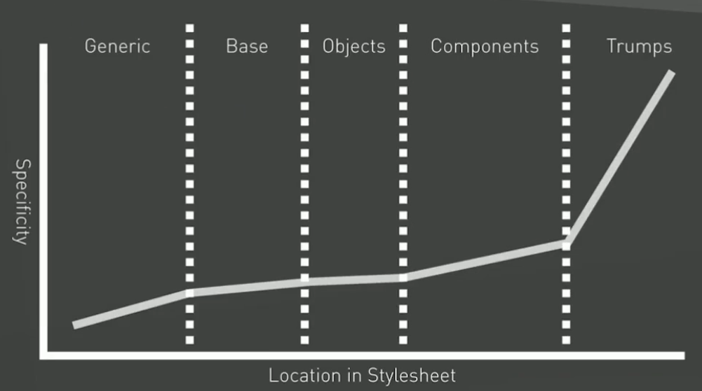
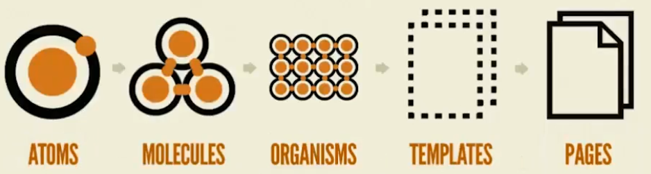
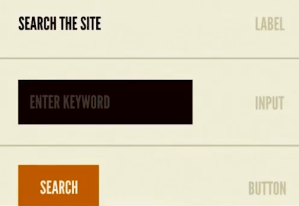
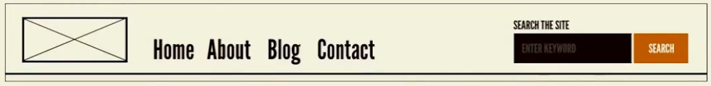
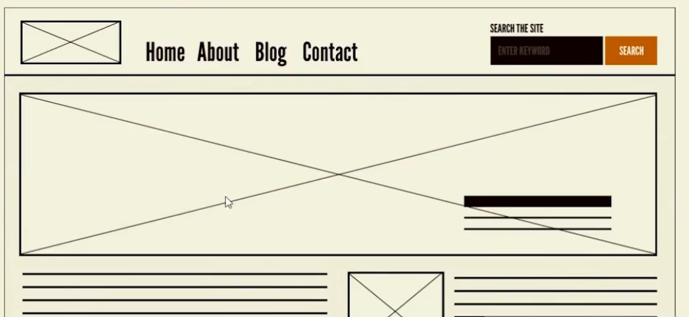

# CSS Avanzado: Grid + Flexbox y Arquitecturas

## Tabla de contenido
- [¿Qué es Flexbox?](#¿Qué-es-Flexbox?)
- [Terminología Flexbox](#Terminología-Flexbox)
- [Propiedades de Flexbox](#Propiedades-de-Flexbox)
    - [Propiedades para el flex-container o elemento padre](#Propiedades-para-el-flex-container-o-elemento-padre:)
        - [Activar Flexbox](#Activar-Flexbox)
        - [Cambiar la dirección del contenido](#Cambiar-la-dirección-del-contenido)
        - [Activar múltiples líneas de contenido](#Activar-múltiples-líneas-de-contenido)
        - [Alineación en el eje principal (main-axis)](#Alineación-en-el-eje-principal-(main-axis))
        - [Alineación en el eje secundario (cross-axis) cuando no hay múltiples líneas de contenido](#Alineación-en-el-eje-secundario-(cross-axis)-cuando-no-hay-múltiples-líneas-de-contenido)
        - [Alineación en el eje secundario (cross-axis) cuando hay múltiples líneas de contenido](#Alineación-en-el-eje-secundario-(cross-axis)-cuando-hay-múltiples-líneas-de-contenido)
    - [Propiedades para los flex-items o elemento hijos directos del flex-container](#Propiedades-para-los-flex-items-o-elemento-hijos-directos-del-flex-container:)
        - [Factor de encogimiento](#Factor-de-encogimiento)
        - [Factor de crecimiento](#Factor-de-crecimiento)
        - [Establecer la dimensión en el eje principal](#Establecer-la-dimensión-en-el-eje-principal)
        - [Shorthand Flex](#Shorthand-Flex)
        - [Alinear un flex-item en particular en el eje secundario (cross-axis)](#Alinear-un-flex-item-en-particular-en-el-eje-secundario-(cross-axis))
        - [Reescribir el orden en el que un elemento es dibujado por el navegador](#Reescribir-el-orden-en-el-que-un-elemento-es-dibujado-por-el-navegador)
- [Notas generales de los ejercicios de Flexbox](#Notas-generales-de-los-ejercicios-de-Flexbox)
- [¿Qué es CSS Grid Layout?](#¿Qué-es-CSS-Grid-Layout?)
- [Terminología de CSS Grid Layout](#Terminología-de-CSS-Grid-Layout)
- [Propiedades de CSS Grid Layout](#Propiedades-de-CSS-Grid-Layout)
    - [Para el grid-container (elemento padre)](#Para-el-grid-container-(elemento-padre):)
        - [Activar CSS Grid Layout](#Activar-CSS-Grid-Layout)
        - [Controlar el flujo de los elementos en el Grid Implícito](#Controlar-el-flujo-de-los-elementos-en-el-Grid-Implícito)
        - [Declarar filas en CSS Grid Layout](#Declarar-filas-en-CSS-Grid-Layout)
        - [Declarar columnas en CSS Grid Layout](#Declarar-columnas-en-CSS-Grid-Layout)
        - [Declararle nombre a las filas o columnas](#Declararle-nombre-a-las-filas-o-columnas)
        - [Nueva unidad de medida de CSS Grid Layout](#Nueva-unidad-de-medida-de-CSS-Grid-Layout)
        - [Función repeat() de CSS Grid Layout](#Función-repeat()-de-CSS-Grid-Layout)
        - [Función minmax() de CSS Grid Layout](#Función-minmax()-de-CSS-Grid-Layout)
        - [Espaciado en el Grid](#Espaciado-en-el-Grid)
        - [Alineación de los grid-items](#Alineación-de-los-grid-items)
        - [Alineación del Grid dentro del grid-container en CSS Grid Layout](#Alineación-del-Grid-dentro-del-grid-container-en-CSS-Grid-Layout)
    - [Propiedades de los grid-items (hijos directos del grid-container)](#Propiedades-de-los-grid-items-(hijos-directos-del-grid-container):)
        - [Posicionar un grid-items horizontalmente según las grid-lines de las filas](#Posicionar-un-grid-items-horizontalmente-según-las-grid-lines-de-las-filas)
        - [Posicionar un grid-item verticalmente según las grid-lines de las columnas](#Posicionar-un-grid-item-verticalmente-según-las-grid-lines-de-las-columnas)
        - [Shorthand para posicionar grid-items horizontal y verticalmente según las grid-lines](#Shorthand-para-posicionar-grid-items-horizontal-y-verticalmente-según-las-grid-lines)
        - [Alinear un grid-items en particular](#Alinear-un-grid-items-en-particular)
        - [Posicionar elementos con nombres de áreas](#Posicionar-elementos-con-nombres-de-áreas)
- [Notas generales de los ejercicios de CSS Grid Layout](#Notas-generales-de-los-ejercicios-de-CSS-Grid-Layout)
- [Arquitectura CSS](#Arquitectura-CSS)
- [¿Qué son los componentes?](#¿Qué-son-los-componentes?)
- [Patrones de diseño](#Patrones-de-diseño)
    - [¿Por qué usar patrones en CSS?](#¿Por-qué-usar-patrones-en-CSS?)
- [Guías de estilos](#Guías-de-estilos)
- [Tipos de Arquitecturas](#Tipos-de-Arquitecturas)
    - [SMACSS: Scalable and Modular Architecture for CSS](#SMACSS:-Scalable-and-Modular-Architecture-for-CSS)
    - [OOCSS: Object-Oriented CSS](#OOCSS:-Object-Oriented-CSS)
    - [ITCSS: Inverted Triangle Architecture for CSS](#ITCSS:-Inverted-Triangle-Architecture-for-CSS)
    - [Atomic Design](#Atomic-Design)
- [Tipos de Nomenclaturas](#Tipos-de-Nomenclaturas)
    - [BEM: Block Element Modifier](#BEM:-Block-Element-Modifier)
    - [SUIT CSS](#SUIT-CSS)
- [Contenido complementario](#Contenido-complementario)
    - [Manejo de tipografías](#Manejo-de-tipografías)
- [Link de interés](#Link-de-interés)


<div style="background:#f9fdc0;border-radius:5px;padding:10px 20px;color:#000">

### <span style="border-bottom: 1px solid #444; display: block; padding-bottom: 10px; margin-bottom: 20px;font-weight:bold;">Nota del Autor</span>

Aunque el presente curso sirvió para afianzar los conocimientos adquiridos en los cursos anteriores, **considero que no aporta nada nuevo** a los temas de CSS Grid Layout o de Flexbox. Los cuales según mi opinión: Flexbox quedó bien explicado en el <a href="../8.%20CSS%20desde%20cero" style="color: inherit; text-decoration: underline">Curso de CSS desde cero</a> y con CSS Grid Layout **sigo recomendando** el <a href="../5.%20CSS%20Grid%20Layout" style="color: inherit; text-decoration: underline">Curso de CSS Grid Layout</a> dado que está mejor estructurado los temas y con explicaciones más simples y entendibles.

Teniendo como fundamento lo anterior me tomaré la libertad de no incluir ilustraciones de las propiedades como se ha venido haciendo en los resúmenes anteriores.

**Recomiendo** este curso para tener una idea acerca de las arquitecturas y nomenclaturas de CSS.
</div>

## ¿Qué es Flexbox?
Es un módulo de CSS que permite crear layouts a través de un concepto de "cajas flexibles". Depende de dos elementos: un `flex-container` y los `flex-items`, es decir, de un contenedor padre a quien se le aplique la propiedad y sus respectivos hijos directos.

<div align="right">
    <small>
        <a href="#tabla-de-contenido">
            🡡 volver al inicio
        </a>
    </small>
</div>

## Terminología Flexbox
1. `flex-container`: Es el contenedor que recibe la propiedad de `display: flex;`.

2. `flex-items`: Son los hijos directos del `flex-container` (los cuales podrían ser también pseudoelementos y textos).

3. `flex-line`: Son las líneas que usa Flexbox para distribuir el contenido. Por defecto Flexbox posicionará el contenido en single-line (en una sola línea) debido al valor por defecto de su propiedad "`flex-wrap: nowrap`", al cambiar el valor de dicha propiedad a "`wrap`" se puede decir que es multi-line (multi línea) aunque **cada línea de contenido es independiente**.

    >Nota: Aunque se utilice el valor de "`wrap`" queda en evidencia que cada línea es independiente puesto que si se invierte la dirección del contenido no se hace de manera global, sino línea por línea. **Es por eso que se considera a Flexbox single-line**.

4. `axis` (ejes): Corresponde a los ejes de Flexbox, los cuales son:

    4.1 `main-axis`: Corresponde al eje principal el cual por defecto es horizontal y tiene una dirección de izquierda a derecha. Además es el encargado de determinar a qué valor corresponderá el `flex-basis` dependiendo de la orientación.

    4.2 `cross-axis`: Corresponde al eje secundario el cual por defecto es vertical y tiene una dirección de arriba hacia abajo.

<div align="right">
    <small>
        <a href="#tabla-de-contenido">
            🡡 volver al inicio
        </a>
    </small>
</div>

## Propiedades de Flexbox

### Propiedades para el `flex-container` o elemento padre:

- #### Activar Flexbox
    Se puede activar Flexbox con las siguientes propiedades:

    * `display: flex;` </br>
    Activa la propiedad de Flexbox, pero los elementos hermanos del `flex-container` lo identificarán como si fuera un elemento de bloque.

    * `display: inline-flex;` </br>
    Activa la propiedad de Flexbox, pero los elementos hermanos del `flex-container` lo identificarán como si fuera un elemento en línea.

    >Nota: En ambos casos el comportamiento por defecto es colocar todos los elementos uno después del otros (en una línea horizontal) y si los `flex-items` (hijos directos del `flex-container`) no tuvieran altura declarada los estiraría hasta cubrir por completo el `cross axis`.

<div align="right">
    <small>
        <a href="#tabla-de-contenido">
            🡡 volver al inicio
        </a>
    </small>
</div>

- #### Cambiar la dirección del contenido
    Se puede cambiar la dirección en la cual se muestra el contenido con 4 valores diferentes, los cuales son:

    * `flex-direction: row;`</br>
    Es el valor por defecto. Coloca todos los `flex-items` en dirección horizontal con un sentido de izquierda a derecha.

    * `flex-direction: row-reverse;`</br>
    Coloca todos los `flex-items` en dirección horizontal con un sentido de derecha a izquierda.

    * `flex-direction: column;`</br>
    Apila todos los elementos en columnas, es decir, uno debajo del otro en sentido de arriba hacia abajo y de izquierda a derecha.

    * `flex-direction: column-reverse;`</br>
    Apila todos los elementos en columnas, es decir, uno debajo del otro pero en sentido de abajo hacia arriba y de izquierda a derecha.

<div align="right">
    <small>
        <a href="#tabla-de-contenido">
            🡡 volver al inicio
        </a>
    </small>
</div>

- #### Activar múltiples líneas de contenido
    Es posible darse el caso que se tengan muchos elementos en un `flex-container` que se necesite que los mismos se distribuyan en varias `flex-lines`. Esto se hace con la siguiente propiedad:

    * `flex-wrap: nowrap;`</br>
    Es el valor por defecto. Indica que el contenido no salte de línea, es decir, todos los `flex-items` intentarán ocupar una `flex-line` sin importar que estos se redimensionen (encojan) para que esto ocurra.

    * `flex-wrap: wrap;`</br>
    Permite que existan saltos de línea en los `flex-items`, de tal forma que si el contenido no cabe en la `flex-line` donde se ubica, salte a otra.

    * `flex-wrap: wrap-reverse;`</br>
    Permite que exista saltos de línea en los `flex-items`, de tal forma que si el contenido no cabe en la `flex-line` donde se ubica, salte a otra pero en sentido inverso del `cross-axis`.

<div align="right">
    <small>
        <a href="#tabla-de-contenido">
            🡡 volver al inicio
        </a>
    </small>
</div>

- #### Alineación en el eje principal (`main-axis`)
    Para alinear los elementos en el eje principal se utiliza la siguiente propiedad en conjunto con alguno de los siguientes valores:

    * `justify-content: flex-start;` </br>
    Es el valor por defecto, ubica a los `flex-items` al principio del `main-axis`.

    * `justify-content: flex-end;` </br>
    Ubica a los `flex-items` al final del `main-axis`.

    * `justify-content: center;` </br>
    Ubica a los `flex-items` al centro del `main-axis`.

    * `justify-content: space-between;` </br>
    Permite que los `flex-items` se posicionen ocupando todo el espacio sobrante disponible del `main-axis` dejando a los elementos internos con un espaciado a su alrededor y los elementos externos (los que están a los bordes) sin espaciado externo, es decir, "pegados" a los bordes del `flex-container`.

    * `justify-content: space-around;` </br>
    Permite que los elementos se posicionen ocupando todo el espacio sobrante disponible del `main-axis` dándole a todos los elementos un espaciado interno como externo.

    * `justify-content: space-evenly;` </br>
    Permite que los `flex-items` se posicionen ocupando todo el espacio sobrante disponible del `main-axis` dándole a todos los elementos un espaciado interno como externo, haciendo que todos estén exactamente a la misma distancia uno del otro tanto los interno como los externos.

    A considerar:

    - Cabe destacar que los márgenes en Flexbox se suman, es decir, no hay colapsado de márgenes. Es por esto que los elementos internos posicionados con `justify-content: space-around;` tienen un mayor espaciado que los externos (los que están a los bordes del `flex-container`).

    - Para que la propiedad `justify-content` tenga efecto con alguno de sus valores **debe existir un espaciado sobrante** en el `main-axis` del `flex-container`.

<div align="right">
    <small>
        <a href="#tabla-de-contenido">
            🡡 volver al inicio
        </a>
    </small>
</div>

- #### Alineación en el eje secundario (`cross-axis`) cuando no hay múltiples líneas de contenido
    Para alinear los elementos en el eje secundario cuando no existen múltiples líneas de contenido, es decir, la propiedad "`flex-wrap`" tiene su valor por defecto: "`nowrap`" se utiliza la siguiente propiedad con los siguientes valores:

    - `align-items: strech;` </br>
    Es el valor por defecto. Estira a los `flex-items` que **no tengan declarada**  la dimensión correspondiente al `cross-axis` (eje secundario).

    - `align-items: flex-start` </br>
    Ubica a los `flex-items` al principio del `cross-axis` (eje secundario).

    - `align-items: flex-end` </br>
    Ubica a los flex-items al final del `cross-axis` (eje secundario).

    - `align-items: center` </br>
    Ubica a los `flex-items` en el centro del `cross-axis` (eje secundario).

    - `align-items: baseline;` </br>
    Ubica a los `flex-items` en la misma línea en la que se dibuja el texto.

<div align="right">
    <small>
        <a href="#tabla-de-contenido">
            🡡 volver al inicio
        </a>
    </small>
</div>

- #### Alineación en el eje secundario (`cross-axis`) cuando hay múltiples líneas de contenido
    Para alinear los elementos en el eje secundario cuando existen múltiples líneas de contenido, es decir, la propiedad "`flex-wrap`" no tiene como valor a "`nowrap`" se utiliza la siguiente propiedad con los siguientes valores:

    - `align-content: strech;` </br>
    Es el valor por defecto. Estira los `flex-items` que **no tengan declarado** la dimensión correspondiente al `cross-axis` (eje secundario).

    - `align-content: flex-start;` </br>
    Ubica a los `flex-items` al principio del `cross-axis` (eje secundario), tratando a las `flex-lines` en conjunto.

    - `align-content: flex-end;` </br>
    Ubica a los `flex-items` al final del `cross-axis` (eje secundario), tratando a las `flex-lines` en conjunto.

    - `align-content: center;` </br>
    Ubica a los `flex-items` en el centro del `cross-axis` (eje secundario), tratando a las `flex-lines` en conjunto.

    - `align-content: space-between;` </br>
    Distribuye el espacio sobrante del `flex-container` alrededor del los `flex-items`. Exceptuando a los bordes, los cuales solo reciben espaciado interno.

    - `align-content: space-around;` </br>
    Distribuye el espaciado sobrante del `flex-container` alrededor de los `flex-items` equitativamente. Esto implica que los elementos que se encuentran a los bordes tengan un margen externo inferior a los que están en el centro, dado que en Flexbox los márgenes se suman.

    - `align-content: space-evenly;` </br>
    Distribuye el espaciado sobrante del `flex-container` alrededor de los `flex-items` equitativamente sin que ningún elemento posea más que otro.

<div align="right">
    <small>
        <a href="#tabla-de-contenido">
            🡡 volver al inicio
        </a>
    </small>
</div>

### Propiedades para los `flex-items` o elemento hijos directos del `flex-container`:

- #### Factor de encogimiento
    El concepto de Flexbox es crear layout a través de "cajas flexibles", se le dicen "flexibles" porque tienen la capacidad de encogerse o estirarse. Por defecto, de no caber todos los `flex-items` en una sola línea del `flex-container` estos se encogerán dado que tienen la siguiente propiedad declarada por defecto:

    ```css
    .flex-item
    {
        flex-shrink: 1;
    }
    ```
    Lo que indica que cada elemento tendrá un factor de encogimiento igual a "1". Cabe destacar que esta propiedad recibe como valor números enteros positivos. Funciona de la siguiente manera:

    Imaginemos que existe un `flex-container` de 800px de ancho. Dentro de él existen 10 `flex-items` de 100px de ancho cada uno.

    Haciendo el siguiente cálculo determinamos que los elementos no cabrán en el `flex-container`:

    * anchoFlexContainer = El `flex-container` mide 800px de ancho.
    * anchoFlexItems = 10 `flex-items` x 100px de ancho = 1000px.

    Entonces al estar activo el `flex-shrink` el navegador hace la siguiente operación:

    * factorDeEncogimiento = anchoFlexItems - anchoFlexContainer
    * factorDeEncogimiento = 1000px - 800px
    * factorDeEncogimiento = 200px

    Esos 200px van a ser divididos en la  Σ(sumatoria) del valor de `flex-shrink` en los elementos.

    Entonces como sabemos que existen 10 `flex-items` y cada uno tiene por defecto `flex-shrink: 1` seria:

    *  ΣFlex-shrink = 1 + 1 + 1 + 1 + 1 + 1 + 1 + 1 + 1 + 1
        >Cada "1" representa el valor de `flex-shrink` de cada `flex-items`.
    *  ΣFlex-shrink = 10

    Teniendo todos los valores anteriores la redimensión de los elementos será determinada por la siguiente fórmula:

    * redimensión = factorDeEncogimiento / ΣFlex-shrink

    * redimensión = 200px / 10

    * redimensión = 20px

    Ahora el valor de la redimensión se la va a **restar** a la dimensión correspondiente al eje principal, en este ejemplo el eje principal es horizontal por tanto se restará al `width`.

    * nuevoWidth = width - (flexShrinkDelElemento * redimensión)

    Como todos tiene el mismo `width` y el mismo `flex-shrink` entonces para cada uno sería:

    * nuevoWidth = 100px - (1 * 20px)
    * nuevoWidth = 80px

    Entonces todos los elementos se redimensionarán dado que no caben en el `flex-container`, pasando automáticamente de 100px de ancho cada uno a tener 80px de ancho.

<div align="right">
    <small>
        <a href="#tabla-de-contenido">
            🡡 volver al inicio
        </a>
    </small>
</div>

- #### Factor de crecimiento
    Si bien el concepto de Flexbox es crear layout a través de "cajas flexibles" que por defecto se encogen de no haber espacio suficiente para los elementos, Flexbox también permite que los `flex-items` **crezcan dependiendo del espacio sobrante**. Esto se hace con la siguiente propiedad:

    ```css
    .flex-item
    {
        flex-grow: 1;
    }
    ```

    Lo que indica que cada elemento `flex-items` tendrá un factor de crecimiento igual a "1". Cabe recordar que esta propiedad a diferencia del `flex-shrink` no está activada por defecto. Esta propiedad recibe como valor números enteros positivos y funciona de la siguiente manera:

    Imaginemos un `flex-container` de 800px de ancho. Dentro de él existen 10 `flex-items` de 50px de ancho.

    Comencemos obteniendo los datos de los elementos:

    * anchoFlexContainer = El `flex-container` mide 800px de ancho.
    * anchoFlexItems = 10 `flex-items` x 50px de ancho = 500px.

    Entonces al estar activo `flex-grow` el navegador hace la siguiente operación:

    * espacioParaCrecer = anchoFlexContainer - anchoFlexItems
    * espacioParaCrecer = 800px - 500px
    * espacioParaCrecer = 300px

    Esos 300px van a ser divididos en la Σ(sumatoria) del valor de `flex-grow` de cada `flex-items`.

    Entonces como sabemos que son 10 `flex-items` y cada uno de ellos tiene asignado un `flex-grow: 1` seria:

    *  ΣFlex-grow = 1 + 1 + 1 + 1 + 1 + 1 + 1 + 1 + 1 + 1
    >Cada "1" representa el valor de `flex-grow` de cada `flex-items`.
    *  ΣFlex-grow = 10

    Con estos valores la redimensión sería:

    * redimensión = espacioParaCrecer / ΣFlex-grow
    * redimensión = 300px / 10
    * redimensión = 30px

    Ahora el valor de redimensión se le **va a sumar** a la dimensión correspondiente al eje principal, en este ejemplo el eje principal es horizontal, por tanto se sumará al `width`:

    * nuevoWidth = width + (flexGrowDelElemento * redimensión)

    Como todos los `flex-items` tienen el mismo `flex-grow` y `width` entonces sería:

    * nuevoWidth = 50px + (1 * 30px)
    * nuevoWidth = 80px

    Entonces todos los elementos se redimensionarán pasando de tener 50px de ancho cada uno a tener 80px de ancho cada uno por tener factor de crecimiento.

<div align="right">
    <small>
        <a href="#tabla-de-contenido">
            🡡 volver al inicio
        </a>
    </small>
</div>

- #### Establecer la dimensión en el eje principal
    Existe una propiedad única de Flexbox que al entrar en conflictos bien sea con `width` o `height` siempre ganará. Esta propiedad es `flex-basis` la cual permite establecer una dimensión en el `main-axis` (eje principal).

    Por ejemplo si el `main-axis` es vertical (`flex-direction: column`) un `flex-basis: 30px;` determinará 30px de altura en el `flex-item` y aunque el height de dicho elemento estuviese declarado no lo tomaría en cuenta.

<div align="right">
    <small>
        <a href="#tabla-de-contenido">
            🡡 volver al inicio
        </a>
    </small>
</div>

- #### Shorthand Flex
    Existe un shorthand que permite agrupar las propiedades anteriormente nombradas. Ex:

    ```css
    .flex-item
    {
        flex: [flex-grow] [flex-shrink] [flex-basis];
    }
    ```

    Algunos valores útiles:

    * Crece o encoge el elemento dependiendo de la necesidad: `flex: auto;`

    * No permite crecer ni encoger al elemento: `flex: none;`

<div align="right">
    <small>
        <a href="#tabla-de-contenido">
            🡡 volver al inicio
        </a>
    </small>
</div>


- #### Alinear un `flex-item` en particular en el eje secundario (`cross-axis`)
    Permite alinear un elemento en particular en el eje secundario (`cross-axis`) usando la siguiente propiedad:

    ```css
    .flex-item:first-child
    {
        align-self: [valor];
    }
    ```

    Donde `[valor]` podría ser:

    * `flex-start`</br>
    Alinea al `flex-item` al principio del eje secundario o principio de la `flex-line` donde se encuentra.

    * `flex-end`</br>
    Alinea al `flex-item` al final del eje secundario o al final de la `flex-line` donde se encuentra.

    * `center`</br>
    Alinea al `flex-item` en el centro del eje secundario o en el centro de la `flex-line` donde se encuentra.

    * `baseline`</br>
    Alinea el `flex-item` teniendo en cuenta la línea de escritura del `flex-container` en el eje secundario o de la `flex-line` donde se encuentra.

<div align="right">
    <small>
        <a href="#tabla-de-contenido">
            🡡 volver al inicio
        </a>
    </small>
</div>

- #### Reescribir el orden en el que un elemento es dibujado por el navegador
    Se puede cambiar el orden en el que el navegador dibuja un elemento con Flexbox. Esto se hace con la siguiente propiedad:

    ```css
    .flex-item:first-child
    {
        order: 1;
    }
    ```

    Cabe destacar que todos los `flex-items` tienen por defecto "`order: 0`", entonces mientras más lejos del 0 este, más lejos lo dibujará el navegador y mientras cercano al 0 este o menor sea, el navegador lo dibujará más al principio.

    >Nota: esta propiedad solo acepta números enteros tanto positivos como negativos

<div align="right">
    <small>
        <a href="#tabla-de-contenido">
            🡡 volver al inicio
        </a>
    </small>
</div>


## Notas generales de los ejercicios de Flexbox
* Una etiqueta `<article>` puede tener dentro de sí etiquetas como `<header>`, `<main>` y `<footer>`.

* Un `flex-item` puede ser a la vez un `flex-container`.

* Un Split Layout es un tipo de layout que consiste en ubicar el contenido a un lado y al otro lado una imagen o viceversa.

* El Split Layout puede generarse con la propiedad `order` de Flexbox o con los atributos de `row` y `row-reverse`.

* Una grilla o cuadricula con Flexbox se puede realizar pero técnicamente no es mantenible al 100% automáticamente. Es decir habría que recurrir a *hacks* para emular dicho aspecto. Ex:

    Si se quiere realizar una grilla de dos columnas con un espaciado entre columnas de 10px y un espaciado entre filas de 10px se debe:

    - El espaciado de columnas se haría con `space-between`.
    - El espaciado de filas se haría con `margin-bottom` aplicado a cada elemento que compone a la fila.
    - Las columnas se harían con un `width: calc(50% - [espaciadoEntreColumnas])` y siempre debería de hacerse este cálculo por la determinada cantidad de columnas.

        Sin embargo hacer mantenible una grilla en la cual sus existan elementos que no tengan la misma cantidad de contenido o si le falta un elemento a la grilla hará que se *desmaquete* haciendo muy difícil de mantener.

    - Si un `flex-item` contiene activa la propiedad `float` esta no surtirá efecto puesto que prevalecerá Flexbox.

    - Por defecto Flexbox tratará en lo posible de igual la altura de los elementos que están en un `flex-container` a la altura del hijo más alto. Esto es posible por su valor por defecto "`strech`" bien sea en su propiedad `align-items` o `align-content`.
        >Esto sucede si no se ha declarado previamente la altura de los elementos.


<div align="right">
    <small>
        <a href="#tabla-de-contenido">
            🡡 volver al inicio
        </a>
    </small>
</div>

## ¿Qué es CSS Grid Layout?
Es un nuevo módulo de CSS que permite construir layouts con una alineación en dos ejes mediante filas y columnas.

<div align="right">
    <small>
        <a href="#tabla-de-contenido">
            🡡 volver al inicio
        </a>
    </small>
</div>

## Terminología de CSS Grid Layout

1. `grid-container`: Es el contenedor que recibe la propiedad de `display: grid;`.

2. `grid-items`: Son los hijos directos del `grid-container`.

3. `grid-lines`: Son las líneas horizontales y verticales que conforman las filas y columnas del Grid. Permite ordenar los elementos con una gran libertad sin importar el flujo en el que están en el HTML. OJO: No son las filas o columnas, son las **LÍNEAS** que las construye.

4. `grid-tracks`: Son espacios del Grid que están limitados por dos `grid-lines` consecutiva, es decir, son aquellos espacios generados por las filas o columnas. Un `grid-track` podría ser una columna completa o una fila completa.

5. `grid-area`: Es cualquier rectángulo que está limitado por `grid-lines`.

6. `grid-cells`: Es el espacio resultante encontrado en las intersecciones de las filas y columnas.

<div align="right">
    <small>
        <a href="#tabla-de-contenido">
            🡡 volver al inicio
        </a>
    </small>
</div>

## Propiedades de CSS Grid Layout
### Para el `grid-container` (elemento padre):

- #### Activar CSS Grid Layout
    Se puede activar CSS Grid Layout con la siguiente propiedad:

    ```css
    .grid-container
    {
        display: grid;
    }
    ```

    El comportamiento por defecto de este nuevo modelo de layout puede verse afecto por la existencia de la grilla, es decir, que ya se hayan declarado las filas y columnas o por la existencia de `grid-lines`.

    Si el `grid-container` no posee `grid-items` no se verá ningún efecto aplicado al `grid-container`, sin embargo si posee `grid-items` CSS Grid Layout creará una fila por cada `grid-items` para ubicarlos.

    Si el `grid-container` posee una grilla declarada (ya se declararon las filas y columnas) CSS Grid Layout colocará los elementos en cada `grid-cells` existente partiendo de izquierda a derecha y de arriba a abajo.

    >Nota: Al no haber declarado las filas y columnas de la grilla los elementos se posicionarán uno en cada fila diferente automáticamente porque se crea un "Grid Implícito" y como la propiedad que controla la dirección del contenido que se encuentra en el Grid Implícito (`grid-auto-flow`) está con su valor por defecto de "`row`", es decir, "fila".

<div align="right">
    <small>
        <a href="#tabla-de-contenido">
            🡡 volver al inicio
        </a>
    </small>
</div>

- #### Controlar el flujo de los elementos en el Grid Implícito
    Por defecto al aplicar CSS Grid Layout pero sin declarar las filas y columnas pertenecientes al mismo, CSS Grid Layout lo que hará es crear una fila para posicionar cada `grid-items` adyacente en él. Esto ocurre por la siguiente propiedad:

    ```css
    .grid-container
    {
        grid-auto-flow: [valor];
    }
    ```

    Donde `[valor]` podría ser:

    * `row`</br>
    Es el valor por defecto. Coloca los elementos sobrantes o que no caben en una nueva fila en el Grid Implícito. Esto lo hace por cada `grid-items` que no quepa en el Grid Explícito.

    * `column`</br>
    Coloca a los elementos sobrantes o que están en el Grid Implícito en una columna diferente. Esto lo hace por cada `grid-items` que no quepa en el Grid Explícito.

    * `dense`</br>
    Al aplicar solo el valor de "`row`" o "`column`" y debido a su acción puede que se creen "huecos" en el Grid. Esto podría solucionarse usando en conjunto el valor de "`dense`", el cual intenta llenar los "huecos" resultantes con el próximo elemento más cercano que pueda caber en dicho "hueco" o espacio sobrante.

        CSS Grid Layout coloca los elementos por defecto en filas con dirección de izquierda a derecha y de arriba a abajo. O si está configurada en columnas de arriba a abajo y de izquierda a derecha.
    
        Sin embargo cuando se crean "huecos" bien sea por el posicionamiento de un elemento el navegador lo que intenta es buscar un espacio donde quepa dicho elemento y lo hace buscando en el sentido antes dicho y una vez encontrado posiciona al elemento y después continua posicionando a los demás elementos y dejando (posiblemente) un "hueco" producto de la redimensión del elemento el cual puede llenarse alterando el orden con el valor de  "`dense`" independientemente de si el `grid-auto-flow` está en `column` o `row`.

<div align="right">
    <small>
        <a href="#tabla-de-contenido">
            🡡 volver al inicio
        </a>
    </small>
</div>

- #### Declarar filas en CSS Grid Layout
    Para declarar filas en CSS Grid Layout se usa la siguiente propiedad:

    * `grid-template-rows: [valor];`</br>
    En donde `[valor]` podría ser cualquier unidad de medida (`px`, `em`, `vh`, etc). Además de que por cada valor que se le agregue se creará automáticamente una fila. Por ejemplo si queremos dos filas: una de 100px y otra del 20% la declaración sería:

        ```css
        .grid-container
        {
            grid-template-rows: 100px 20%;
        }
        ```

<div align="right">
    <small>
        <a href="#tabla-de-contenido">
            🡡 volver al inicio
        </a>
    </small>
</div>

- #### Declarar columnas en CSS Grid Layout
    Para declarar columnas en CSS Grid Layout se usa la siguiente propiedad:

    * `grid-template-columns: [valor];`</br>
    En donde `[valor]` podría ser cualquier unidad de medida (`px`, `em`, `vh`, etc). Además de que por cada valor que se le agregue se creará automáticamente una columna. Por ejemplo si se quieren tres columnas: una de 100px, otra de 50% y una última de 2em, sería:

        ```css
        .grid-container
        {
            grid-template-columns: 100px 50% 2em;
        }
        ```

<div align="right">
    <small>
        <a href="#tabla-de-contenido">
            🡡 volver al inicio
        </a>
    </small>
</div>

- #### Declararle nombre a las filas o columnas
    Es posible darle nombre a las líneas al momento de declarar los `grid-tracks` bien sean columnas o filas. Lo único que hay que tener en cuenta es que siempre habrá una línea sin dimensiones, es decir, el total de líneas sería: líneasDeclaradas + N, donde "N" representa la última línea (el final) que no tienen dimensiones.

    La estructura de la declaración seria:

        [nombreDeLinea] [dimensión]


    ```css
    .grid-container
    {
        grid-template-columns: [start] 1fr
                               [middle] 1fr
                               [end];
    }
    ```

<div align="right">
    <small>
        <a href="#tabla-de-contenido">
            🡡 volver al inicio
        </a>
    </small>
</div>

- #### Nueva unidad de medida de CSS Grid Layout
    CSS Grid Layout introduce una nueva unidad de medida la cual es la "fracción" (`fr`) la cual trabaja parecido al factor de crecimiento/encogimiento de Flexbox. Es decir, el espacio sobrante se divide entre la sumatoria de fracciones y luego dicho resultado es multiplicado por el valor en fracciones de cada fila o columna. Ex:

    ```css
    .grid-container
    {
        grid-template-columns: 1fr 1fr;
    }
    ```

    En dicho ejemplo existen dos columnas de `1fr` cada una. Entonces la sumatoria sería: 1fr + 1fr = 2fr. El espacio sobrante (que al no tener ninguna dimensión fija declarada sería del 100%) se dividiría entre la sumatoria de la siguiente forma: 100% / 2fr = 50%. Entonces cada fracción tendría una dimensión del 50%.

<div align="right">
    <small>
        <a href="#tabla-de-contenido">
            🡡 volver al inicio
        </a>
    </small>
</div>

- #### Función `repeat()` de CSS Grid Layout
    Por la forma repetitiva en la que se declaran las filas y columnas en CSS Grid Layout existe la función "`repeat()`" siendo exclusiva de CSS Grid Layout, la cual permite repetir un valor "n" cantidad de veces. Se usa de la siguiente manera:

    ```css
    repeat([n], [valor]);
    ```

    Donde `[n]` representa la cantidad de veces que se repetirá el `[valor]` y `[valor]` a su vez representa el valor deseado a repetirse.

<div align="right">
    <small>
        <a href="#tabla-de-contenido">
            🡡 volver al inicio
        </a>
    </small>
</div>

- #### Función `minmax()` de CSS Grid Layout
    Existe una nueva función de CSS Grid Layout que se utiliza para establecer dimensiones, esta función es `minmax()` la cual trabaja así:

    ```css
    .grid-container
    {
        grid-template-columns: minmax([min], [max]);
    }
    ```

    Donde `[min]` será el valor mínimo que tendrá dicha dimensión. Y `[max]` corresponde al valor máximo que puede alcanzar dicha dimensión.

<div align="right">
    <small>
        <a href="#tabla-de-contenido">
            🡡 volver al inicio
        </a>
    </small>
</div>

- #### Espaciado en el Grid
    Es posible definir el espaciado entre filas y columnas a través del uso de las siguientes propiedades:

    * `column-gap: [valor];`</br>
    Es la propiedad que permite declarar el espaciado correspondiente a las columnas.

    * `row-gap: [valor];`</br>
    Es la propiedad que permite declarar el espaciado correspondiente a las filas.

    * `gap: [valor];`</br>
    Es un shorthand que permite a través de dos valores diferentes o (el mismo para ambos) dar espaciados tanto a filas y columnas.

<div align="right">
    <small>
        <a href="#tabla-de-contenido">
            🡡 volver al inicio
        </a>
    </small>
</div>

- #### Alineación de los `grid-items`
    CSS Grid Layout permite alinear sus `grid-items` con respecto a las `grid-cells` donde se encuentra. Esto se hace a través de las siguientes propiedades:

    * `justify-items: [valor];`</br>
    Permite alinear los `grid-items` con respecto a la anchura (horizontalmente) de la `grid-cell` donde se encuentra.

    * `align-items: [valor];`</br>
    Permite alinear los `grid-items` como respecto a la altura (verticalmente) de la `grid-cell` donde se encuentra.

    Ambas propiedades reciben como `[valor]` los siguientes:

    * `strech`</br>
    Es el valor por defecto. Estira al `grid-items` hasta cubrir por completo la `grid-cells` bien sea vertical u horizontalmente.

    * `start`</br>
    Permite colocar al `grid-item` al principio (del eje en el que se usa) de la `grid-cell` y hace que el elemento se redimensione dependiendo de su contenido. Es decir, solo ocupará el espacio que necesita en la `grid-cells`.

    * `end`</br>
    Permite colocar al `grid-item` al final (del eje en el que se usa) de la `grid-cell` y hace que el elemento se redimensione dependiendo de su contenido. Es decir, solo ocupará el espacio que necesite en la `grid-cell`.

    * `center`</br>
    Permite colocar al `grid-item` en el centro (del eje en el que se usa) de la `grid-cell` y hace que el elemento se redimensione dependiendo de su contenido. Es decir, solo ocupará el espacio que necesite en la `grid-cell`.

<div align="right">
    <small>
        <a href="#tabla-de-contenido">
            🡡 volver al inicio
        </a>
    </small>
</div>

- #### Alineación del Grid dentro del `grid-container` en CSS Grid Layout
    CSS Grid Layout permite alinear el Grid que contiene el `grid-container` siempre y cuando el Grid resultante **no ocupe el 100%** del tamaño (alto y ancho del `grid-container`) es decir, se necesita de espacio sobrante dentro del `grid-container`. Se hace de la siguiente manera:

    * `justify-content: [valor];`</br>
    Permite alinear las filas del Grid con respecto al `grid-container`. Es la alineación horizontal.

    * `align-content: [valor];`</br>
    Permite alinear las columnas del Grid con respecto al `grid-container`. Es la alineación vertical.

    Ambas propiedades reciben como `[valor]` los siguientes:

    * `strech`</br>
    Es la propiedad por defecto. Estira la grilla hasta cubrir por completo la dimensión asignada.

    * `start` </br>
    Permite colocar al Grid al principio del `grid-container` según el eje que corresponda.

    * `end`</br>
    Permite colocar al Grid al final del `grid-container` según el eje que corresponda.

    * `center`</br>
    Permite colocar al Grid en el centro del `grid-container` según el eje que corresponda.

    * `space-around`</br>
    Le otorga al Grid un espaciado alrededor del `grid-container` según el eje que corresponda.

    * `space-between`</br>
    Le otorga al Grid un espaciado a los `grid-tracks` internos (no a los ubicados en los bordes) según el eje que corresponda.

    * `space-evenly`</br>
    Le otorga al Grid un espaciado a los `grid-tracks` de forma homogénea. Es decir, tanto a los ubicados en los bordes como los internos tendrán la misma separación. Esto sucede teniendo en cuenta el eje donde corresponda.

<div align="right">
    <small>
        <a href="#tabla-de-contenido">
            🡡 volver al inicio
        </a>
    </small>
</div>


### Propiedades de los `grid-items` (hijos directos del `grid-container`):

- #### Posicionar un `grid-items` horizontalmente según las `grid-lines` de las filas
    Es posible posicionar un elemento según las `grid-lines` resultantes de las filas que se crean debido al Grid Explícito. Esto se hace con la siguiente propiedad:

    ```css
    .grid-items:first-child
    {
        grid-row-start: [row-start];
        grid-row-end: [row-end];
    }
    ```

    En donde `[row-start]` representa al número de línea en la que va a iniciar y `[row-end]` representa al número de línea en la que va a terminar.

    Sin embargo se puede usar la palabra reservada "`span`" para indicar cuantos `grid-tracks` se quiere que ocupe en lugar de estar contando las líneas.

    También se puede especificarse a través del siguiente shorthand:

    ```css
    .grid-items:first-child
    {
        grid-row: [row-start] / [row-end];
    }
    ```

    >Nota: Si se omiten los finales de `grid-row` y `grid-column`, pero si se declara el inicio, es decir, el `row-start` y el `column-start`, el `grid-item` que se esté manipulando empezará en el punto que se le indicó pero terminará ocupando solo una celda. Es decir, terminará en la próxima `grid-line` más cercana.

<div align="right">
    <small>
        <a href="#tabla-de-contenido">
            🡡 volver al inicio
        </a>
    </small>
</div>

- #### Posicionar un `grid-item` verticalmente según las `grid-lines` de las columnas
    Es posible posicionar un elemento según las `grid-lines` resultantes de las columnas que se crean debido al Grid declarado. Esto se hace con las siguientes propiedades:

    ```css
    .grid-items:first-child
    {
        grid-column-start: [column-start];
        grid-column-end: [column-end];
    }
    ```

    En donde `[column-start]` representa el número de línea en la que va a iniciar y `[column-end]` respresenta el número de línea en la que va a terminar.

    Sin embargo se puede usar la palabra reservada "`span`" para indicar cuantos `grid-tracks` se quiere que ocupe en lugar de estar contando las líneas.

    También se puede especificarse a través del siguiente shorthand:

    ```css
    .grid-items:first-child
    {
        grid-column: [column-start] / [column-end];
    }
    ```

    >Nota: Si se omiten los finales de `grid-row` y `grid-column`, pero si se declara el inicio, es decir, el `row-start` y el `column-start`, el `grid-item` que se esté manipulando empezará en el punto que se le indicó pero terminará ocupando solo una celda. Es decir, terminará en la próxima `grid-line` más cercana.

- #### Shorthand para posicionar `grid-items` horizontal y verticalmente según las `grid-lines`
    Se usa la siguiente propiedad:

    ```css
    .grid-items:first-child
    {
        grid-area: [row-start] / [column-start] / [row-end] / [column-end];
    }
    ```

<div align="right">
    <small>
        <a href="#tabla-de-contenido">
            🡡 volver al inicio
        </a>
    </small>
</div>

- #### Alinear un `grid-items` en particular
    A través de CSS Grid Layout se puede alinear un `grid-item` en particular según el espacio que tenga en su `grid-cells`. Se hace de la siguiente manera:

    * Alineación horizontal</br>
    Se usa la siguiente propiedad:
        ```css
        .grid-items:first-child
        {
            justify-self: [valor];
        }
        ```

    * Alineación Vertical</br>
    Se usa la siguiente propiedad:
        ```css
        .grid-items:first-child
        {
            align-self: [valor];
        }
        ```

    Ambas propiedades pueden recibir alguno de las siguientes opciones como `[valor]`:

    * `strech`</br>
    Es el valor por defecto. Estira al elemento a todo lo que da en el eje de la `grid-cells` donde se ubica.

    * `center`</br>
    Posiciona al `grid-items` al centro del eje de la `grid-cells` donde se ubica, ocupando solo el espacio requerido por su contenido.

    * `start`</br>
    Posiciona al `grid-items` al principio del eje de la `grid-cell` donde se ubica ocupando solo el espacio requerido por su contenido.

    * `end`</br>
    Posiciona al `grid-items` al final del eje de la `grid-cells` donde se ubica ocupando solo el espacio requerido por su contenido.

<div align="right">
    <small>
        <a href="#tabla-de-contenido">
            🡡 volver al inicio
        </a>
    </small>
</div>

- #### Posicionar elementos con nombres de áreas
    Si se quisiera realizar el siguiente layout dándole nombre a los elementos se haría de la siguiente manera:

    Realizar el siguiente layout el cual contiene 3 filas y 3 columnas.


        |---------------------|
        |        Header       |
        |---------------------|
        | Side |  Contenido   |
        |---------------------|
        |       Footer        |
        |---------------------|

    #### Parte A: Establecer el Grid
    Primero se definiría el Grid container con la dimensiones de las filas y columnas que necesitaría el layout. Ex:

    ```css
    .grid-container
    {
        /* con su altura necesaria */
        min-height: 100vh;

        display: grid;
        grid-template-columns: repeat(3, 1fr);
        grid-template-rows: repeat(3, 1fr);
    }
    ```

    #### Parte B: Declarar la disposición de las áreas
    Tal como si se estuviera estableciendo el layout a través de palabras se haría con la siguiente propiedad dentro del `grid-container`:

    ```css
    .grid-container
    {
        /* Previamente*/
        min-height: 100vh;
        display: grid;
        grid-template-columns: repeat(3, 1fr);
        grid-template-rows: repeat(3, 1fr);

        grid-areas: "header header header"
                    "sidebar main main"
                    "footer footer footer";
    }
    ```

    Donde como puede observarse se declaran nombres arbitrarios a las áreas las cuales representarán la posición dentro del layout, y como puede observarse se pueden repetir tantas veces como columnas o filas deba abarcar.

    #### Parte C: Asignar las áreas a los elementos
    Previamente escrito el HTML con los elementos que conformarán el layout se procede a asignarle las áreas con la siguiente propiedad:

    ```css
    header.grid-item{ grid-area: header; }

    aside.grid-item{ grid-area: sidebar; }

    main.grid-item{ grid-area: main; }

    footer.grid-item{ grid-area: footer; }
    ```

    **Nota**: Las áreas declaradas podrían abarcar (repetirse en su declaración) tanto a filas como columnas. La única limitante es que las áreas solo pueden ser rectangulares por ejemplo:

    ```css
    .grid-container
    {
    grid-areas: "sidebar header header"
                "sidebar main main"
                "sidebar footer footer";
    }
    ```

    Es importante recalcar que cuando se declaran `grid-areas` se crean líneas relacionadas a los `grid-tracks` resultantes  automáticamente con el mismo nombre de las áreas. Es decir, cada vez que se crea un área se crean líneas alrededor de dicho tracks cuyos nombres son `[nombreDeÁrea]-start` y `[nombreDeÁrea]-end`, en otras palabras las líneas tienen nombres implícitos relativos a las áreas.

    Entonces teniendo en consideración esto, la siguiente declaración podrá ser válida:

    ```css
    aside.grid-item
    {
        grid-column: sidebar-start / sidebar-end;
        grid-row: sidebar-start / sidebar-end;
    }
    ```
    >Aunque a simple vista no se diferencia cuales son las horizontales de las verticales, es en la propiedad que se diferencia dado que llevan el mismo nombre por la forma en la que se declaran en el `grid-area`.

<div align="right">
    <small>
        <a href="#tabla-de-contenido">
            🡡 volver al inicio
        </a>
    </small>
</div>

## Notas generales de los ejercicios de CSS Grid Layout

* Cuando en la fórmula de un `nth-child()` se coloca la "`n`" negativa seguida de una suma a un número se está haciendo referencia a los primeros X elementos. Ex:

    ```css
    .grid-items:nth-child(-n+8)
    {
        /* Estilos */
    }
    ```

    En esta regla se está refiriendo a los primeros 8 elementos.

* Al usar `display: grid;` se puede usar en los `grid-items` la propiedad `order` y `z-index` si necesidad de posicionar los elementos o aplicar Flexbox respectivamente.

* Cuando un `grid-item` se sale del Grid Explícito, es decir, del que hemos declarado bien sea con áreas o filas y columnas, el navegador crea un Grid Implícito con dimensiones en "`auto`" para filas y columnas.

    Esto quiere decir, que si un elemento se va a desbordar (o salirse del Grid Explícito) por una declaración errónea en las columnas el navegador creará más columnas con el ancho en "`auto`".

    Sin embargo si esto sucede en las filas al estar la dimensión en "`auto`" la misma será de 0 (cero) dado que por defecto se ajustan al contenido, hasta llegar a la fila o `grid-line` necesitada para ubicar al elemento.

    Para controlar esto, es decir, el Grid Implícito se usan las siguientes propiedades dependiendo del caso:

    ```css
    grid-auto-row: [valor];
    grid-auto-column: [valor];
    ```

    Los cuales sirven para indicar el tamaño que tendrá las filas o columnas que se podrían generar por un desbordamiento, es decir, para controlar el tamaño del Grid Implícito.

* Para hacer *Cross Browser* se hace usando la condicional de CSS:

    ```css
    @supports (condicional)
    {
        /* estilos */
    }
    ```

    La cual funciona de la siguiente manera: En la condición se coloca la propiedad que se espera que sea soportada y en el contenido de query los estilos correspondientes si se soporta dicha propiedad. Ex:

    ```css
    /*Si se soporta GRID*/
    @support (grid-template-areas: "sidebar")
    {
        /* estilos */
    }
    ```

    >Nota: La condición debe incluir la [propiedad] y el [valor] sin importar que este sea falso o de prueba.

<div align="right">
    <small>
        <a href="#tabla-de-contenido">
            🡡 volver al inicio
        </a>
    </small>
</div>

## Arquitectura CSS
La arquitectura según Wikipedia es la: "Técnica y estilo con los que se diseña, proyecta y construye un edificio o monumento".

Aplicando el concepto a CSS sería:
Técnicas que nos ayudan a organizar y mantener nuestro código CSS de manera óptima y saludable abstrayéndolo y dividiéndolo en módulos y/o componentes que permitirán su reutilización y escalabilidad de manera estructurada y ordenada.

<div align="right">
    <small>
        <a href="#tabla-de-contenido">
            🡡 volver al inicio
        </a>
    </small>
</div>

## ¿Qué son los componentes?
Se puede decir que un componente es aquel que cumple con las siguientes características:

- Un fragmento de la interfaz que cumple una única función.
- Son independientes, tanto de su contexto como del resto de componentes.
- Son reutilizables.
- Son auto contenidos, es decir, no filtran estilos a los otros componentes.

La primera persona que propuso el enfoque de componentes fue "Nicole Sullivan" en una charla en la cual decía que estos componentes eran:

<blockquote>
    <cite>It's a repeating visual pattern, that can be abstracted into a independent snippet of HTML, CSS and possibly JavaScript</cite>
</blockquote>

Un ejemplo de un componente podría ser un plugin de Wordpress o de JQuery.

<div align="right">
    <small>
        <a href="#tabla-de-contenido">
            🡡 volver al inicio
        </a>
    </small>
</div>

## Patrones de diseño
Los patrones de diseño son la base de la búsqueda de soluciones a problemas comunes en el desarrollo de software y otros ámbitos referentes al diseño de interacción o interfaces.

Un patrón resulta ser una solución a un problema. Para que una solución sea considerada un patrón debe:

- Comprobar su efectividad resolviendo problemas similares.
- Ser reutilizables lo que significa que es aplicable a diferentes problemas en distintas circunstancias.

<div align="right">
    <small>
        <a href="#tabla-de-contenido">
            🡡 volver al inicio
        </a>
    </small>
</div>

### ¿Por qué usar patrones en CSS?
Debemos usar patrones de diseño en CSS dado que:

- Construimos sistemas no páginas.
- Necesidad de modularidad.
- Mejora el flujo de trabajo.
- Ya han sido probados y validados.
- Si se trabaja en equipos mantienen el orden.
- Promueve la filosofía *DRY* (Don't Repeat Yourself).


<div align="right">
    <small>
        <a href="#tabla-de-contenido">
            🡡 volver al inicio
        </a>
    </small>
</div>

## Guías de estilos
Las guías de estilos son convenciones humanas que se siguen al escribir código. Esto se hace con la finalidad de que si están trabajando más de un desarrollador el código luzca como si lo fuera hecho una sola persona, manteniendo así un código más legible y fácil de mantener. Entre algunas de las guías de estilos más famosas están:

- Airbnb / Sass Styleguide
- Idiomatic CSS
- CSS Guideline
- Code Guide
- Primer de GitHub

<div align="right">
    <small>
        <a href="#tabla-de-contenido">
            🡡 volver al inicio
        </a>
    </small>
</div>

## Tipos de Arquitecturas
Cuando se comienza con CSS se suele pensar que basta con saber las propiedades y sus posibles valores, pero rápidamente este enfoque cambia a medida que el proyecto crece y surge la necesidad de cambios o de integrar más desarrolladores al proyecto.

Es ahí cuando surgen la necesidad de aplicar arquitecturas de CSS para mantener el CSS lo más sano y legible posible sin importar que tan antiguo sea o cuantas personas estén involucradas.

Cabe destacar que estas arquitecturas son "convenciones humanas", es decir, no se marcara como error alguna parte del código si no se siguen correctamente o si se les modifica alguna parte de la misma.

Entre las arquitecturas más usadas están:

<div align="right">
    <small>
        <a href="#tabla-de-contenido">
            🡡 volver al inicio
        </a>
    </small>
</div>

### SMACSS: Scalable and Modular Architecture for CSS
Es la traducción de "Arquitectura Modular y Escalable para CSS", la cual permite realizar proyectos con CSS dividiendo el código en categorías, las cuales son:

1. Base</br>
Son los estilos base que se le aplican a los elementos usando un selector de etiqueta o descendiente haciendo uso de los `nth-child()` o cualquier pseudoclase. Básicamente es donde se ubican los reset o estilos base. Ex:

    ```css
    body{ /*Estilos base*/ }

    a{ /*Estilos base*/ }

    a:hover{ /*Estilos base*/ }
    ```

2. Layout </br>
Son los estilos que definen la organización de los bloques grandes en la maquetación de la página. Por ejemplo: la anchura del header, del aside o del footer.

    Según SMACSS existen dos tipos de componente: los mayores (que son los que corresponden a esta categoría), los cuales son los espacios donde estarán los "menores" que son los componentes que están ubicados dentro, por ejemplo:

    Un componente mayor (de layout) sería un `#header` y un componente menor (módulo) sería el `.nav`

    En SMACSS se puede usar ID para nombrar a los componentes de layout. Ex:

    ```css
    #header,
    #article,
    #footer
    {
        width: 960px;
        margin: auto;
    }

    #article
    {
        border: solid #ccc;
        border-width: 1px 0 0;
    }
    ```

    Puede darse el caso que se necesite repetir un estilo de layout a otro componente y por estar con `#ID` no se pueda realizar. Por eso **se recomienda** usar clases con el prefijo "l-" para saber que corresponde a estilos de la categoría layouts y permita su reutilización. Ex:

    ```css
    .l-flipped #article
    {
        /*Estilos*/
    }

    .l-flipped #sidebar
    {
        /*Estilos*/
    }
    ```

3. Module</br>
Los Módulos o componentes son aquellos que viven dentro de los componentes de layout. Por ejemplo un menú de navegación, un carrousel, un widget, etc. Cuando se declaran módulos se evita el uso de `#ID`. Ex:

    ```css
    .module > h2
    {
        /*Estilos*/
    }
    ```

4. State</br>
Son reglas que hacen referencia al estado, las cuales se aplican cuando un elemento cambia con (posiblemente) JavaScript o por la intervención del usuario.

    Son reglas que sobrescriben algún estilo. Por ejemplo un acordeón se le aplica el estado "activo" cuando se despliega:

    ```html
    <div id="header" class="is-collapsed">
        <form>
            <div class="msg is-error">
                There is an error!
            </div>
            <label for="searchbox" class="is-hidden">
                Search
            </label>
            <input type="search" id="searchbox" />
        </form>
    </div>
    ```

    Generalmente estas reglas llevan el prefijo "is-" como se ve en el ejemplo anterior: "is-hidden", "is-active", "is-collapsed", etc.

5. Theme </br>
Corresponde a las reglas de tema englobando colores, imágenes y tipografías. Son los estilos que le dan el *Look and Feel* al sitio.

>Nota general: Para SMACSS **es recomienda** utilizar un preprocesador para dividir el código en archivos separados según la categoría y que el preprocesador al compilarlos los una en un solo archivo al final.

<div align="right">
    <small>
        <a href="#tabla-de-contenido">
            🡡 volver al inicio
        </a>
    </small>
</div>

### OOCSS: Object-Oriented CSS
Es la traducción de "CSS orientado a objetos" Permite realizar proyectos con CSS teniendo en cuenta dos principios fundamentales:

1. Separar la estructura (HTML) de la presentación (CSS)</br>
Para aplicar la regla de separar la estructura del diseño en OOCSS se debe diferenciar las propiedades que modifican la estructura de las propiedades que modifican el diseño. Para ello se crean diferentes estilos sin mezclar propiedades de estos dos grupos.

    Por ejemplo las propiedades: `padding` o `margin` son propiedades que modifican la estructura o maquetación. Mientras que `color` o `border` son propiedades que modifican la visualización pero no la maquetación.

    Estos son dos ejemplos de estilos que mezclan propiedades de estructura como de diseño:

    ```css
    .block-red
    {
        width: 200px;
        height: 50px;
        padding: 10px;
        border: 1px solid #000;
        background: linear-gradient(#ccc, #f00);
    }

    .block-blue
    {
        width: 200px;
        height: 50px;
        padding: 10px;
        border: 1px solid #000;
        background: linear-gradient(#ccc, #00f);
    }
    ```

    En los estilos anteriores teniendo en cuenta el principio anterior, podemos detectar que:

    - La estructura no está separada del diseño.
    - Existen propiedades de estructura que se repiten en ambas clases.
    - Las propiedades de estilos no son reutilizables en otros elementos.

    Aplicando la primera regla de OOCSS los estilos quedan de la siguiente forma:

    ```css
    .block
    {
        width: 200px;
        height: 50px;
        padding: 10px;
    }
    .red
    {
        border: 1px solid #000;
        background: linear-gradient(#ccc, #f00);
    }
    .blue
    {
        border: 1px solid #000;
        background: linear-gradient(#ccc, #00f);
    }
    ```

2. Separar el contenido de sus contenedores </br>
Esta regla trata de evitar que los estilos dependan del contenedor en el que están; dada la estructura del HTML ya que esto hace que el estilo aplicado al contenido no sea reutilizable.

    Estos son dos ejemplos de estilos en lo que el contenido y el contenedor tienen una dependencia:

    ```css
    header h1
    {
        font-family: "Roboto", Helvetica, sans-serif;
        font-size: 2em;
        color: #f44;
    }

    footer h1
    {
        font-family: "Roboto", Helvetica, sans-serif;
        font-size: 1.5em;
        opacity: 0.5;
        filter: opacity(0.5);
        color: #f44;
    }
    ```

    Aplicando OOCSS para separar el contenido del contenedor los estilos se transformarán en los siguientes:

    ```css
    h1
    {
        font-family: "Roboto", Helvetica, sans-serif;
        color: #f44;
    }

    h1,
    .h1-size
    {
        font-size: 2em;
    }

    h2,
    .h2-size
    {
        font-size: 1.8em;
    }

    h3,
    .h3-size
    {
        font-size: 1.5em;
    }

    .muted
    {
        opacity: 0.5;
        filter: opacity(0.5);
    }
    ```

<div align="right">
    <small>
        <a href="#tabla-de-contenido">
            🡡 volver al inicio
        </a>
    </small>
</div>

### ITCSS: Inverted Triangle Architecture for CSS
Es la traducción de "Arquitectura de Triangulo Invertido para CSS". Permite realizar proyectos con CSS dividiendo el código en capas, además de permitir su uso en conjunto con otras metodologías.

ITCSS en palabras de su creador; Harry Roberts es:

* Es una sana y escalable forma de manejar la arquitectura.
* No es una librería, es una forma de pensar.
* Es un meta-framework, es decir, un framework para framework.
* Es increíblemente simple.

ITCSS propone categorizar el CSS para que el código CSS quede lo más ordenado posible y acabar así con las <span style="text-decoration:underline;">guerras de especificidad</span>, de forma de que a medida que avance el código se vaya de lo genérico a lo específico como puede evidenciarse en la siguiente gráfica:

<div align="center">
    
    <small><p>Gráfico de especificidad de ITCSS.</p></small>
</div>

<div align="right">
    <small>
        <a href="#tabla-de-contenido">
            🡡 volver al inicio
        </a>
    </small>
</div>

#### Capas de ITCSS

Como puede observarse en la imagen, ITCSS consta de varias "capas" las cuales son:

1. Settings </br>
Si se trabaja con un preprocesador es en esta capa donde irán las variables, configuraciones generales, etc. Ex:

    ```scss
    //SASS

    $color-ui: #BADA55;
    $spacing-unit: 10px;
    ```

2. Tools </br>
Si se está trabajando con un preprocesador; es en esta capa donde irán los mixin, las funciones, helpers, etc. Ex:

    ```scss
    //SASS

    @mixin font-brand()
    {
        font-family: "UI Font", sans-serif;
        font-weight: 400;
    }
    ```

3. Generic </br>
Es recién en esta capa donde se escribe CSS que puede apreciarse en una gráfica de especificidad. En esta capa se ubican los estilos genéricos o de etiquetas como podría ser un reset, un normalize o el `box-sizing`. Etc:

    ```css
    *
    {
        box-sizing: border-box;
    }
    ```

4. Base </br>
Son estilos aplicados a etiquetas HTML sin uso de clase o ID's. Ex:

    ```css
    ul
    {
        list-style: square outside;
    }
    ```

5. Objects </br>
Son elementos que pueden ser reutilizados en el proyecto o los que no se le aplican <span style="text-decoration:underline;">estilos cosméticos</span>, es decir, como OOCSS; es la estructura separada de la presentación. Deben de usar clases y los nombres de las clases han de ser agnósticos. Ex:

    ```scss
    //SASS

    .ui-list
    {
        margin: 0;
        padding: 0;
        list-style: none;
    }

    .ui-list__item
    {
        padding: $spacing-unit;
    }
    ```

6. Components </br>
Son pedazos de UI diseñados. Son como los módulos de SMACSS o la segunda regla de OOCSS. Se siguen usando clases pero con nombres más específicos. Ex:

    ```scss
    // SASS

    .product-list
    {
        @include font-brand()
        border-top: 1px solid $color-ui;
    }

    .product-list__item
    {
        border-bottom: 1px solid $color-ui;
    }
    ```

7. Trumps </br>
Son utilidades muy específicas como los helpers o código que sobrescribe estilos (modificadores), afectando a una pieza del DOM a la vez. A veces se suele usar el `!important`. Ex:

    ```css
    .one-half
    {
        width: 50% !important;
    }
    ```

<div align="right">
    <small>
        <a href="#tabla-de-contenido">
            🡡 volver al inicio
        </a>
    </small>
</div>

#### Escalar la arquitectura ITCSS
ITCSS es sumamente flexible con su forma de trabajo tal que:

- Se pueden añadir o remover capas cuando se necesiten.
- Si no se usa un preprocesador se puede quitar la capa de Settings y Tools.
- Si no se usa OOCSS se puede remover la capa de Objects.
- Si se necesita una capa de Theme se puede incorporar sin ningún problema solo hay que tener en cuenta que su ubicación sería antes de la capa de Trumps.

Siempre se debe recordar que para añadir capas:

- Se deben añadir en el lugar correcto.
- La especificidad y la explicidad de los selectores determinará la ubicación.
- Se debe hacer honor a la gráfica de especificidad, es decir, siempre la tendencia debe ser ascendente sin recaídas.

<div align="right">
    <small>
        <a href="#tabla-de-contenido">
            🡡 volver al inicio
        </a>
    </small>
</div>

### Atomic Design
Es una arquitectura que hace referencia a la química, en la cual los elementos que intervienen en la metodología "evolucionan" pasando de:

- Átomos a moléculas.
- Moléculas a organismos.
- Organismos a templates.
- Templates a páginas.

<div align="center">
    
    <small><p>Elementos del Atomic Design.</p></small>
</div>

#### Átomos
Al igual que la química es la parte más pequeña e indivisible de un elemento. En el contexto de CSS se estaría hablando por ejemplo de un label, un input, o un botón, etc.

<div align="center">
    
    <small><p>Átomos.</p></small>
</div>


#### Moléculas
Son un conjunto de átomos que mezclados entre sí forman algo. Así como en la química 2 átomos de hidrógeno y 2 de oxígeno formarían agua, en esta metodología un átomo de botón, otro de input y un último de label formaría una molécula de caja de búsqueda.

<div align="center">
    
    <small><p>Molécula.</p></small>
</div>

#### Organismos
Son el resultado de un conjunto de moléculas. Es decir, la caja de búsqueda podría ser parte del Header y junto a las demás moléculas que se encuentren ahí conformarían el organismo del Header.

<div align="center">
    
    <small><p>Organismo.</p></small>
</div>


#### Templates
Son una especie de "Wireframe" donde ya se está diseñando la página y solo falta el contenido final (definitivo) como podría ser los artes finales, los colores, textos, etc.

<div align="center">
    
    <small><p>Templates.</p></small>
</div>


#### Páginas
Corresponden al sitio ya desarrollado en su totalidad con el contenido final.

<div align="center">
    
    <small><p>Página.</p></small>
</div>

<div align="right">
    <small>
        <a href="#tabla-de-contenido">
            🡡 volver al inicio
        </a>
    </small>
</div>

## Tipos de Nomenclaturas

### BEM: Block Element Modifier
Es la traducción de bloque, elemento y modificador. Es una nomenclatura para nombrar clases en CSS que consiste en dividir a las partes del contenido en bloques los cuales a su vez están compuestos por elementos y si se da el caso de que un bloque o un elemento en particular posea algún rasgo diferente se le aplica un modificador. Se usa de la siguiente manera:

```css
.bloque{ ... }

.bloque__elemento{ ... }

.bloque--modificador{ ... }
```

Los bloques es lo primero que se declara. Es un componente (OOCSS) o un módulo (SMACSS). Es una pieza independiente de UI. Ex:

```html
<nav class="menu">
</nav>
```

Luego de haber declarado el bloque se procede a nombrar a los elementos que lo conforman anteponiendo el nombre del bloque seguidamente de doble guión bajo (_). Ex:

```html
<nav class="menu">
    <ul class="menu__list">
        <li class="menu__item">Item 1</li>
        <li class="menu__item">Item 2</li>
        <li class="menu__item">Item 3</li>
    </ul>
</nav>
```
Y en caso de necesitarse un modificador bien sea para un elemento o para el bloque se hace anteponiendo doble guión (--). Por ejemplo en este caso es un modificador para el bloque:

```html
<nav class="menu menu--principal">
    <ul class="menu__list">
        <li class="menu__item">Item 1</li>
        <li class="menu__item">Item 2</li>
        <li class="menu__item">Item 3</li>
    </ul>
</nav>
```

<div align="right">
    <small>
        <a href="#tabla-de-contenido">
            🡡 volver al inicio
        </a>
    </small>
</div>

### SUIT CSS
Es un tipo de nomenclatura que comparado con BEM resulta muy similar; dado que lo que BEM llama Bloque en SUIT CSS es Componente, lo que BEM llama Elemento en SUIT CSS es Parte y el modificador es igual para ambos casos. Ex:

```css
.MyComponent{ ... }
.MyComponent.is-animating{ ... }
.MyComponent--modifier{ ... }
.MyComponent-part{ ... }
.MyComponent-anotherPart{ ... }
```

Aplicado sería:

```html
<nav class="Menu is-active">
    <ul class="Menu-list">
    </ul>
</nav>
```

Nótese que es muy similar a BEM solo que se usa *PascalCase* para el componente y *camelCase* para las partes del componente en caso de tener más de 1 palabra y no se usa guiones bajos.

<div align="right">
    <small>
        <a href="#tabla-de-contenido">
            🡡 volver al inicio
        </a>
    </small>
</div>

## Contenido complementario

### Manejo de tipografías
Cuando se hace CSS una de las cosas que suele ocupar tiempo es la selección de tamaños de tipografías. Una buena forma de solucionarlo es teniendo previamente definido 6 tamaños de fuente diferente disponibles para cualquier ocasión. Las cuales serían:

- **H1**: más grande.
- **H2**: grande.
- **H3**: mediana.
- **p:** normal / tamaño base.
- **H4**: pequeña.
- **H5**: más pequeña.

Se podría implementar dichos estilos en clases tal como:

```css
.t1{ /*Títulos de primer nivel o H1*/ }

.t2{ /*Títulos de segundo nivel o H2*/ }

.t3{ /*Títulos de tercer nivel o H3*/ }

.normal{ /*Tamaño de fuente base*/ }

.s1{ /*Títulos cuarto nivel o H4*/ }

.s2{ /*Títulos quinto nivel o H5*/ }
```

La diferencia de tamaño debe de partir con relación al tamaño base. Es decir a medida que crece el tamaño se debe multiplicar por un factor de crecimiento con relación a la de su tamaño base y a medida que disminuye se divide, a esto se le conoce como "escala tipográfica". Ex:

* Se debe tener un tamaño base (tamaño de fuente normal), en este caso será el por defecto, es decir: 16px/1em.

* Se debe seleccionar un "ratio" por el cual se regirá la escala a la hora de multiplicar/dividir. En este caso se usará la correspondiente al *Golden Ratio* = 1.618.

Con esto definido se procede a obtener el tamaño de los más grandes (multiplicación):

- **H3** = TamañoBase(1em) * ratio(1.618) => 1.618em

- **H2** = H3 * ratio(1.618) => 2.618em

- **H1** = H2 * ratio(1.618) => 4.236em
    >Y así consecutivamente según se necesite.

Para los tamaños más pequeños (división):

- **H4** = tamañoBase(1em) / ratio(1.618) => 0.618em

- **H5** = H4 / ratio(1.618) => 0.382em
    >Y así consecutivamente según se necesite.


#### Notas
- Nótese como los tamaños de fuente correspondientes a H4 y H5 (e inclusive si estuviera el H6) son más pequeños que los de un párrafo normal.

- En resposive design se puede escalar o bajar un nivel (a ojo por ciento) el tamaño de fuente según se necesite. Ex:

    ```scss
    // SASS

    @mixin t1
    {
        font-size: $t3;

        @media screen and (min-width: 640px)
        {
            font-size: $t2;
        }
        @media screen and (min-width: 1024px)
        {
            font-size: $t1;
        }
    }
    ```
    >En dicho mixin se está estableciendo que el tamaño de fuente del H1 en resoluciones menores a 640px sea el del H3 y para resoluciones mayor o igual a 640px sea la del H2, y cuando sea mayor o igual a 1024px cambie a su tamaño original, es decir, la del H1.

<div align="right">
    <small>
        <a href="#tabla-de-contenido">
            🡡 volver al inicio
        </a>
    </small>
</div>

## Link de interés

- [Guia de CSS Tricks para Flexbox](https://css-tricks.com/snippets/css/a-guide-to-flexbox/)
- [Documentación oficial Flexbox](https://www.w3.org/TR/css-flexbox/)
- [Interactivo de flexbox](https://codepen.io/jonmircha/pen/aWWbre)
- [Juego: Flexbox Defense](https://www.flexboxdefense.com)
- [Juego: Flexbox Froggy](https://www.flexboxfroggy.com)
- [15 Reasons Why a Grid based approach will improve your designs](https://designschool.canva.com/blog/grid-design/)
- [The Grid System: Building a solid design layout](https://www.interaction-design.org/literature/article/)
- [La evolución de la web](https://www.evolutionoftheweb.com)
- [960 Grid System](https://960.gs)
- [CSS reference](https://cssreference.io)
- [A complete guide to CSS Grid layout](https://chris.house/blog/a-complete-guide-css-grid-layout/)
- [Learn CSS Grid](https://learncssgrid.com)
- [Grid W3C](https://www.w3.org/TR/css3-grid-layout/)
- [Ejercicios interactivos de Grid](https://codepen.io/collection/DgwjNL/)
- [Juego: Grid Garden](https://cssgridgarden.com)
- [Test para Cross Browser](https://www.browserstack.com)
- [Conferencia de componentes modulares by Nicole Sullivan](https://vimeo.com/72759139)
- [Grafico de especificidad de CSS](https://jonassebastianohlsson.com/specificity-graph/)
- [Modular Scale (Escala tipografica)](https://www.modularscale.com)
- [Type-scale (Escala tipografica)](https://www.type-scale.com)
- [CSS Clip-path maker](https://www.bennettfeely.com/)
- [Videos para background](https://www.coverr.co)

<div align="right">
    <small>
        <a href="#tabla-de-contenido">
            🡡 volver al inicio
        </a>
    </small>
</div>